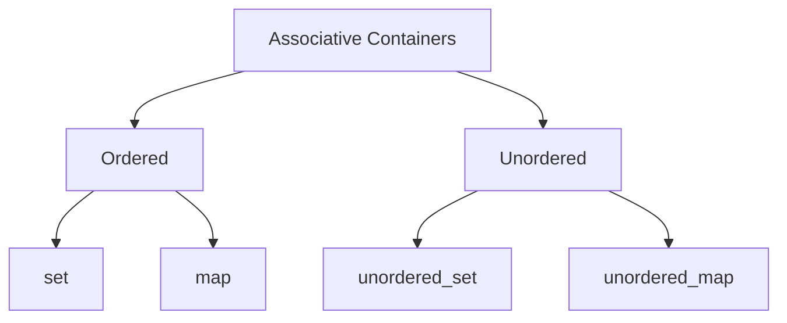

Midquarter review of Stanford CS106L.

<!--more-->

## stream

> stream: an abstraction for input/output. Streams  convert between data and the string representation of data.

### Output Streams

- Have type `std::ostream`
- Can only send data using the `<<` operator
  - Converts any type into string and sends it to the stream
- `std::cout` is the output stream that goes to the console

```c++
std::cout << 5 << std::endl; 
// converts int value 5 to string “5”
// sends “5” to the console output stream
```

### Output File Streams

- Have type `std::ofstream`
- Only receive data using the `<<` operator
  - Converts data of any type into a string and sends it to the  file stream
- Must initialize your own `ofstream` object linked to your file

```c++
std::ofstream out(“out.txt”, std::ofstream::out);
// out is now an ofstream that outputs to out.txt
out << 5 << std::endl; // out.txt contains 5
```

### Input Streams

- Have type `std::istream`
- Can only receive data using the `>>` operator
  - Receives a string from the stream and converts it to data
- `std::cin` is the output stream that gets input from the console

```c++
int x;
string str;
std::cin >> x >> str;
//reads exactly one int then 1 string from console
```

### Nitty Gritty Details: std::cin

- First call to std::cin >> creates a command line prompt  that allows the user to type until they hit enter
- Each >> ONLY reads until the next whitespace
  - Whitespace = tab, space, newline
- Everything after the first whitespace gets saved and used the  next time std::cin >> is called
  - The place its saved is called a buffer!
- If there is nothing waiting in the buffer, std::cin >> creates a new command line prompt
- Whitespace is eaten: it won’t show up in output

### Stringstreams

- Input stream: std::istringstream
  - Give any data type to the istringstream, it’ll store it as a  string!
- Output stream: std::ostringstream
  - Make an ostringstream out of a string, read from it  word/type by word/type!
- The same as the other i/ostreams you’ve seen

```c++
//ostringstreams
string judgementCall(int age, string name, bool lovesCpp) {
    std::ostringstream formatter;
    formatter << name <<", age " << age;
    if(lovesCpp) formatter << ", rocks.";
    else formatter << " could be better";
    return formatter.str();
}
//istringstreams
Student reverseJudgementCall(string judgement) {
    std::istringstream converter;
    string fluff; int age; bool lovesCpp; string name;
    converter >> name;
    converter >> fluff;
    converter >> age;
    converter >> fluff;
    string cool;
    converter >> cool;
    if(fluff == "rocks") return Student{name, age, "bliss"};
    else return Student{name, age, "misery"};
}
```

## References

### References to variables

```c++
vector<int> original{1, 2};
vector<int> copy = original;
vector<int>& ref = original;
original.push_back(3);
copy.push_back(4);
ref.push_back(5);
cout << original << endl; // {1, 2, 3, 5}
cout << copy << endl; // {1, 2, 4}
cout << ref << endl; // {1, 2, 3, 5}
```

### The classic reference-copy bug:

```c++
void shift(vector<std::pair<int, int>>& nums) {
    for (size_t i = 0; i < nums.size(); ++i) {
        auto [num1, num2] = nums[i];//This creates a copy of the course
        num1++;
        num2++;//This is updating that same copy!
    }
}

//The classic reference-copy bug, fixed:
void shift(vector<std::pair<int, int>>& nums) {
    for (auto& [num1, num2]: nums) {
        num1++;
        num2++;
    }
}
```

### The classic reference-rvalue error

```c++
void shift(vector<std::pair<int, int>>& nums) {
    for (auto& [num1, num2]: nums) {
        num1++;
        num2++;
    }
}
shift({{1, 1}}); 
// {{1, 1}} is an rvalue, it can’t be referenced
```

- l-values
  - l-values can appear on the left or  right of an =
  - `x` is an l-value
  - l-values have names
  - l-values are not temporary
- r-values
  - r-values can ONLY appear on the  right of an =
  - `3` is an r-value
  - r-values don’t have names
  - r-values are temporary

```c++
//The classic reference-rvalue error, fixed
void shift(vector<pair<int, int>>& nums) {
    for (auto& [num1, num2]: nums) {
        num1++;
        num2++;
    }
}
auto my_nums = {{1, 1}};
shift(my_nums);
```

### const indicates a variable can’t be modified

```c++
std::vector<int> vec{1, 2, 3};
const std::vector<int> c_vec{7, 8}; // a const variable
std::vector<int>& ref = vec; // a regular reference
const std::vector<int>& c_ref = vec; // a const reference
vec.push_back(3); // OKAY
c_vec.push_back(3); // BAD - const
ref.push_back(3); // OKAY
c_ref.push_back(3); // BAD - const
```

### const & subtleties

```c++
std::vector<int> vec{1, 2, 3};
const std::vector<int> c_vec{7, 8};
std::vector<int>& ref = vec;
const std::vector<int>& c_ref = vec;
auto copy = c_ref; // a non-const copy
const auto copy = c_ref; // a const copy
auto& a_ref = ref; // a non-const reference
const auto& c_aref = ref; // a const reference
```

## Containers and Iterators

### Simple  Sequence Containers


~~~mermaid
graph TB
A[Sequence Containers]-->B[Simple]
A-->C[Adaptors]
B-->d[vector]
B-->e[deque]
B-->f[list]
B-->q[tuple]
C-->p[stack]
C-->o[queue]
C-->m[priority_queue]
~~~



| What you want to do               | std::vector | std::deque | std::list  |
| --------------------------------- | ----------- | ---------- | ---------- |
| Insert/remove in the front        | Slow        | Fast       | Fast       |
| **Insert/remove in the back**     | Super Fast  | Very Fast  | Fast       |
| **Indexed Access**                | Super Fast  | Fast       | Impossible |
| Insert/remove in the middle       | Slow        | Fast       | Very Fast  |
| Memory usage                      | Low         | High       | High       |
| Combining (splicing/joining)      | Slow        | Very Slow  | Fast       |
| Stability (iterators/concurrency) | Bad         | Very Bad   | Good       |

### Container Adaptors

> What is a container adaptor? `std::stack and std::queue`

Container adaptors are wrappers in C++

- Container adaptors provide a different interface for sequence containers. 
- You can choose what the underlying container is
- For instance, let’s choose a deque as our underlying container, and let’s implement a  queue

```c++
std::queue<int> stack_deque; // Container = std::deque
std::queue<int, std::list<int>> stack_list;// Container = std::list
```

### Associative Containers

```c++
//set
std::set<int> s;//Create an empty set
s.insert(k);//Add a value k to the set
s.erase(k);//Remove value k from the set
if (s.count(k))...//Check if a value k is in the set
if (vec.empty())...//Check if vector is empty
```

```c++
//map
std::map<int, char> m;//Create an empty map
m.insert({k, v});
m[k] = v;//Add key k with value v into the map
m.erase(k);//Remove key k from the map
if (m.count(k)) ...//Check if key k is in the map
if (m.empty()) ...//Check if the map is empty
//Retrieve or overwrite value associated with key k (error if key isn’t in map)
char c = m.at(k);
m.at(k) = v;
//Retrieve or overwrite value associated with key k (auto-insert if key isn’t in map)
char c = m[k];
m[k] = v;
```

### STL Iterators

-  Iterators are objects that point to elements inside containers.
-  Each STL container has its own iterator, but all of these iterators exhibit a similar  behavior!
-  Generally, STL iterators support the following operations:

```c++
std::set<type> s = {0, 1, 2, 3, 4};
std::set::iterator iter = s.begin(); // at 0
++iter; // at 1
*iter; // 1
(iter != s.end()); // can compare 
iterator equality
auto second_iter = iter; // "copy construction"
```

Why ++iter and not iter++?

**Answer**: ++iter returns the value after being incremented! iter++ returns the previous value and then increments it. (wastes  just a bit of time)

### Looping over collections

```c++
//初始
std::set<int> set{3, 1, 4, 1, 5, 9};
for (auto iter = set.begin(); iter != set.end(); ++iter) {
    const auto& elem = *iter;
    cout << elem << endl;
}
std::map<int> map{{1, 6}, {1, 8}, {0, 3}, {3, 9}};
for (auto iter = map.begin(); iter != map.end(); ++iter) {
    const auto& [key, value] = *iter; // structured binding!
    cout << key << ":" << value << ", " << endl;
}
//改进
std::set<int> set{3, 1, 4, 1, 5, 9};
for (const auto& elem : set) {
    cout << elem << endl;
}
std::map<int> map{{1, 6}, {1, 8}, {0, 3}, {3, 9}};
for (const auto& [key, value] : map) {
    cout << key << ":" << value << ", " << endl;
}
```

### Pointers

- When variables are created, they're given  an address in memory.
- Pointers are objects that store an address  and type of a variable.

## classes

> A programmerdefined custom type. An  abstraction of an object or data type.

### Sections

- Public section:
  - Users of the Student object can  directly access anything here!
  - Defines interface for interacting with  the private member variables
- Private section:
  - Usually contains all member  variables
  - Users can’t access or modify  anything in the private section

### Constructors

- Define how the member variables of an object is initialized
- What gets called when you first create a Student object
- Overloadable

### Destructors

- Arrays are memory WE allocate, so we need to give instructions for when to  deallocate that memory!
- When we are done using our array, we need to `delete []` it!

### Template classes

```c++
//mypair.cpp
#include “mypair.h”
template<class First, typename Second>
First MyPair<First, Second>::getFirst(){
    return first;
}
template<class Second, typename First>
    Second MyPair<First, Second>::getSecond(){
    return second;
}
```

### Member Types

- Sometimes, we need a name for a type that is dependent on  our template types
- iterator is a member type of vector

```c++
//vector.h
template<typename T> class vector {
    using iterator = … // something internal
    private:
    iterator front;
}
//vector.cpp
template <typename T>
typename vector<T>::iterator vector<T>::insert(iterator pos, intvalue) {...}
//iterator is a nested type in namespace vector<T>::
```

**Aside: Type Aliases**

- You can use using type_name = type in application  code as well!
- When using it in a class interface, it defines a nested type, like  vector::iterator
- When using it in application code, like main.cpp, it just creates another name for type within that scope (until the  next unmatched })

**Summary**

- Used to make sure your clients have a standardized way to  access important types
- Lives in your namespace: `vector<T>::iterator`
- After class specifier, you can use the alias directly (e.g. inside  function arguments, inside function body)
- Before class specifier, use typename.

### Recap

**Template classes**

- Add `template<typename T1, typename T2 ...>` before class definition in .h
- Add `template<typename T1, typename T2 ...>` before all  function signature in .cpp
- When returning nested types (like iterator types), put `template<typename T1, typename T2 ...>::member_type` as return type, not  just `member_type`
- Templates don’t emit code until instantiated, so `#include` the  .cpp file in the .h file, not the other way around

**Const and Const-correctness**

- Use const parameters and variables wherever you can in application code
- Every member function of a class that doesn’t change its member variables should be marked `const`
- auto will drop all const and &, so be sure to specify
- Make iterators and const_iterators for all your classes!
  - **const iterator** = cannot increment the iterator, can dereference and change underlying value
  - **const_iterator** = can increment the iterator, cannot dereference and change underlying value
  - **const const_iterator** = cannot increment iterator, cannot dereference and change underlying value

