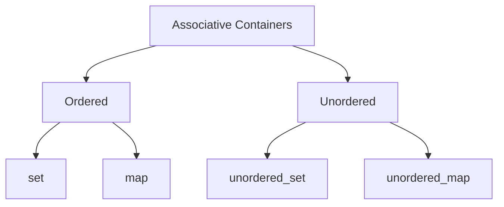

Stanford CS106L: Standard C++ Programming课程笔记。

<!--more-->

> 引言：*CS106B/X* 和 *CS106L* 是配套课程，学习完前一个再学习 *CS106L* 才是正确的路径。但是浙江大学的《数据结构基础》课程已经包括了 *CS106B* 中除 *C++ Class* 和 *Huffman Coding* 之外的其他内容，所以对于 *CS106B* 的内容仅做简单补充。
>
> 此笔记基于 *CS 106L, Fall '21*

# Lec1 Welcome to CS 106L!

## Why C++ is important

## What is C++

```c++
#include <iostream>
int main() {
	std::cout << "Hello World!" << std::endl;
	return 0;
}
```

```c++
#include "stdio.h"
#include "stdlib.h"
int main(int argc, char *argv) {
     asm("sub $0x20,%rsp\n\t" // assembly code!
         "movabs $0x77202c6f6c6c6548,%rax\n\t"
         "mov %rax,(%rsp)\n\t"
         "movl $0x646c726f, 0x8(%rsp)\n\t"
         "movw $0x21, 0xc(%rsp)\n\t"
         "movb $0x0,0xd(%rsp)\n\t"
         "leaq (%rsp),%rax\n\t"
         "mov %rax,%rdi\n\t"
         "call __Z6myputsPc\n\t"
         "add $0x20, %rsp\n\t"
     );
     return EXIT_SUCCESS;
}
```

# Lec2 Types and Structs

> Types make things better...and sometimes harder...but still better

## Types

### Fundamental Types

```c++
int val = 5; //32 bits
char ch = 'F'; //8 bits (usually)
float decimalVal1 = 5.0; //32 bits (usually)
double decimalVal2 = 5.0; //64 bits (usually)
bool bVal = true; //1 bit
#include <string>
std::string str = "Frankie";
```

​	C++ is a statically typed language: everything  with a name (variables,  functions, etc) is given a  type before runtime

​	static typing helps us to  prevent errors before our  code runs

### Static Types + Function

```c++
int add(int a, int b);
int, int -> int
string echo(string phrase);
string -> string
string helloworld();
void -> string
double divide(int a, int b);
int, int -> double
```

### Overloading

```c++
int half(int x, int divisor = 2) { // (1)
return x / divisor;
}
double half(double x) { // (2)
return x / 2;
}
half(3)// uses version (1), returns 1
half(3, 3)// uses version (1), returns 1
half(3.0) // uses version (2), returns 1.5
```

## Intro to structs

> struct: a group of named variables each with their own type. A way to bundle different types together

```c++
struct Student {
    string name; // these are called fields
    string state; // separate these by semicolons
    int age;
};
Student s;
s.name = "Frankie"; 
s.state = "MN";
s.age = 21; // use . to access fields
void printStudentInfo(Student student) {
    cout << s.name << " from " << s.state;
    cout << " (" << s.age ")" << endl;
}
Student randomStudentFrom(std::string state) {
    Student s;
    s.name = "Frankie";//random = always Frankie
    s.state = state;
    s.age = std::randint(0, 100);
    return s;
}
 Student foundStudent = randomStudentFrom("MN");
 cout << foundStudent.name << endl; // Frankie
```

> std::pair: An STL  built-in struct with two fields of any type

```c++
std::pair<int, string> numSuffix = {1,"st"};
cout << numSuffix.first << numSuffix.second; 
//prints 1st
struct Pair {
    fill_in_type first; 
    fill_in_type second; 
};
//pair in functions
std::pair<bool, Student> lookupStudent(string name) {
    Student blank;
    if (found(name)) return std::make_pair(false, blank);
    Student result = getStudentWithName(name);
    return std::make_pair(true, result);
}
std::pair<bool, Student> output = lookupStudent(“Keith”);
```

> auto: Keyword used in lieu  of type when declaring a  variable, tells the compiler  to deduce the type.

```c++
//It means that the type is  deduced by the compiler. 
auto a = 3;
auto b = 4.3;
auto c = ‘X’;
auto d = “Hello”;
auto e = std::make_pair(3, “Hello”);
```

## Sneak peek at streams

> stream: an abstraction for input/output. Streams convert between data and the string representation of data.

```c++
std::cout << 5 << std::endl; // prints 5 
// use a stream to print any primitive type!
std::cout << "Frankie" << std::endl; 
// Mix types!
std::cout << "Frankie is " << 21 << std::endl;
// structs?
Student s = {"Frankie", "MN", 21};
std::cout << s.name << s.age << std::endl;
```

## Recap

- Everything with a name in your program has a type
- Strong type systems prevent errors before your code runs!
- Structs are a way to bundle a bunch of variables of many types 
- std::pair is a type of struct that had been defined for you and is in the STL
- So you access it through the std:: namespace (std::pair) 
- auto is a keyword that tells the compiler to deduce the type of a variable, it should be used when the type is obvious or very  cumbersome to write out

# Lec3 Initialization & References

## Initialization

> Initialization: How we provide initial values to variables

```c++
// Recall: Two ways to initialize a struct
Student s;
s.name = "Frankie"; 
s.state = "MN";
s.age = 21; 
//is the same as ...
Student s = {"Frankie", "MN", 21};
```

```c++
//Multiple ways to initialize a pair
std::pair<int, string> numSuffix1 = {1,"st"};
std::pair<int, string> numSuffix2;
numSuffix2.first = 2;
numSuffix2.second = "nd";
std::pair<int, string> numSuffix2 = std::make_pair(3, "rd");
```

```c++
//Initialization of vectors
std::vector<int> vec1(3,5); 
// makes {5, 5, 5}, not {3, 5}!
std::vector<int> vec2;
vec2 = {3,5};
// initialize vec2 to {3, 5} after its declared
```

> Uniform initialization: curly bracket initialization.  Available for all types,  immediate initialization on declaration(统一初始化：声明时用花括号定义)

```c++
std::vector<int> vec{1,3,5};
std::pair<int, string> numSuffix1{1,"st"};
Student s{"Frankie", "MN", 21};
// less common/nice for primitive types, but possible!
int x{5};
string f{"Frankie"};
//Careful with Vector initialization!
std::vector<int> vec1(3,5); 
// makes {5, 5, 5}, not {3, 5}!
//uses a std::initializer_list (more later)
std::vector<int> vec2{3,5};
// makes {3, 5}

//TLDR: use uniform  initialization to initialize every  field of your non-primitive  typed variables - but be  careful not to use vec(n, k)!
```

> auto:  use it to reduce long type names

```c++
std::pair<bool, std::pair<double, double>> result = quadratic(a, b, c);
//It can be write as below
auto result = quadratic(a, b, c);
```

**Don’t overuse auto!**

```c++
//A better way to use quadratic
int main() {
     auto a, b, c;
     std::cin >> a >> b >> c;
     auto [found, solutions] = quadratic(a, b, c);
     if (found) {
         auto [x1, x2] = solutions;
         std::cout << x1 << “ ” << x2 << endl;
     } else {
         std::cout << “No solutions found!” << endl;
     }
}
//This is better is because it’s semantically clearer: variables have clear names
```

## References

> Reference: An alias  (another name) for a named variable

**References in 106B**

```c++
void changeX(int& x){ //changes to x will persist
    x = 0;
}
void keepX(int x){
    x = 0;
}
int a = 100;
int b = 100;
changeX(a); //a becomes a reference to x
keepX(b); //b becomes a copy of x
cout << a << endl; //0
cout << b << endl; //100
```

**References in 106L: References to variables**

```c++
vector<int> original{1, 2};
vector<int> copy = original;
vector<int>& ref = original;
original.push_back(3);
copy.push_back(4);
ref.push_back(5);
cout << original << endl; // {1, 2, 3, 5}
cout << copy << endl; // {1, 2, 4}
cout << ref << endl; // {1, 2, 3, 5}
//“=” automatically makes a copy! Must use & to avoid this.
```

**Reference-copy bug**

```c++
//bug
void shift(vector<std::pair<int, int>>& nums) {
    for (auto [num1, num2]: nums) {
        num1++;
        num2++;
    }
}
//fixed
void shift(vector<std::pair<int, int>>& nums) {
    for (auto& [num1, num2]: nums) {
        num1++;
        num2++;
    }
}
```

> - l-values
>   - l-values can appear on the left or  right of an =
>   - `x` is an l-value
>   - l-values have names
>   - l-values are not temporary
> - r-values
>   - r-values can ONLY appear on the  right of an =
>   - `3` is an r-value
>   - r-values don’t have names
>   - r-values are temporary

**The classic reference-rvalue error**

```c++
//可以取地址的，有名字的，非临时的就是左值；不能取地址的，没有名字的，临时的就是右值；
void shift(vector<std::pair<int, int>>& nums) {
    for (auto& [num1, num2]: nums) {
        num1++;
        num2++;
    }
}
shift({{1, 1}}); 
// {{1, 1}} is an rvalue, it can’t be referenced

//fixed
void shift(vector<pair<int, int>>& nums) {
for (auto& [num1, num2]: nums) {
        num1++;
        num2++;
    }
}
auto my_nums = {{1, 1}};
shift(my_nums);
```

## BONUS: Const and Const References

> const indicates a variable can’t be modified!

```c++
std::vector<int> vec{1, 2, 3};
const std::vector<int> c_vec{7, 8}; // a const variable
std::vector<int>& ref = vec; // a regular reference
const std::vector<int>& c_ref = vec; // a const reference, 注意前面也要加上 const

vec.push_back(3); // OKAY
c_vec.push_back(3); // BAD - const
ref.push_back(3); // OKAY
c_ref.push_back(3); // BAD - const
```

```c++
const std::vector<int> c_vec{7, 8}; // a const variable
// BAD - can't declare non-const ref to const vector
std::vector<int>& bad_ref = c_vec;
// fixed
const std::vector<int>& bad_ref = c_vec;
// BAD - Can't declare a non-const reference as equal to a const reference!
std::vector<int>& ref = c_ref;
```

**const & subtleties**

```c++
std::vector<int> vec{1, 2, 3};
const std::vector<int> c_vec{7, 8};
std::vector<int>& ref = vec;
const std::vector<int>& c_ref = vec;
auto copy = c_ref; // a non-const copy
const auto copy = c_ref; // a const copy
auto& a_ref = ref; // a non-const reference
const auto& c_aref = ref; // a const reference
```

​	Remember: C++, by default, makes copies when we  do variable assignment! We need to use & if we  need references instead.

## Recap

- Use input streams to get information
- Use structs to bundle information
- Use uniform initialization wherever possible
- Use references to have multiple aliases to the same thing
- Use const references to avoid making copies whenever possible

# Lec4 Streams

> stream: an abstraction for input/output. Streams convert between data and the string representation of data.

## Input streams

> std::cin is an input stream. It has type std::istream

- Have type std::istream
- Can only receive strings using the `>>` operator
  - Receives a string from the stream and converts it to data 
- std::cin is the input stream that gets input from the console

```c++
int x;
string str;
std::cin >> x >> str;
//reads exactly one int then 1 string from console
```

- First call to std::cin >> creates a command line prompt  that allows the user to type until they hit enter
- **Each `>>` ONLY reads until the next whitespace**
  - **Whitespace = tab, space, newline**
- Everything after the first whitespace gets saved and used the  next time std::cin >> is called
- If there is nothing waiting in the buffer, std::cin >> creates a new command line prompt
- Whitespace is eaten: it won’t show up in output

```c++
string str;
int x;
std::cin >> str >> x;
//what happens if input is "blah blah"?
std::cout << str << x;
//once an error is detected, the input stream’s
//fail bit is set, and it will no longer accept 
//input
```

**To read a whole line, use  std::getline(istream& stream, string& line);**

```c++
std::string line;
std::getline(cin, line); //now line has changed!
//say the user entered “Hello World 42!” 
std::cout << line << std::endl; 
//should print out“Hello World 42!”
```

- `>>` reads up to the next whitespace character and does not go past that whitespace character.
- `getline` reads up to the next delimiter (by default, ‘\n’), and does go past that delimiter.

## Output streams

> std::cout is an output  stream. It has type std::ostream

- Can only send data using the << operator
  - Converts any type into string and sends it to the stream
-  std::cout is the output stream that goes to the console

## File streams

### Input File Streams

- Have type std::ifstream
- Only send data using the >> operator
  - Receives strings from a file and converts it to data of any type
- Must initialize your own ifstream object linked to your file

```c++
std::ifstream in(“out.txt”);
// in is now an ifstream that reads from out.txt
string str;
in >> str; // first word in out.txt goes into str
```

### Output File Streams

- Have type std::ofstream
- Only send data using the << operator
  - Converts data of any type into a string and sends it to the file stream
- Must initialize your own ofstream object linked to your file

```c++
std::ofstream out(“out.txt”);
// out is now an ofstream that outputs to out.txt
out << 5 << std::endl; // out.txt contains 5
```

## string streams

- Input stream: std::istringstream
  - Give any data type to the istringstream, it’ll store it as a  string!
- Output stream: std::ostringstream
  - Make an ostringstream out of a string, read from it  word/type by word/type
- The same as the other i/ostreams you’ve seen!

### ostringstreams

```c++
string judgementCall(int age, string name, bool lovesCpp)
{
    std::ostringstream formatter;
    formatter << name <<", age " << age;
    if(lovesCpp) formatter << ", rocks.";
    else formatter << " could be better";
    return formatter.str();
}
```

### istringstreams

```c++
Student reverseJudgementCall(string judgement){ 
    //input: “Frankie age 22, rocks”
    std::istringstream converter;
    string fluff; int age; bool lovesCpp; string name;
    converter >> name;
    converter >> fluff;
    converter >> age;
    converter >> fluff;
    string cool;
    converter >> cool;
    if(cool == "rocks") return Student{name, age, "bliss"};
    else return Student{name, age, "misery"};
}// returns: {“Frankie”, 22, “bliss”}
```

## Recap

- Streams convert between data of any type and the string  representation of that data.
- Streams have an endpoint: console for cin/cout, files for i/o fstreams,  string variables for i/o streams where they read in a string from or  output a string to. 
- To send data (in string form) to a stream, use stream_name <<  data.
- To extract data from a stream, use stream_name >> data, and the stream will try to convert a string to whatever type data is.

# Lec5 Containers

> What's in the STL:
>
> - Containers
> - Iterators
> - Functions
> - Algorithms

## Types of containers

All containers can hold almost all elements

~~~mermaid
graph TB
A[Sequence Containers]-->B[Simple]
A-->C[Adaptors]
B-->d[vector]
B-->e[deque]
B-->f[list]
B-->q[tuple]
C-->p[stack]
C-->o[queue]
C-->m[priority_queue]
~~~



## Sequence Containers

### vector

```c++
#include<vector>
//construct
std::vector<int> intArr;//Create a new, empty vector
std::vector<int> vec(n);//Create a vector with n copies of 0 
std::vector<int> vec(n, k);//Create a vector with n copies of a value k
std::vector<string> strArr;
std::vector<myStruct> structArr;
std::vector<std::vector<string>> vecArr;//二维数组

//use
int k = vec[i];//Get the element at index i (does not bounds check)
vec.push_back(k);//Add a value k to the end of a vector
for (std::size_t i = 0; i < vec.size(); ++i)//Loop through vector by index i
vec[i] = k;//Replace the element at index i(does not bounds check)
vec.clear();//Remove all elements of a vector
vec.size();//Check size of vector 
vec.pop_back();//删除末尾
vec.capacity();//给vector分配的空间大小
vec.empty();//判断是否为空
vec.at(2);//位置为2处元素引用
vec.begin();//头指针
vec.end();//尾指针
```

[菜鸟教程](https://www.runoob.com/w3cnote/cpp-vector-container-analysis.html)

### array

```c++
#include<array>
//construct
std::array<int, 3> arr = {1, 2, 3};
std::array<std::array<string, 3>, 4>;//4*3的string数组
//访问
arr.at(2).at(1);//二维数组中访问
```

### deque

​	`deque`支持`vector`的所有操作，并且支持快速`push_front()`，但是实践中一般使用`vector`，因为其他操作更快。

### list

​	A list provides fast insertion anywhere, but no random (indexed)  access.

| What you want to do               | std::vector | std::deque | std::list  |
| --------------------------------- | ----------- | ---------- | ---------- |
| Insert/remove in the front        | Slow        | Fast       | Fast       |
| **Insert/remove in the back**     | Super Fast  | Very Fast  | Fast       |
| **Indexed Access**                | Super Fast  | Fast       | Impossible |
| Insert/remove in the middle       | Slow        | Fast       | Very Fast  |
| Memory usage                      | Low         | High       | High       |
| Combining (splicing/joining)      | Slow        | Very Slow  | Fast       |
| Stability (iterators/concurrency) | Bad         | Very Bad   | Good       |

> wrapper: A wrapper on an object changes how external users can interact  with that object.

**Container adaptors are wrappers in C++!**

### queue

```c++
queue.push_back();
queue.pop_front();
```

### stack

```c++
stack.push_back();
stack.pop_back();
```

### priority_queue

​	Adding elements with a priority, always removing the highest priority-element.

## Associative Containers

### set

`set`就是集合，每个元素只出现一次，按键值升序排列。访问元素的时间复杂度是O(logn).

```c++
std::set<int> s;//Create an empty set
s.insert(k);//Add a value k to the set
s.erase(k);//Remove value k from the set
if (s.count(k))...//Check if a value k is in the set
if (vec.empty())...//Check if vector is empty
```

### map

`map`是c++标准库中定义的关联容器，是键（key）值（value）对的结合体。

```c++
std::map<int, char> m;//Create an empty map
m.insert({k, v});
m[k] = v;//Add key k with value v into the map
m.erase(k);//Remove key k from the map
if (m.count(k)) ...//Check if key k is in the map
if (m.empty()) ...//Check if the map is empty
//Retrieve or overwrite value associated with key k (error if key isn’t in map)
char c = m.at(k);
m.at(k) = v;
//Retrieve or overwrite value associated with key k (auto-insert if key isn’t in map)
char c = m[k];
m[k] = v;
```

Every `std::map<k, v>` is actually backed by:  `std::pair<const k, v>`

```c++
//Iterating through maps and sets
std::set<...> s;
std::map<..., ...> m;
for (const auto& element : s) {
    // do stuff with element
}
for (const auto& [key, value] : m) {
    // do stuff with key and value
}
```

### unordered_map and unordered_set

- Each STL set/map comes with an unordered sibling. They’re almost the same,  except:
  - Instead of a comparison operator, the set/map type must have a hash function defined for it.
    - Simple types, like int, char, bool, double, and even std::string are already supported! 
    - Any containers/collections need you to provide a hash function to use them.
- unordered_map/unordered_set are generally faster than map/set.

## Recap

- Sequence Containers
  - `std::vector` - use for almost everything
  - `std::deque` - use when you need fast insertion to front AND back
- Container Adaptors
  - `sta::stack` and `std::queue`
- Associative Containers
  - `std::map` and `std::set`
  - if using simple data types/you’re familiar with hash functions, use `std::unordered_map` and `std::unordered_set`

# Lec6 Iterators and Pointers

## Iterators

> A way to access all containers programmatically!

- Iterators are objects that point to elements inside containers.
- Each STL container has its own iterator, but all of these iterators exhibit a similar  behavior!
- Generally, STL iterators support the following operations:

```c++
std::set<type> s = {0, 1, 2, 3, 4};
std::set::iterator iter = s.begin(); // at 0
++iter; // at 1
*iter; // 1
(iter != s.end()); // can compare iterator equality
auto second_iter = iter; // "copy construction"
```

Types:

- Input Iterator：只能单步向前迭代元素，不允许修改由该类迭代器引用的元素。
- Output Iterator：该类迭代器和Input Iterator极其相似，也只能单步向前迭代元素，不同的是该类迭代器对元素只有写的权力。
- Forward Iterator：该类迭代器可以在一个正确的区间中进行读写操作，它拥有Input Iterator的所有特性，和Output Iterator的部分特性，以及单步向前迭代元素的能力。
- Bidirectional Iterator：该类迭代器是在Forward Iterator的基础上提供了单步向后迭代元素的能力。
- Random Access Iterator：该类迭代器能完成上面所有迭代器的工作，它自己独有的特性就是可以像指针那样进行算术计算，而不是仅仅只有单步向前或向后迭代。

Explain:

- There are a few different types of iterators,  since containers are different!

- All iterators can be incremented (++) 

- Input iterators can be on the RHS (right  hand side) of an = sign: `auto elem = *it;`

- Output iterators can be on the LHS of = : `*elem = value;`

- Random access iterators support indexing  by integers!

  ```c++
  it += 3; // move forward by 3
  it -= 70; // move backwards by 70
  auto elem = it[5]; // offset by 5
  ```

Why ++iter and not iter++?

​	**Answer**: ++iter returns the value after being incremented! iter++ returns the previous value and then increments it. (wastes just a bit of time)

```c++
std::map<int, int> map {{1, 2}, {3, 4}};
auto iter = map.begin(); // what is *iter?
++iter;
auto iter2 = iter; // what is (*iter2).second?
++iter2; // now what is (*iter).first?
// ++iter: go to the next element
// *iter: retrieve what's at iter's position
// copy constructor: create another iterator pointing to the same thing
```

```c++
std::set<int> set{3, 1, 4, 1, 5, 9};
for (auto iter = set.begin(); iter != set.end(); ++iter) {
    const auto& elem = *iter;
    cout << elem << endl;
}
std::map<int> map{{1, 6}, {1, 8}, {0, 3}, {3, 9}};
for (auto iter = map.begin(); iter != map.end(); ++iter) {
    const auto& [key, value] = *iter; // structured binding!
    cout << key << ":" << value << ", " << endl;
}
```

```c++
std::set<int> set{3, 1, 4, 1, 5, 9};
for (const auto& elem : set) {
    cout << elem << endl;
}
std::map<int> map{{1, 6}, {1, 8}, {0, 3}, {3, 9}};
for (const auto& [key, value] : map) {
    cout << key << ":" << value << ", " << endl;
}
```

```c++
auto key = (*iter).first;
auto key = iter->first;
//These are equivalent.
```

## Pointers

- When variables are created, they're  given an address in memory.
- Pointers are objects that store an  address and type of a variable.
- To get the value of a pointer, we can dereference it (get the object referenced by  the pointer)

```c++
int x = 5;
int* pointerToInt = &x; // creates pointer to int
cout << *pointerToInt << endl; // 5
std::pair<int, int> pair = {1, 2}; // creates pair
std::pair<int, int>* pointerToPair = &pair; // creates pointer to pair
cout << (*pair).first << endl; // 1
cout << pair->first << endl; // 1
```

## Pointers vs. Iterators

- Iterators are a form of pointers!
- Pointers are more generic iterators
  - can point to any object, not just elements in a container!

```c++
std::string lands = "Xadia";
// iterator
auto iter = lands.begin();
// syntax for a pointer. don't worry about the specifics if you're in 106B! they'll be discussed in the latter half of the course.
char* firstChar = &lands[0];
```

# Lec7 Classes

> Containers are all classes defined  in the STL!
>
> Iterators are (basically) pointers! More on that later

> Class: A programmerdefined custom type. An  abstraction of an object or data type.

## But don’t structs do that?

```c++
struct Student {
    string name; // these are called fields
    string state; // separate these by semicolons
    int age;
};
Student s = {"Frankie", "MN", 21};
```

**Issues with structs**

- Public access to all internal state data by default
- Users of struct need to explicitly initialize each data member.

**Classes provide their users with a public interface and separate this from a private implementation.**

## Turning Student into a class: Header File + .cpp File: 

```c++
//student.h
class Student {
    public:
    std::string getName();
    void setName(string name);
    int getAge();
    void setAge(int age);
    
    private:
    std::string name;
    std::string state;
    int age;
};
//student.cpp
#include student.h
std::string
Student::getName(){
	return name;
}
void Student::setName(){
    this -> name = name;
}
int Student::getAge(){
    return age;
}
void Student::setAge(int age){
    if(age >= 0) {
        this -> age = age;
    }
    else error("Age cannot be negative!");
}

```

**Function definitions with namespaces!**

- namespace_name::name in a function prototype means  “this is the implementation for an interface function in  namespace_name ”

- Inside the {...} the private member variables for  namespace_name will be in scope!

  `std::string Student::getName(){...}`

**The this keyword!**

- Here, we mean “set the Student private member variable name equal to the parameter name ”

  ```c++
  void Student::setName(){
      name = name;
  }
  ```

- this->element_name means “the item in this Student  object with name element_name”. Use this for naming  conflicts!

  ```c++
  void Student::setName(string name){
      this->name = name; //better!
  }
  ```

## Constructors and Destructors

**constructors:**

- Define how the member variables of an object is initialized
- What gets called when you first create a Student object
- Overloadable!

**destructors:**

- deleteing (almost) always happens in the destructor of a class!
- The destructor is defined using Class_name::~Class_name()
- No one ever explicitly calls it! Its called when Class_name  object go out of scope!
- Just like all member functions, declare it in the .h and  implement in the .cpp!

构造函数就是一个与类名相同的函数，在生成这个类的时候就会被调用，用来初始化这个类。

与构造函数相对的是析构函数，在关闭文件、释放内存前释放资源，名称是类名前加一个`~`

```c++
#include <iostream>
class Entity {
public:
	float X, Y;
	Entity() {
		std::cout << "Entity is constructed!" << std::endl;
	}
	~Entity() {
		std::cout << "Entity is destructed!" << std::endl;
	}
};
void Function() {
	Entity e;
}
int  main() {
	Function();
	std::cin.get();
}
```

## Public and Private Sections

> Class: A programmerdefined custom type. An  abstraction of an object or data type.

```c++
//student.h
class Student {
    public:
    std::string getName();
    void setName(string 
    name);
    int getAge();
    void setAge(int age);
    private:
    std::string name;
    std::string state;
    int age;
};
```

**Public section:**

- Users of the Student object can  directly access anything here!
- Defines interface for interacting with the private member variables!

**Private section:**

- Usually contains all member variables
- Users can’t access or modify anything in the private section

## One last thing… Arrays

```c++
//int * is the type of an int array variable
int *my_int_array;
//my_int_array is a pointer!
//this is how you initialize an array
my_int_array = new int[10];
//this is how you index into an array
int one_element = my_int_array[0];
//Arrays are memory WE allocate, so we need to give instructions for when to deallocate that memory!
//When we are done using our array, we need to delete [] it!
delete [] my_int_array;
```

# Lec8 Template Classes and Const  Correctness

## Template Classes

> Fundamental Theorem of Software Engineering: Any  problem can be solved by  adding enough layers of  indirection.

**The problem with IntVector**

- Vectors should be able to contain any data type!

  Solution? Create StringVector, DoubleVector, BoolVector etc..

- What if we want to make a vector of struct Students?

  - How are we supposed to know about every custom class?

- What if we don’t want to write a class for every type we can  think of?

`SOLUTION: Template classes!`

> Template Class: A class that is parametrized over some number of types. A class that is comprised of member variables of a general type/types.

**Template Classes You’ve Used**

Vectors/Maps/Sets... Pretty much all containers!

```c++
template<class T>
T add(const T& left,const T& right){
	return left + right;
}
//隐式实例化
int main(){
	int a1=10;
	double b1=10.0;
	//add(a1,b1);
	add(a1,(int)b1);//强制类型转换
	return 0;
}
//显式实例化
int main(){
	int a=10;
	double b=10.0;
	add<int>(a,b);
	return 0;
}
```

**Writing a Template Class: Syntax**

```c++
//mypair.h
template<typename First, typename Second> class MyPair {
    public:
        First getFirst();
        Second getSecond();
        void setFirst(First f);
        void setSecond(Second f);
    private:
        First first;
        Second second;
};
//mypair.cpp
#include “mypair.h”
//如果没有下面这句话会Compile error! Must announce every member function is templated
template<typename First, typename Second>
First MyPair::getFirst(){
    return first;
}
template<typename Second, typename First>
    Second MyPair::getSecond(){
    return second;
}
```

**Member Types**

- Sometimes, we need a name for a type that is dependent on  our template types

- iterator is a member type of vector

  ```c++
  std::vector a = {1, 2};
  std::vector::iterator it = a.begin();
  ```

Summary:

- Used to make sure your clients have a standardized way to  access important types.
- Lives in your namespace: `vector<T>::iterator`.
- After class specifier, you can use the alias directly (e.g. inside  function arguments, inside function body).
- Before class specifier, use typename.


```c++
// main.cpp
#include “vector.h”
vector<int> a;
a.at(5);
// vector.h
#include “vector.h”//注意是在.h文件中引入verctor.h，而不是在verctor.cpp中引入!!!
template <typename T>
class vector<T> {
     T at(int i);
};
// vector.cpp
template <typename T>
void vector<T>::at(int i) {
	// oops
}
```

​	**Templates don’t emit code until instantiated**, so include the .cpp in the .h instead of the other way around!

## Const Correctness

> const: keyword  indicating a variable,  function or parameter  can’t be modified

**const indicates a variable can’t be modified!**

```c++
std::vector<int> vec{1, 2, 3};
const std::vector<int> c_vec{7, 8}; // a const variable
std::vector<int>& ref = vec; // a regular reference
const std::vector<int>& c_ref = vec; // a const reference
vec.push_back(4); // OKAY
c_vec.push_back(9); // BAD - const
ref.push_back(5); // OKAY
c_ref.push_back(6); // BAD - const
```

**Can’t declare non-const reference to const variable!**

```c++
const std::vector<int> c_vec{7, 8}; // a const variable
// fixed
const std::vector<int>& bad_ref = c_vec;
// BAD - Can't declare a non-const reference as equal
// to a const reference!
std::vector<int>& ref = c_ref;
```

**const & subtleties with auto**

```c++
std::vector<int> vec{1, 2, 3};
const std::vector<int> c_vec{7, 8};
std::vector<int>& ref = vec;
const std::vector<int>& c_ref = vec;
auto copy = c_ref; // a non-const copy
const auto copy = c_ref; // a const copy
auto& a_ref = ref; // a non-const reference
const auto& c_aref = ref; // a const reference
```

**Why const?**

```c++
// Find the typo in this code
void f(const int x, const int y) {
    if ((x==2 && y==3)||(x==1))
        cout << 'a' << endl;
    if ((y==x-1)&&(x==-1||y=-1))//轻松发现这里的y==-1写错了
        cout << 'b' << endl;
    if ((x==3)&&(y==2*x))
        cout << 'c' << endl;
}
```

```c++
// Overly ambitious functions in application code
long int countPopulation(const Planet& p) {
    // Hats are the cornerstone of modern society
    addLittleHat(p); //compile error
    // Guaranteed no more population growth, all future calls will be faster
    sterilize(p); //compile error
    // Optimization: destroy planet
    // This makes population counting very fast
    deathStar(p); //compile error
    return 0;
}

//How does the algorithm above work?
long int countPopulation(const Planet& p) {
    addLittleHat(p); //p is a const reference here

    ...
}
void addLittleHat(Planet& p) {//p is a (non const) reference here
    p.add(something);
} 
//So it will become compile error
```

Calling addLittleHat on p is  like setting a non const  variable equal to a const  one, it’s not allowed!

**Const and Classes**

```c++
//student.cpp
#include student.h
std::string Student::getName(){
    return name; //we can access name here!
}
void Student::setName(string name){
    this->name = name; //resolved!
}
int Student::getAge(){
    return age;
}
void Student::setAge(int age){
//We can define what “age” means!
    if(age >= 0){
        this -> age = age;
    }
    else error("Age cannot be negative!");
}
//student.h
class Student {
    public:
    std::string getName();
    void setName(string 
    name);
    int getAge();
    void setAge(int age);
    
    private:
    std::string name;
    std::string state;
    int age;
};

```

Using a const Student:

```c++
//main.cpp
std::string stringify(const Student& s){
    return s.getName() + " is " + std::to_string(s.getAge) + 
    " years old." ;
}
//compile error!
```

- The compiler doesn’t know getName and getAge don’t modify s!
- We need to promise that it doesn’t by defining them as **const functions**
- Add const to the end of function signatures!

So, we make Student const-correct:

```c++
//student.cpp
#include student.h
std::string Student::getName() const{//there
    return name; 
}
void Student::setName(string name){
    this->name = name; 
}
int Student::getAge()const{//there
    return age;
}
void Student::setAge(int age){
    if(age >= 0){
        this -> age = age;
    }
    else error("Age cannot be negative!");
}
//student.h
class Student {
    public:
    std::string getName() const;//there
    void setName(string name);
    int getAge const();//there
    void setAge(int age);
    private:
    std::string name;
    std::string state;
    int age;
};
```

> const-interface: All member  functions marked const in  a class definition. Objects of  type const ClassName may only use the  const-interface.

Making RealVector‘s const-interface:

```c++
class StrVector {
public:
    using iterator = std::string*;
    const size_t kInitialSize = 2;
    /*...*/
    size_t size() const;
    bool empty() const;
    std::string& at(size_t indx);
    void insert(size_t pos, const std::string& elem);
    void push_back(const std::string& elem);
    iterator begin();
    iterator end();
    /*...*/
}
```

Should begin() and end() be const?

**Answer**: 虽然这两个函数都是const的，但是它们给我们返回了一个可以变化的iterator，所以会报错！

**Solution**: cbegin() and cend()

```c++
class StrVector {
    public:
     using iterator = std::string*;
     using const_ iterator = const std::string*;
     /*...*/
     size_t size() const;
     bool empty() const;
     /*...*/
     void push_back(const std::string& elem);
    iterator begin();
    iterator end();
    const_iterator begin()const;
    const_iterator end()const;
    /*...*/
}
```

```c++
void printVec(const RealVector& vec){
    cout << "{ ";
    for(auto it = vec.cbegin(); it != vec.cend(); ++it){
        cout << *it << cout;
    }
    cout << " }" << cout;
}
//Fixed! And now we can’t set *it equal to something: it will be a compile error!
```

**const iterator vs const_iterator: Nitty Gritty**

```c++
using iterator = std::string*;
using const_iterator = const std::string*;
const iterator it_c = vec.begin(); //string * const, const ptr to non-const obj
*it_c = "hi"; //OK! it_c is a const pointer to non-const object
it_c++; //not ok! cant change where a const pointer points! 
const_iterator c_it = vec.cbegin(); //const string*, a non-const ptr to const obj
c_it++; // totally ok! The pointer itself is non-const
*c_it = "hi" // not ok! Can’t change underlying const object
cout << *c_it << endl; //allowed! Can always read a const object, just can't change
//const string * const, const ptr to const obj
const const_iterator c_it_c = vec.cbegin(); 
cout << c_it_c << " points to " << *c_it_c << endl; //only reads are allowed!
```

## Recap

### Template classes

- Add `template<typename T1, typename T2 ...>` before class definition in .h
- Add `template<typename T1, typename T2 ...>` before all  function signature in .cpp
- When returning nested types (like iterator types), put `template<typename T1, typename T2 ...>::member_type` as return type, not  just `member_type`
- Templates don’t emit code until instantiated, so `#include` the  .cpp file in the .h file, not the other way around

### Const and Const-correctness

- Use const parameters and variables wherever you can in application code
- Every member function of a class that doesn’t change its member variables should be marked `const`
- auto will drop all const and &, so be sure to specify
- Make iterators and const_iterators for all your classes!
  - **const iterator** = cannot increment the iterator, can dereference and change underlying value
  - **const_iterator** = can increment the iterator, cannot dereference and change underlying value
  - **const const_iterator** = cannot increment iterator, cannot dereference and change underlying value

# Lec9 Template Functions

## Generic Programming

### Generic C++

- Allow data types to be parameterized (C++ entities that work on any  datatypes)
- Template classes achieve generic classes
- **How can we write methods that work on any data type?**

### Function to get the min of two ints

```c++
int myMin(int a, int b) {
return a < b ? a : b;
}
int main() {
auto min_int = myMin(1, 2); // 1
auto min_name = myMin("Sathya", "Frankie"); // error!
```

**One solution: overloaded functions**

```c++
int myMin(int a, int b) {
    return a < b ? a : b;
}
// exactly the same except for types
std::string myMin(std::string a, std::string b) {
    return a < b ? a : b;
}
int main() {
    auto min_int = myMin(1, 2); // 1
    auto min_name = myMin("Sathya", "Frankie"); // Frankie
}
```

But what about comparing other data types, like doubles, characters, and  complex objects?

## Template functions

> Writing reusable, unique code with no duplication!

```c++
//generic, "template" functions
template <typename Type>
Type myMin(Type a, Type b) {
    return a < b ? a : b;
}

//Here, "class" is an alternative keyword to typename. 
//They're 100% equivalent in template function declarations!
template <class Type>
Type myMin(Type a, Type b) {
    return a < b ? a : b;
}

//Default value for class template parameter
template <typename Type=int>
Type myMin(Type a, Type b) {
    return a < b ? a : b;
}

// int main() {} will be omitted from future examples
// we'll instead show the code that'd go inside it
cout << myMin<int>(3, 4) << endl; // 3

//let compiler deduce return type
template <typename T, typename U>
auto smarterMyMin(T a, U b) {
    return a < b ? a : b;
}
cout << myMin(3.2, 4) << endl; // 3.2
```

### Template type deduction - case 1

If the template function parameters are regular, pass-by-value parameters: 

1. Ignore the "&"
2. After ignoring "&", ignore const too

```c++
template <typename Type>
Type addFive(Type a) {
    return a + 5; // only works for types that support "+"
}
int a = 5; 
addFive(a); // Type is int
const int b = a;
addFive(b); // Type is still int
const int& c = a;
addFive(c); // even now, Type is still int
```

### Template type deduction - case 2

If the template function parameters are references or pointers, this is how types (e.g. Type)  are deduced:

1. Ignore the "&" 
2. Match the type of parameters to inputted arguments
3. Add on const after

```c++
template <typename Type>
void makeMin(const Type& a, const Type& b, Type& minObj) {//a and b are references to const values
    // set minObj to the min of a and b instead of returning.
    minObj = a < b ? a : b;
}
const int a = 20; 
const int& b = 21; 
int c; 
myMin(a, b, c); // Type is deduced to be int
cout << c << endl; // 20
```

**behind the scenes**

- Normal functions are created during compile time, and used in runtime

- Template functions are not compiled until used by the code

  ```c++
  template <typename Type>
  Type myMin(Type a, Type b) {
      return a < b ? a : b;
  }
  cout << myMin(3, 4) << endl; // 3
  ```

- The compiler deduces the parameter types and generates a unique  function specifically for each time the template function is called

- After compilation, the compiled code looks as if you had written each  instantiated version of the function yourself

## Template Metaprogramming

> - Normal code runs during run time.
> - TMP -> run code during compile time
>   - make compiled code packages smaller
>   - speed up code when it's actually running

```c++
template<unsigned n>
struct Factorial {
    enum { value = n * Factorial<n - 1>::value };
};
template<> // template class "specialization"
struct Factorial<0> {
    enum { value = 1 };
};
std::cout << Factorial<10>::value << endl; // prints 3628800, but run during compile time!
```

### How can TMP actually be used?

- TMP was actually discovered (not invented, discovered) recently!
- Where can TMP be applied
  - Ensuring dimensional unit correctness
  - Optimizing matrix operations
  - Generating custom design pattern implementation
    - policy-based design (templates generating their own templates)

## Why write generic functions?

```c++
Count the # of times 3 appears in a std::vector<int>. 
Count the # of times "Y" appears in a std::istream. 
Count the # of times 5 appears in the second half of a std::deque<int>. 
Count the # of times "X" appear in the second half of a std::string.
//By using generic functions, we can solve each of these problems with a single function!
```

**Counting Occurrences**

```c++
//Attempt 1
//count strings
int count_occurrences(std::vector<std::string> vec, std::string target){
    int count = 0;
    for (size_t i = 0; i < vec.size(); ++i){
        if (vec[i] == target) count++;
    }
    return count;
}
Usage: count_occurrences({"Xadia", "Drakewood", "Innean"}, "Xadia"); 
```

```c++
//Attempt 2
//generalize this beyond just strings
template <typename DataType>
int count_occurrences(const std::vector<DataType> vec, DataType target){
    int count = 0;
    for (size_t i = 0; i < vec.size(); ++i){
        if (vec[i] == target) count++;
    }
    return count;
}
Usage: count_occurrences({"Xadia", "Drakewood", "Innean"}, "Xadia");
```

```c++
//Attempt 3
//generalize this beyond just vectors
template <typename Collection, typename DataType>
int count_occurrences(const Collection& arr, DataType target){
    int count = 0;
    for (size_t i = 0; i < arr.size(); ++i){
        if (arr[i] == target) count++;
    }
    return count;
}
Usage: count_occurrences({"Xadia", "Drakewood", "Innean"}, "Xadia"); 
//The collection may not be indexable!
```

```c++
//Attempt 4
//Solve the problem in Attempt 3
template <typename InputIt, typename DataType>
int count_occurrences(InputIt begin, InputIt end, DataType target){
    int count = 0;
    for (initialization; end-condition; increment){
        if (element access == target) count++;
    }
    return count;
}
vector<std::string> lands = {"Xadia", "Drakewood", "Innean"};
Usage: count_occurrences(lands.begin(), lands.end(), "Xadia"); 
//We manually pass in begin and end so that we can customize our search bounds.
```

# Lec10 Functions and Lambdas

## Review of template functions

```c++
template <typename InputIt, typename DataType>
int count_occurrences(InputIt begin, InputIt end, DataType val) {
 int count = 0;
 for (auto iter = begin; iter != end; ++iter) {
     if (*iter == val) count++;
 }
 return count;
}
Usage: std::string str = "Xadia";
       count_occurrences(str.begin(), str.end(), 'a');
```

Could we reuse this to find how many vowels are in ”Xadia”, or how  many odd numbers were in a std::vector?

## Function Pointers and Lambdas

### Predicate Functions

> Any function that returns a boolean is a predicate!

```c++
//Unary Predicate
bool isLowercaseA(char c) {
    return c == 'a';
}
bool isVowel(char c) {
    std::string vowels = "aeiou";
    return vowels.find(c) != std::string::npos;
}
//Binary Predicate
bool isMoreThan(int num, int limit) {
	return num > limit;
}
bool isDivisibleBy(int a, int b) {
	return (a % b == 0);
}
```

### Function Pointers for generalization

```c++
template <typename InputIt, typename UnaryPred>//no typename DataType
int count_occurrences(InputIt begin, InputIt end, UnaryPred pred) {//add UnaryPred pred
    int count = 0;
    for (auto iter = begin; iter != end; ++iter) {
        if (pred(*iter)) count++;//no *iter == val
    }
    return count;
}
bool isVowel(char c) {
    std::string vowels = "aeiou";
    return vowels.find(c) != std::string::npos;
}
Usage: std::string str = "Xadia";
       count_occurrences(str.begin(), str.end(), isVowel);
```

**isVowel** is a pointer, just like `Node *` or `char *`! It’s called a “function pointer”,  and can be treated like a variable.

Function pointers don’t  generalize well. 

### Lambdas

```c++
auto var = [capture-clause] (auto param) -> bool {
	...
};
//Capture Clause: Outside variables your function uses
//Parameters: You can use auto in lambda parameters!
```

**capture clause**

```c++
[] // captures nothing
[limit] // captures lower by value
[&limit] // captures lower by reference
[&limit, upper] // captures lower by reference, higher by value
[&, limit] // captures everything except lower by reference
[&] // captures everything by reference
[=] // captures everything by value
auto printNum = [] (int n) { std::cout << n << std::endl; };
printNum(5); // 5
int limit = 5;
auto isMoreThan = [limit] (int n) { return n > limit; };
isMoreThan(6); // true
limit = 7;
isMoreThan(6);
int upper = 10;
auto setUpper = [&upper] () { upper = 6; };
```

**Solution**

```c++
template <typename InputIt, typename UniPred>
int count_occurrences(InputIt begin, InputIt end, UniPred pred) {
    int count = 0;
    for (auto iter = begin; iter != end; ++iter) {
        if (pred(*iter)) count++;
    }
    return count;
}
Usage:
int limit = 5;
auto isMoreThan = [limit] (int n) { return n > limit; };
std::vector<int> nums = {3, 5, 6, 7, 9 ,13};
count_occurrences(nums.begin(), nums.end(), isMoreThan);
```

**what really are they**

- Lambdas are cheap, but copying them may not be.
- Use lambdas when you need a short function, or one with read/write  access to local variables
- Use function pointers for longer logic and for overloading
- We use “auto” because type is figured out in compile time

### Functors and Closures

```c++
class functor {
public:
    int operator() (int arg) const { // parameters and function body
    return num + arg;
	}
private:
    int num; // capture clause
};
int num = 0;
auto lambda = [&num] (int arg) { num += arg; };
lambda(5);
```

- A functor is any class that provides an implementation of operator().
- Lambdas are essentially syntactic sugar for creating a functor.
- If lambdas are functor classes, then “closures” are instances of those classes.
- At runtime, closures are generated as instances of lambda classes.

How do functors, lambdas, and function pointers relate?

**Answer:**  standard function, std::function<…>, is the one to rule them all — it’s  the overarching type for anything callable in C++. Functors, lambdas, and  function pointers can all be casted to standard functions

```c++
void functionPointer (int arg) {
    int num = 0;
    num += arg;
}
// or
int num = 0;
auto lambda = [&num] (int arg) { num += arg; };
lambda(5); // num = 5;
std::function<void(int)> func = lambda;
```

We could cast either functionPointer or lambda to func, as both of them  have a void return signature and take in one integer parameter.

## Introducing STL Algorithms

> A collection of completely generic functions written by C++ devs

`#include <algorithm>`:  

sort · reverse · min_element · max_element ·  binary_search · stable_partition · find · find_if · count_if · copy · transform · insert · for_each · etc.!

# Lec11 Operator Overloading

> Redefining what operators mean

## Function Overloading

Allow for calling the same function with different parameters:

```c++
int sum(int a, int b) {
    return a + b;
}
double sum(double a, double b) {
    return a + b;
}
// usage:
cout << sum(1.5, 2.4) << endl;
cout << sum(10, 20) << endl;
```

## Operator Overloading

`\+ - * / % ^ & | ~ ! , = < > <= >=  ++ -- << >> == != && || += -= *=  /= %= ^= &= |= <<= >>= [] () ->  ->* new new[] delete delete[]`

```c++
if (before(a, b)) { // a, b defined earlier
    cout << "Time a is before Time b" << endl;
}
//Overloading
if (a < b) {
    cout << "Time a is before Time b" << endl;
}
```

## Two ways to overload operators

### Member Functions

Add a function called operator __ to your class:

```c++
class Time {
    bool operator < (const Time& rhs) const;//rhs = Right Hand Side
    bool operator + (const Time& rhs) const;
    bool operator ! () const; // unary, no arguments
}
//lhs (left hand side) of each operator is this.
```

- Call the function on the left hand side of the expression (this) 
- Binary operators (5 + 2, "a" < "b"): accept the right hand side (& rhs) as an argument(参数). 
- Unary operators (~a, !b): don't take any arguments

```c++
class Time {
bool operator< (const Time& rhs) {
    if (hours < rhs.hours) return true;
    if (rhs.hours < hours) return false;
    // compare minutes, seconds...
    }
}
Time a, b;
if (a.operator<(b)) {
// do something;
}
```

- Operators can only be called on the left hand side
- What if we can't control what's on the left hand side of the operation?
  - e.g. if we want to compare a double and a Fraction

### Non-Member Functions

Add a function called operator __ outside of your class:

```c++
bool operator < (const Time& lhs, const Time& rhs);
Time operator + (const Time& lhs, const Time& rhs);
Time& operator += (const Time& lhs, const Time& rhs);
Time operator ! (const Time& lhs, const Time& rhs);
```

Instead of taking only rhs, it takes both the left hand side and right hand side!

The STL prefers using non-member functions for operator overloading:  

1. allows the LHS to be a non-class type (e.g. double < Fraction)
2. allows us to overload operations with a LHS class that we don't own

You may be wondering how non-member functions can access private member variables:

**The answer**: friends!

```c++
class Time {
    // core member functions omitted for brevity
    public:
    friend bool operator == (const Time& lhs, const Time& rhs);
    private:
    int hours, minutes, seconds;
}
bool operator == (const Time& lhs, const Time& rhs) {
    return lhs.hours == rhs.hours && lhs.minutes == rhs.minutes && lhs.seconds == rhs.seconds;
}
```

### << Operator Overloading

We can use << to output something to an std::ostream&:

```c++
std::ostream& operator << (std::ostream& out, const Time& time) {
    out << time.hours << ":" << time.minutes << ":" << time.seconds;// 1) print data to ostream 
    return out; // 2) return original ostream 
}
// in time.h -- friend declaration allows access to private attrs 
public:
    friend std::ostream& operator << (std::ostream& out, const Time& time);
// now we can do this! 
cout << t << endl; // 5:22:31
```

This is how std::cout mixes types (and still works)!

```c++
//Since these two methods are implemented in the STL
std::ostream& operator << (std::ostream& out, const std::string& s);
std::ostream& operator << (std::ostream& out, const int& i);
//then
cout << "test" << 5; // (cout << "test") << 5;
//then
operator<<(operator<<(cout, "test"), 5);
//then
operator<<(cout, 5);
//then
cout;
```

**Don't overuse operator overloading!**

```c++
//Confusing
MyString a("opossum");
MyString b("quokka");
MyString c = a * b; // what does this even mean??

//Great!
MyString a("opossum");
MyString b("quokka");
MyString c = a.charsInCommon(b); // much better!
```

## Rules of Operator Overloading

1. Meaning should be obvious when you see it
2. Should be reasonably similar to corresponding arithmetic operations
   - Don't define `+` to mean set subtraction!
3. When the meaning isn't obvious, give it a normal name instead

# Lec12 Special Member Function

## Special Member Functions (SMFs)

These functions are generated only when they're called (and before any  are explicitly defined by you):

- Default Constructor
- Copy Constructor
- Copy Assignment Operator
- Destructor
- Move Constructor
- Move Assignment Operator

```c++
class Widget {
    public:
        Widget(); // default constructor
        Widget (const Widget& w); // copy constructor
        Widget& operator = (const Widget& w); // copy assignment operator
        ~Widget(); // destructor
        Widget (Widget&& rhs); // move constructor
        Widget& operator = (Widget&& rhs); // move assignment operator
}
```

- Default Constructor
  - object is created with no  parameters
  - constructor also has no parameters
  - all SMFs are public and inline function, meaning that wherever  it's used is replaced with the  generated code in the function
- Copy Constructor
  - another type of constructor that creates an instance of a class
  - constructs a member-wise copy of  an object (deep copy)
- Copy Assignment Operator
  -  very similar to copy constructor,  except called when trying to set  one object equal to another  e.g. w1 = w2;
- Destructor
  - called whenever object goes out  of scope
  - can be used for deallocating  member variables and avoiding  memory leaks
- Move Constructor
- Move Assignment Operator

```c++
//Examples:
using std::vector;
vector<int> func(vector<int> vec0) {
    vector<int> vec1;//Default constructor creates empty vector
    vector<int> vec2(3);//Not a SMF - calls a constructor with parameters→{0,0,0}
    vector<int> vec3{3};//Also not a SMF, uses initializer_list
    vector<int> vec4();//A function declaration! (C++'s most vexing parse)
    vector<int> vec5(vec2};//Copy constructor - vector created as copy of another
    vector<int> vec{};//Also the default constructor
    vector<int> vec{vec3 + vec4};//Copy constructor
    vector<int> vec8 = vec4;//Copy constructor - vec8 is newly constructor
    vec8 = vec2;//Copy assignment - vec8 is an existing object
    return vec8;//Copy constructor: copies vec8 to location outside of func
}//Destructors on all values (except return value) are called
```

## Copy Constructors and Copy  Assignment Operators

### initializer lists

```c++
template <typename T>
vector<T>::vector<T>() {//members are first default constructed (declared to be their default values)
    _size = 0;
    _capacity = kInitialSize;
    _elems = new T[kInitialSize];//Then each member is reassigned. This seems wasteful!
}
//The technique below is called an initializer list
template <typename T>
vector<T>::vector<T>() ://Directly construct each member with a starting value
    _size(0), _capacity(kInitialSize),
    _elems(new T[kInitialSize]) { }
```

- Prefer to use member initializer lists, which directly constructs each  member with a given value
  - Faster! Why construct, and then immediately reassign? 
  - What if members are a non-assignable type (you'll see by the end of  lecture how this can be possible!)
- Important clarification: you can use member initializer lists for ANY  constructor, even if it has parameters (and thus isn't an SMF)

### Why aren't the default SMFs  always sufficient?

The default compiler-generated copy constructor and copy  assignment operator functions work by manually copying each member variable!

Moral of the story: in many cases, copying is not  as simple as copying each member variable!

```c++
//the default copy constructor
template <typename T>
vector<T>::vector<T>(const vector::vector<T>& other) :
    _size(other._size),
    _capacity(other._capacity),
    _elems(other._elems) { 
}

//We can create a new array
template <typename T>
vector<T>::vector<T>(const vector::vector<T>& other) :
    _size(other._size),
    _capacity(other._capacity),
    _elems(other._elems) { 
    _elems = new T[other._capacity];
    std::copy(other._elems, other._elems + other._size, _elems);
}

//Even better: let's move this to the initializer list
template <typename T>
vector<T>::vector<T>(const vector::vector<T>& other) :
    _size(other._size),
    _capacity(other._capacity),
    _elems(new T[other._capacity]) {//We can move our reassignment of _elems up!
    std::copy(other._elems, other._elems + other._size, _elems);
}
```

```c++
//the default copy assignment operator
template <typename T>
vector<T>& vector<T>::operator = (const vector<T>& other) {
    _size = other._size;
    _capacity = other._capacity;
    _elems = other._elems;
    return *this;
}

//Attempt 1: Allocate a new array and copy over elements
template <typename T>
vector<T>& vector<T>::operator = (const vector<T>& other) {
    _size = other._size;
    _capacity = other._capacity;
    _elems = new T[other._capacity];//We've lost access to the old value of _elems, and leaked the array that it pointed to!
    std::copy(other._elems, other._elems + other._size, _elems);
}

//Attempt 2: Deallocate the old array and make a new one
template <typename T>
vector<T>& vector<T>::operator = (const vector<T>& other) {
    if (&other == this) return *this;//Also, be careful about self-reassignment!
    _size = other._size;
    _capacity = other._capacity;
    delete[] _elems;
    _elems = new T[other._capacity];
    std::copy(other._elems, other._elems + other._size, _elems);
    return *this;//Remember to return a reference to the vector itself
}
```

Copy operations must perform these tasks:

- Copy constructor
  - Use initializer list to copy members  where simple copying does the  correct thing.
    - int, other objects, etc
  - Manually copy all members otherwise 
    - pointers to heap memory
    - non-copyable things
- Copy assignment
  - Clean up any resources in the existing object about to be overwritten
  - Copy members using direct  assignment when assignment works
  - Manually copy members where assignment does not work
  - You don't have to do these in this order

Summary: Steps to follow for an assignment operator

1. Check for self-assignment.
2. Make sure to free existing members if applicable.
3. Copy assign each automatically assignable member. 
4. Manually copy all other members.
5. Return a reference to *this (that was just reassigned).

## = delete and = default

```c++
//Explicitly delete the copy member functions
//Adding = delete; after a function prototype tells C++ to not generate the corresponding SMF
class PasswordManager {
    public:
        PasswordManager();
        PasswordManager(const PasswordManager& pm);
        ~PasswordManager();
        // other methods ...
        PasswordManager(const PasswordManager& rhs) = delete;
        PasswordManager& operator = (const PasswordManager& rhs) = delete;
    private:
        // other important members ...
}
```

```c++
//Is there a way to keep, say, the default copy constructor if you write another constructor?
//Adding = default; after a function prototype tells C++ to still generate the default SMF, even if you're defining other SMFs
class PasswordManager {
    public:
        PasswordManager();
        PasswordManager(const PasswordManager& pm) = default;
        ~PasswordManager();
        // other methods ...
        PasswordManager(const PasswordManager& rhs) = delete;
        PasswordManager& operator = (const PasswordManager& rhs) = delete;
    private:
        // other important members ...
}
```

## Rule of 0 and Rule of 3

### Rule of 0 

>  If the default operations work, then don't define your own!

When should you define your own SMFs

- When the default ones generated by the compiler won't work
- Most common reason: there's a resource that our class uses that's not  stored inside of our class 
  - e.g. dynamically allocated memory
    - our class only stores the pointers to arrays, not the arrays in memory  itself

### Rule of 3 (C++ 98)

- If you explicitly define a copy constructor, copy assignment operator, or  destructor, you should define all three
- What's the rationale?
  - If you're explicitly writing your own copy operation, you're controlling  certain resources manually
  - You should then manage the creation, use, and releasing of those  resources!

**Recap of Special Member Functions (SMFs)**

- Default Constructor
  - Object created with no parameters, no member variables instantiated 
- Copy Constructor
  - Object created as a copy of existing object (member variable-wise) 
- Copy Assignment Operator
  - Existing object replaced as a copy of another existing object. 
- Destructor 
  - Object destroyed when it is out of scope.

Are these 4 enough?

```c++
class StringTable {
    public:
        StringTable() {}
        StringTable(const StringTable& st) {}
        // functions for insertion, erasure, lookup, etc., 
        // but no move/dtor functionality
        // ...
    private:
        std::map<int, std::string> values;
}
```

## Move constructors and move  assignment operators

### Move Operations (C++11)

These functions are generated only when they're called (and before any are explicitly defined by you)

```c++
//Allow for moving objects and std::move operations (rvalue refs)
class Widget {
    public:
        Widget(); // default constructor
        Widget (const Widget& w); // copy constructor
        Widget& operator = (const Widget& w); // copy assignment operator
        ~Widget(); // destructor
        Widget (Widget&& rhs); // move constructor
        Widget& operator = (Widget&& rhs); // move assignment operator
}
```

- Move constructors and move assignment operators will perform  "memberwise moves"
- Defining a copy constructor does not affect generation of a default copy  assignment operator, and vice versa
- Defining a move assignment operator prevents generation of a move copy  constructor, and vice versa
  - Rationale: if the move assignment operator needs to be re-implemented,  there'd likely be a problem with the move constructor

### Some nuances to move operation SMFs

- Move operations are generated for classes only if these things are true:
  - No copy operations are declared in the class 
  - No move operations are declared in the class
  - No destructor is declared in the class
    - Can get around all of these by using default:

```c++
Widget(Widget&&) = default;
Widget& operator=(Widget&&) = default; // support moving
Widget(const Widget&) = default;
Widget& operator=(const Widget&) = default; // support copying
```

# Lec13 Move Semantics in C++

> l-values live until the end of the scope 
>
> r-values live until the end of the line

```c++
//Find the r-values! (Only consider the items on the right of = signs)
int x = 3; //3 is an r-value
int *ptr = 0x02248837; //0x02248837 is an r-value
vector<int> v1{1, 2, 3}; //{1, 2, 3} is an r-value,v1 is an l-value
auto v4 = v1 + v2; //v1 + v2 is an r-value
size_t size = v.size(); //v.size()is an r-value
v1[1] = 4*i; //4*i is an r-value, v1[1] is an l-value
ptr = &x; //&x is an r-value
v1[2] = *ptr; //*ptr is an l-value
MyClass obj; //obj is an l-value
x = obj.public_member_variable; //obj.public_member_variable is l-value
```

## How many arrays will be allocated, copied and destroyed here?

```c++
int main() {
    vector<int> vec;
    vec = make_me_a_vec(123); // //make_me_a_vec(123) is an r-value
}
vector<int> make_me_a_vec(int num) {
    vector<int> res;
    while (num != 0) {
        res.push_back(num%10);
        num /= 10;
    }
    return res;
}
```

- vec is created using the default constructor 
- make_me_a_vec creates a vector using the default constructor and returns it 
- vec is reassigned to a copy of that return value using copy assignment
- copy assignment creates a new array and copies the contents of the old one 
- The original return value’s lifetime ends and it calls its destructor 
- vec’s lifetime ends and it calls its destructor

## How do we know when to use move assignment and  when to use copy assignment?

**Answer**: When the item on the right of the = is an  r-value we should use move assignment

Why? r-values are always about to die, so we can steal their resources

```c++
//Examples
//Using move assignment
int main() {
    vector<int> vec;
    vec = make_me_a_vec(123); 
}
//Using copy assignment
int main() {
    vector<string> vec1 = {“hello”, “world”}
    vector<string> vec2 = vec1;
    vec1.push_back(“Sure hope vec2 doesn’t see this!”)
} //and vec2 never saw a thing
```

## the r-value reference

> How to make two different assignment operators? Overload vector::operator= ! 
>
> How? Introducing… the r-value reference `&&`
>
> (This is different from the l-value reference & you have see before) (it has one more ampersand)

**Overloading with `&&`**

```c++
int main() {
    int x = 1;
    change(x); //this will call version 2
    change(7); //this will call version 1
}
void change(int&& num){...} //version 1 takes r-values
void change(int& num){...} //version 2 takes l-values
//num is a reference to vec
```

### Copy assignment and Move assignment

```c++
//Copy assignment
vector<T>& operator=(const vector<T>& other) { 
    if (&other == this) return *this; 
    _size = other._size; 
    _capacity = other._capacity; 
    //must copy entire array
    delete[] _elems; 
    _elems = new T[other._capacity]; 
    std::copy(other._elems, 
    other._elems + other._size, 
    _elems); 
    return *this;
}
//Move assignment
vector<T>& operator=(vector<T>&& other) { 
    if (&other == this) return *this; 
    _size = other._size; 
    _capacity = other._capacity; 
    //we can steal the array
    delete[] _elems; 
    _elems = other._elems
    return *this; 
}
//This works
int main() {
    vector<int> vec;
    vec = make_me_a_vec(123); //this will use move assignment
    vector<string> vec1 = {“hello”, “world”}
    vector<string> vec2 = vec1; //this will use copy assignment
    vec1.push_back(“Sure hope vec2 doesn’t see this!”)
} 
```

**The compiler will pick which vector::operator= to use based  on whether the RHS is an l-value or an r-value**

### Can we make it even better?

In the move assignment above, these are also making copies (using int/ptr copy assignment)

```c++
_size = other._size; 
_capacity = other._capacity; 
_elems = other._elems;
```

We can force move assignment  rather than copy assignment of these ints by using std::move

```c++
vector<T>& operator=(vector<T>&& other) { 
    if (&other == this) return *this; 
    _size = std::move(other._size); 
    _capacity = std::move(other._capacity); 
    //we can steal the array
    delete[] _elems; 
    _elems = std::move(other._elems);
    return *this; 
}
```

The compiler will pick which vector::operator= to use based on whether the RHS is an l-value or an r-value

### Constructor

```c++
//How about this
int main() {
    vector<int> vec;
    vec = make_me_a_vec(123); //this will use move assignment
    vector<string> vec1 = {“hello”, “world”} //this should use move 
    vector<string> vec2 = vec1; //this will use copy construction
    vec1.push_back(“Sure hope vec2 doesn’t see this!”)
}
```

```c++
//copy constructor
vector<T>(const vector<T>& other) { 
    if (&other == this) return *this; 
    _size = other._size; 
    _capacity = other._capacity; 
    //must copy entire array
    delete[] _elems; 
    _elems = new T[other._capacity]; 
    std::copy(other._elems, other._elems + other._size, _elems); 
    return *this; 
}
//move constructor
vector<T>(vector<T>&& other) { 
    if (&other == this) return *this;
    _size = std::move(other._size); 
    _capacity = std::move(other._capacity); 
    //we can steal the array
    delete[] _elems; 
    _elems = std::move(other._elems);
    return *this;
}
```

Where else should we use std::move?

**Answer**: 

1. Wherever we take in a const & parameter in a class member function and assign it  to something else in our function
2. Don’t use std::move outside of class  definitions, never use it in application code!

### vector::push_back

```c++
//Copy push_back 
void push_back(const T& element) {
    elems[_size++] = element; 
    //this is copy assignment 
}
//Move push_back
void push_back(T&& element) {
    elems[_size++] = std::move(element); 
    //this forces T’s move assignment 
}
```

### Be careful with std::move

```c++
int main() {
    vector<string> vec1 = {“hello”, “world”}
    vector<string> vec2 = std::move(vec1);
    vec1.push_back(“Sure hope vec2 doesn’t see this!”)//wrong!!!
}
```

- After a variable is moved via std::move, it should never be used until it is  reassigned to a new variable!
- The C++ compiler might warn you about this mistake, but the code above compiles!

## TLDR: Move Semantics

- If your class has copy constructor and copy assignment defined, you should also define a move constructor and move assignment
- Define these by overloading your copy constructor and assignment to be  defined for Type&& other as well as Type& other 
- Use std::move to force the use of other types’ move assignments and  constructors 
- All std::move(x) does is cast x as an rvalue 
- Be wary of std::move(x) in main function code

## Bonus: std::move and RAII

- Recall: RAII means all resources required by an object are acquired in its constructor and destroyed in its destructor 
- To be consistent with RAII, you should have no half-ready resources, such as a  vector whose underlying array has been deallocated

Is std::move consistent with RAII?

- I say NO! 
- This is a sticky language design flaw, C++ has a lot of those! 

# Lec14 Type Safety and `std::optional`

## Recap: Const-Correctness

- We pass big pieces of data by reference into helper functions  by to avoid making copies of that data
- If this function accidentally or sneakily changes that piece of  data, it can lead to hard to find bugs! 
- **Solution**: mark those reference parameters const to  guarantee they won’t be changed in the function!

## How does the compiler know when it’s safe to call  member functions of const variables?

> const-interface: All member functions marked const in a class definition. Objects of  type const ClassName may only use the const-interface.

**RealVector’s const-interface**

```c++
template<class ValueType> class RealVector {
public:
    using iterator = ValueType*;
    using const_ iterator = const ValueType*;
    /*...*/
    size_t size() const;
    bool empty() const;
    /*...*/
    void push_back(const ValueType& elem);
    iterator begin();
    iterator end();
    const_iterator cbegin()const;
    const_iterator cend()const;
    /*...*/
}
```

Key Idea: Sometimes less functionality is better functionality

- Technically, adding a const-interface only limits what RealVector objects marked const can do 
- Using types to enforce assumptions we make about function calls help us prevent programmer errors! 

## Type Safety

> Type Safety: The extent to which a language prevents typing errors.**guarantees the behavior  of programs.**

What does this code do?

```c++
void removeOddsFromEnd(vector<int>& vec){
    while(vec.back() % 2 == 1){
        vec.pop_back();
    }
}
//What happens when input is {} ?
```

```c++
//One solution
void removeOddsFromEnd(vector<int>& vec){
    while(!vec.empty() && vec.back() % 2 == 1){
        vec.pop_back();
    }
}
//Key idea: it is the programmers job to enforce the precondition that vec be non-empty, otherwise we get undefined behavior!
```

There may or may not be a “last element” in vec. How can vec.back() have deterministic  behavior in either case?

**The problem**

```c++
valueType& vector<valueType>::back(){
    return *(begin() + size() - 1);
}
//Dereferencing a pointer without verifying it points to real memory is undefined behavior!

valueType& vector<valueType>::back(){
    if(empty()) throw std::out_of_range;
    return *(begin() + size() - 1);
}
//Now, we will at least reliably error and stop the program or return the last element whenever back() is called
```

> Type Safety: The extent to  which a **function signature** guarantees the  behavior of a **function**.

**The problem**

```c++
//back() is promising to return something of type valueType when its possible no such value exists!
valueType& vector<valueType>::back(){
    return *(begin() + size() - 1);
}

//A first solution?
std::pair<bool, valueType&> vector<valueType>::back(){
    if(empty()){
        return {false, valueType()};//valueType may not have a default constructor
    }
    return {true, *(begin() + size() - 1)};
}//Even if it does, calling constructors is expensive

//So, what should back() return?
??? vector<valueType>::back(){
    if(empty()){
        return ??;
    }
    return *(begin() + size() - 1);
}//Introducing std::optional
```

## std::optional

**What is `std::optional<T>`?**

`std::optional` is a template class which will either contain a value of type T or contain nothing (expressed as `nullopt`)

```c++
void main(){
    std::optional<int> num1 = {}; //num1 does not have a value
    num1 = 1; //now it does!
    num1 = std::nullopt; //now it doesn't anymore
}
```

**What if back() returned an optional?**

```c++
std::optional<valueType> vector<valueType>::back(){
    if(empty()){
        return {};
    }
    return *(begin() + size() - 1);
}
```

**std::optional interface**

- `.value()` returns the contained value or throws bad_optional_access error 
- `.value_or(valueType val)` returns the contained value or default value, parameter val
- `.has_value()` returns true if contained value exists, false otherwise

**Checking if an optional has value**

```c++
std::optional<Student> lookupStudent(string name){//something}
std::optional<Student> output = lookupStudent(“Keith”);
if(student){
    cout << output.value().name << “ is from “ << output.value().state << endl;
} else {
    cout << “No student found” << endl;
}
```

So we have perfect solutions

```c++
void removeOddsFromEnd(vector<int>& vec){
    while(vec.back().has_value() && vec.back().value() % 2 == 1){
        vec.pop_back();
    }
}
//Below totally hacky, but totally works, but don't do this!
void removeOddsFromEnd(vector<int>& vec){
    while(vec.back().value_or(2) % 2 == 1){
        vec.pop_back();
    }
}
```

**Recap: The problem with std::vector::back()**

- Why is it so easy to accidentally call back() on empty  vectors if the outcome is so dangerous? 
- The function signature gives us a false promise! 
- Promises to return an something of type valueType 
- But in reality, there either may or may not be a “last element”  in a vector

**std::optional “monadic” interface (C++23 sneak peek!)**

- `.and_then(function f)` returns the result of calling f(value) if contained value exists,  otherwise null_opt (f must return optional) 
- `.transform(function f) `returns the result of calling f(value) if contained value exists,  otherwise null_opt (f must return optional) 
- `.or_else(function f)` returns value if it exists, otherwise returns result of calling f

**Recall: Design Philosophy of C++**

- Only add features if they solve an actual problem
- Programmers should be free to choose their own style
- Compartmentalization is key 
- Allow the programmer full control if they want it
- Don’t sacrifice performance except as a last resort
- Enforce safety at compile time whenever possible

## Recap: Type Safety and std::optional

- You can guarantee the behavior of your programs by using a strict type  system! 
- std::optional is a tool that could make this happen: you can return either a  value or nothing
  - .has_value() 
  - .value_or() 
  - .value() 
- This can be unwieldy and slow, so cpp doesn’t use optionals in most stl data  structures
- Many languages, however, do! 
- The ball is in your court!

> “Well typed programs cannot go wrong.” 
>
> - Robert Milner (very  important and good CS dude)

# Lec15 RAII, Smart Pointers, and C++  Project Building

## Exceptions - Why care? 

### How many code paths are in this function?

```c++
string get_name_and_print_sweet_tooth(Person p) {
    if (p.favorite_food() == "chocolate" || p.favorite_drink() == "milkshake") {
        cout << p.first() << " " << p.last() << " has a sweet tooth!" << endl;
    }
    return p.first() + " " + p.last();
}
```

- Code Path 1 - favors neither chocolate nor milkshakes
- Code Path 2 - favors milkshakes
- Code Path 3 - favors chocolate (and possibly milkshakes)

Are there any more code paths?

### Hint: Exceptions

- Exceptions are ways to signal that something has gone wrong during run-time

- Exceptions are "thrown" and can crash the program, but can be "caught" to  avoid this

### Hidden Code Paths

There are (at least) 23 code paths in the code before! 

- (1) copy constructor of Person parameter may throw
- (5) constructor of temp string may throw 
- (6) call to favorite_food, favorite_drink, first (2), last (2), may throw
- (10) operators may be user-overloaded, thus may throw
- (1) copy constructor of string for return value may throw

### What could go wrong here?

```c++
string get_name_and_print_sweet_tooth(int id_number) {
    Person* p = new Person(id_number); // assume the constructor fills in variables
    if (p->favorite_food() == "chocolate" ||
     p->favorite_drink() == "milkshake") {
    cout << p->first() << " " << p->last() << " has a sweet tooth!" << endl;
    }
    auto result = p->first() + " " + p->last();
    delete p;//must release!!!
    return result;
}
```

### This problem isn't just unique to pointers

|             | Acquire  | Release |
| ----------- | -------- | ------- |
| Heap memory | new      | delete  |
| Files       | open     | close   |
| Locks       | try_lock | unlock  |
| Cockets     | socket   | close   |

How do we guarantee resources get released, even if there are exceptions?

##  RAII

> Resource Acquisition Is Initialization

### What is R·A·Double I?

- All resources used by a class should be acquired in the constructor
- All resources used by a class should be released in the destructor

Why?

- Objects should be usable immediately after creation 
- There should never be a "half-valid" state of an object, where it exists  in memory but is not accessible to/used by the program 
- The destructor is always called (when the object goes out of scope),  so the resource is always freed

### Is it RAII Compliant?

```c++
//The following three algorithms are not RALL
void printFile() {
    ifstream input;
    input.open("hamlet.txt");
    string line;
    while (getline(input, line)) { // might throw exception
         cout << line << endl;
    }
    input.close();
}
void printFile() {
    ifstream input("hamlet.txt");
    string line;
    while (getline(input, line)) { // might throw exception
         cout << line << endl;
    }
}
void cleanDatabase (mutex& databaseLock, map<int, int>& database) {
    databaseLock.lock();
    // other threads will not modify database
    // modify the database
    // if exception thrown, mutex never unlocked!
    databaseLock.unlock();
}
```

This fixes it!

```c++
void cleanDatabase (mutex& databaseLock, map<int, int>& database) {
    lock_guard<mutex> lg(databaseLock);
    // other threads will not modify database
    // modify the database
    // if exception thrown, mutex is unlocked!
    // no need to unlock at end, as it's handle by the lock_guard
}
class lock_guard {
    public:
        lock_guard(mutex& lock) : acquired_lock(lock){
            acquired_lock.lock();
        }
        ~lock_guard() {
        acquired_lock.unlock();
    }
    private:
        mutex& acquired_lock;
}
```

### What about RAII for memory?

This is where we're going with RAII: from the C++ Core Guidelines:

**Avoid calling `new` and `delete` explicitly**

##  Smart Pointers

> RAII for memory

We saw how this was not RAII-compliant because of the "naked" delete.

```c++
string get_name_and_print_sweet_tooth(int id_number) {
    Person* p = new Person(id_number); //assume the constructor fills in variables
    if (p->favorite_food() == "chocolate" || p->favorite_drink() == "milkshake") {
        cout << p->first() << " " << p->last() << " has a sweet tooth!" << endl;
    }
    auto result = p->first() + " " + p->last();
    delete p;
    return result;
}
```

### Solution: built-in "smart" (RAII-safe) pointers

- Three types of smart pointers in C++ that automatically free underlying  memory when destructed 
  - std::unique_ptr • Uniquely owns its resource, can't be copied 
  - std::shared_ptr • Can make copies, destructed when underlying memory goes out of  scope 
  - std::weak_ptr • models temporary ownership: when an object only needs to be  accessed if it exists (convert to shared_ptr to access)

### std::unique_ptr

```c++
//Before
void rawPtrFn() {
    Node* n = new Node;
    // do things with n
    delete n;
}
//After
void rawPtrFn() {
    std::unique_ptr<Node> n(new Node);
    // do things with n
    // automatically freed!
}
```

what if we wanted to have multiple  pointers to the same object? `std::shared_ptr`

### std::shared_ptr

- Resources can be stored by any number of shared_ptrs
- The resource is **deleted** when none of the pointers points to the resource

```c++
{
    std::shared_ptr<int> p1(new int);
    // use p1
    {
        std::shared_ptr<int> p2 = p1;
        // use p1 and p2
    }
    // use p1, like so
    cout << *p1.get() << endl;
}
// the integer is now deallocated!
```

### Smart pointers: RAII Wrapper for pointers

```c++
std::unique_ptr<T> up{new T};
std::unique_ptr<T> up = std::make_unique<T>();
std::shared_ptr<T> sp{new T};
std::shared_ptr<T> sp = std::make_shared<T>();
std::weak_ptr<T> wp = sp;//A weak_ptr is a container for a raw pointer. It is created as a copy of a shared_ptr. The existence or destruction of weak_ptr copies of a shared_ptr have no effect on the shared_ptr or its other copies. After all copies of a shared_ptr have been destroyed, all weak_ptr copies become empty.
// can only be copy/move constructed (or empty)!
```

```c++
//So which way is better?
//Always use std::make_unique<T>()!
std::unique_ptr<T> up{new T};
std::unique_ptr<T> up = std::make_unique<T>();
std::shared_ptr<T> sp{new T};
std::shared_ptr<T> sp = std::make_shared<T>();
```

- If we don't use make_shared, then we're allocating memory twice (once for sp, and once for new T)!
- We should be consistent across smart pointers

##  Building C++ Projects 

> What happens when you run our "./build_and_run.sh"?

### What do make and Makefiles do?

- make is a "build system" 
- uses g++ as its main engine
- several stages to the compiler system
- can be utilized through a Makefile!
- let's take a look at a simple makefile to get some practice!

### So why do we use cmake in our assignments?

- cmake is a cross-platform make
- cmake creates build systems!
- It takes in an even higher-level config file, ties in external libraries,  and outputs a Makefile, which is then run. 
- Let's take a look at our makefiles!

### Example cmake file (CMakeLists.txt)

```bash
cmake_minimum_required(VERSION 3.0) # 指定 cmake 最低版本
project(wikiracer) # 指定项目名称(随意)
set(CMAKE_CXX_STANDARD 17) 
set(CMAKE_CXX_STANDARD_REQUIRED True) 
find_package(cpr CONFIG REQUIRED) 
# adding all files 
add_executable(main main.cpp wikiscraper.cpp.o error.cpp) # 指定编译一个可执行文件，main是第一个参数，表示生成可执行文件的文件名（这个文件名也是任意的），第二个参数main.cpp则用于指定源文件。
target_link_libraries(main PRIVATE cpr)
```

### Components of C++'s compilation system

~~~mermaid
graph LR
A[Preprocessing <br>in: cpp files out: full cpp files]-->B[Compiling <br>in: full cpp files out: .s files]-->C[Assembling <br>in: .s files out: .o files]-->D[Linking<br> in: .o files out: executable]
~~~

### Preprocessing (g++ -E)

- The C/C++ preprocessor handles preprocessor directives: replaces  includes (#include …) and and expands any macros (#define …) 
  - Replace #includes with content of respective files (which is  usually just function/variable declarations, so low bloat)
  - Replaces macros (#define) and selecting different portions of text  depending on #if, #ifdef, #ifndef 
- Outputs a stream of tokens resulting from these transformations
- If you want, you can produce some errors at even this stage (#if,  #error)

### Compilation (g++ -S)

- Performed on output of the preprocessor (full C++ code)
- Structure of a compiler: 
  - Lexical Analysis
  - Parsing 
  - Semantic Analysis
  - Optimization
  - Code Generation (assembly code) 
- This is where traditional "compiler errors" are caught

### Assembling (g++ -c)

- Runs on the assembly code as outputted by the compiler
- Converts assembly code to binary machine code
- Assumes that all functions are defined somewhere without checking
- Final output: object files
  - Can't be run by themselves!

### Linking (ld, g++)

- Creates a single executable file from multiple object files 
  - Combine the pieces of a program
  - Figure out a memory organization so that all the pieces can fit  together 
  - Resolve references so that the program can run under the new  memory organization
    - .h files declare functions, but the actual functions may be in  separate files from where they're called!
- Output is fully self-suficient—no other files needed to run
