接触计算机视觉相关的第一门课程。

<!--more-->

## Lec 1 Introduction

### 1 CV主要任务：

- 三维重建
- 图像理解
- 图像合成

### 2 Review of Linear Algebra

省略。。。

## Lec 2 Image formation

### 1 Camera and lens

#### Pinhole camera

Add a barrier to block off most of the rays, the opening known as the aperture(光圈).

#### Lens

Focal length:

$$\frac{1}{i}+\frac{1}{o}=\frac{1}{f}$$

Image Magnification:

$$m=\frac{h_i}{h_o}$$

Field of View (FOV):

- Longer focal length = Narrower angle of view
- Shorter focal length = Wider angle of view 
- FOV also depends on sensor size

Aperture: control image brightness

F-number: represent aperture as a fraction of focal length

Depth of Field: range of object distances over which the image is sufficiently well focused

### 2 Geometric image formation

#### Pinhole camera model: Perspective Projection

#### Homogeneous coordinates

- Converting from Cartesian to Homogeneous coordinates(add an extra dimension)
- Converting from Homogeneous to Cartesian(remove the last dimension by dividing a number)

Homogeneous coordinates are invariant to scaling. 

Each point has an infinite set of homogeneous coordinates. 

The point in the 2D plane is projection of a ray in 3D space:

#### Perspective Projection

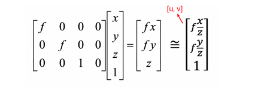

#### Orthographic projection

### 3 Photometric image formation

#### Shutter speed

Shutter speed controls exposure time. The pixel value is equal to the integral of the light intensity within the exposure time.

#### Rolling shutter effect

Exposing the image line by line.

#### Color spaces

- RGB 
- HSV (Hue / Value / Saturation)

#### Color Sensing: Bayer filter

## Lec 3 Image processing

### 1 Image processing basics

#### Convolution 

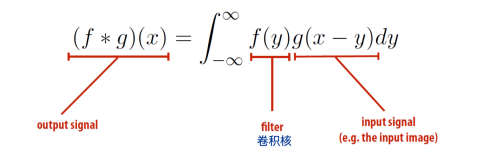

#### 2D convolution 

#### Discrete 2D convolution 

This can also be the same with the vector/matrix dot product.

#### Padding 

Adding pixels around the image border.

#### Blur 

box滤波：卷积核全为1

高斯滤波：特定函数

#### Sharpen 

Sharpening is adding high frequencies. 

- Let be the original image. 
- High frequencies in image is J-blur(I), blur(I) is the low frequencied in image. 
- Sharpened image is I+(I-blur(I)).

#### Gradient detection filter 

#### Bilateral filter

### 2 Image sampling

> Change image size / resolution. resolution: pixel / inch

#### Reducing image size 

降采样，去掉旁边的像素或者取均值

#### Aliasing 

Aliasing - artifacts due to sampling 

Signals are changing too fast but sampled too slow.

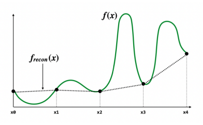

#### Anti-aliasing 

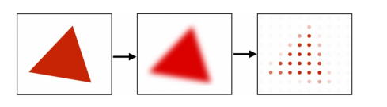

How to do anti-aliasing 

- Convolve the image with low-pass filters (e.g. Gaussian). 
- Sample it with a Nyquist rate.

#### Fourier Transform

Represent a function as a weighted sum of sines and cosines.

### 3 Image magnification

#### Interpolation 

- Nearest-neighbor interpolation 

- Linear interpolation 

- Cubic spline interpolation (Polynomial interpolation) 

  Each interval of function has different parameters

- Bilinear Interpolation (2D) Bilinear Interpolation is good enough.

#### Seam Carving

A method to change aspect ratio. 

Find connected path of pixels from top to bottom of which the edge energy is minimal, removing unnoticeable pixels.

Algorithm: DP

## Lec 4 Model Fitting and Optimization

> 本讲与数值分析课程高度重合

### 1 Optimization

> minimize f~0~(x)

#### Model fitting

Mean Square Error (MSE)

### 2 Numerical methods

Find a solution path: F (x~0~) > F (x~1~) > … > F (x~k~) > …

与数值分析课上内容类似，泰勒展开，进行迭代，做一阶、二阶近似

#### 梯度下降法：迭代法的一种

#### Newton method：见数值分析课程

#### 高斯-牛顿迭代

### 3 Robust estimation

Use other loss functions to replace MSE，去掉影响很大的噪点

#### Random Sample Concensus (RANSAC)

Key ideas 

- The distribution of inliers is similar  while outliers differ a lot 
- Use data point pairs to vote

###  4 Interpolation

> 具体请参考数值分析

线性插值

三次样条插值

### 5 Graphcut

#### Images as Graphs

A vertex for each pixel, an edge between each pair, each edge is weighted by the affinity or similarity between its two vertices.

#### Normalized cut

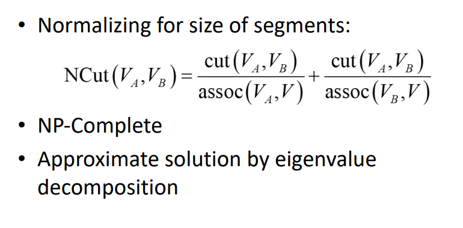

#### Markov Random Field (MRF)

马尔科夫随机场，没看懂

## Lec 5 Image Matching and Motion Estimation

### 1 Image matching

> Finding point-to-point correspondences between two images.

#### Steps

- Detection: Identify the interest points (key points). 
- Description: Extract vector feature descriptor surrounding each interest point. 
- Matching: Determine correspondence between descriptors in two views.

#### detection

Principal Component Analysis (PCA)

角点检测

- Compute the covariance matrix at each point

  

- Compute eigenvalues

  

- Classify points using eigenvalues of H:

  

#### Blob detector

Blobs are have large second derivatives in image intensity.

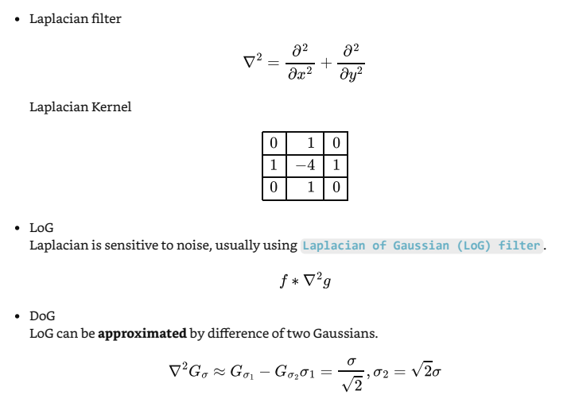

#### Description

SIFT descriptor：Scale Invariant Feature Transform descriptor, use histogram of oriented gradients.

SIFT Algorithm

- Run DoG detector to find maximum in location/scale space.
- Find dominate orientation and normalize the orientation.
- For each (x, y, scale, orientation), create the only descriptor.

#### Matching

Define the difference between two features f1 , f2, distance L2 = ||f1 − f2 ||

### 2 Motion estimation

#### Problem

Both feature matching and motion estimation are called correspondence problems.

特征追踪：

Extract feature (interest) points and "track" them over multiple frames. 

Output: displacement of sparse points

光流法：

Recover image motion at each pixel 

Output: dense displacement field (optical flow filed)

#### Lucas-Kanade Method

Key assumptions：

- Small motion: points do not move very far 
- Brightness constancy: same point looks the same(in brightness) in every frame 
- Spatial coherence: points move like their neighbors

本讲小总结：

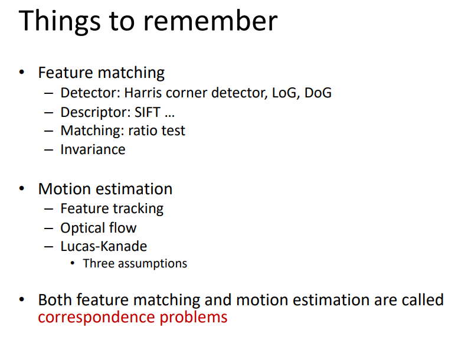

## Lec 6 Image stitching

### 1 Image Warping

Change shape of image

#### Linear Transformmation

Linear map = Matrices

#### Affine Transformation

Affine map = linear map + translation

Using homogenous coordinates

- 6 unknowns in equations 

- 2 equations for each match 

- we need at least 3 matches to solve a affine transformation 

- for n matches, solve with least squares

  

The result of solution must be remembered. 

the last row with matrix must be [0 0 1]

#### Projective Transformation (Homography)

- 8 unknowns in equations 

- Homography matrix is up to scale (can be multiplied by a scalar), which means the degree of freedom is 8 . 

- 2 equations for each match 

- we need at least 4 matches to solve the homography 

- for n matches, solve with ||h|| = 1

  h = eigenvector of A^T^A with smallest eigenvalue

#### DoF

- Translation: The degree of freedom is 2 
- Affine: The degree of freedom is 6 
- Projective: The degree of freedom is 8

#### Forward Warping

#### Inverse Warping

if pixel lands between pixels, we interpolate color values from neighboring pixels.

- nearest neighbor 
- bilinear (usually this method is enough) 
- bicubic

### 2 Image Stitching

Algorithm:

- Input images 
- Feature matching 
- Compute transformation matrix with RANSAC 
- Fix image 1 and warp image 2

Cylindrical projection:

## Lec 7 Structure from Motion

> Target: recover camera poses and 3D structure of a scene from its images

### 1 Camera calibration

#### 图像处理

参考文献：[图像处理——相机标定](https://blog.csdn.net/fengye2two/article/details/80686409/)

> 世界坐标系（world coordinate）(*xw,yw,zw*)，也称为测量坐标系，是一个三维直角坐标系，以其为基准可以描述相机和待测物体的空间位置。世界坐标系的位置可以根据实际情况自由确定。世界坐标系的最小单位为mm。

> 相机坐标系（camera coordinate）(*xc,yc,zc*)，也是一个三维直角坐标系，原点位于镜头光心处，xc、yc轴分别与像面的两边平行，zc轴为镜头光轴，与像平面垂直。相机坐标系的最小单位为mm。

>图像坐标系（image coordinate）(*x*,*y*)，是像平面上的二维直角坐标系。图像坐标系的原点为镜头光轴与像平面的交点（也称主点，principal point），它的x轴与相机坐标系的xc轴平行，它的y轴与相机坐标系的yc轴平行。图像坐标系的最小单位为mm。

>像素坐标系（pixel coordinate）(u,v)，是图像处理工作中常用的二维直角坐标系，反映了相机CCD/CMOS芯片中像素的排列情况。它的原点位于图像左上角，横坐标u表示像素所在的列，纵坐标v表示像素所在的行。像素坐标系与图像坐标系可以简单理解为平移关系，它们同处于像平面。像素坐标系的x轴与图像坐标系的u轴平行，像素坐标系的y轴与图像坐标系的v轴平行。像素坐标系的最小单位为像素。

变换过程：

世界=》相机=》图像=》像素

so, it is similar to lab2.

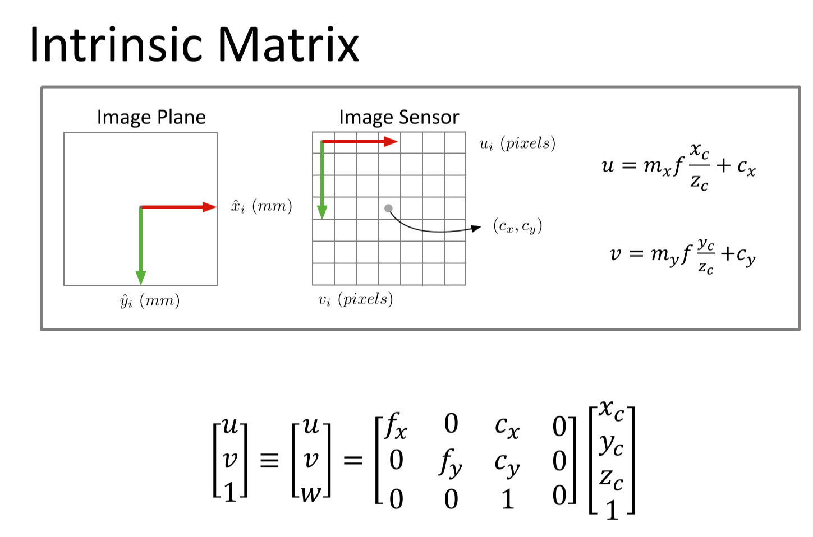

世界直接转换为像素：

解方程时：

- 找特征点，建立方程求解未知数$p$

> 具体查看参考文献和课程PPT

#### PnP问题

参考文献：[PnP问题各种算法总结分析](https://zhuanlan.zhihu.com/p/399140251)

> 问题描述：已知n个3D点的坐标(相对世界坐标系)以及这些点的像素坐标时，如何估计相机的位姿

##### Direct Linear Transform (DLT)

前面我们通过解方程的形式解出了这个方程，这种方法就叫做DLT。

##### P3P

至少三个对应关系可以解出相机坐标，还需要一个对应关系使这个解是特解。

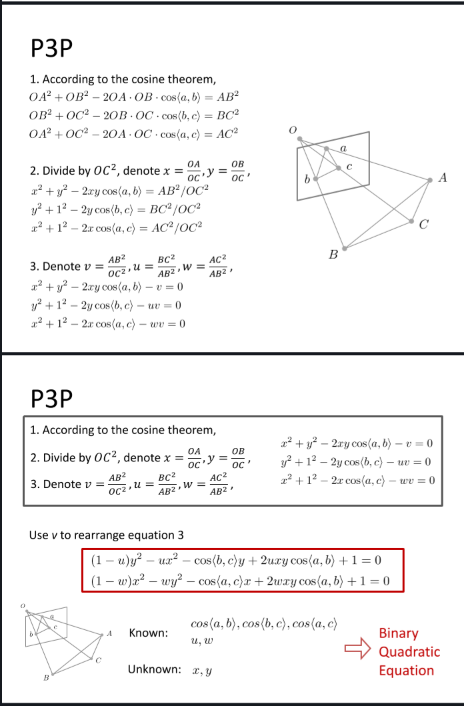

##### EPnP

Main steps: 

1. Represent each point as the linear combination of 4 control points c~i~. 
2. Construct a linear system in the control-point coordinate.

3. Solve the equation.

### 2 Two-frame structure from motion

1. Assume Camera Matrix 𝐾 is known for each camera 
2. Find a few Reliable Corresponding Points
3. Find Relative Camera Position 𝐭 and Orientation 𝑅
4. Find 3D position of scene points

详细讲解：[对极几何--知乎](https://zhuanlan.zhihu.com/p/472205819)

​					[对极几何--github](https://xhy3054.github.io/epipolar-geometry/)

### 3 Multi-frame structure from motion

1. Initialize camera motion and scene structure 
2. For each additional view - Determine projection matrix of new camera using all the
    known 3D points that are visible in its image - Refine and extend structure: compute new 3D points, reoptimize existing points that are also seen by this camera
3. Refine structure and motion: Bundle Adjustment

### 4 A modern SfM system: COLMAP

> sfM: Structure-from-Motion
>
> MVS: Multi-View Stereo

## Lec 8 Depth estimation and 3D reconstruction

### 1 Depth estimation

#### 1.1 Introduction

​	深度传感器顾名思义是用来探测环境物体与传感器之间的距离的。它的输出主要可以表示为深度图(depth map)和点云(point cloud)这两种形式。

​	深度图像（depth image)也被称为距离影像（range image），是指将从图像采集器到场景中各点的距离（深度）作为像素值的图像，它直接反映了景物可见表面的几何形状。深度图像经过坐标转换可以计算为点云数据，有规则及必要信息的点云数据也可以反算为深度图像数据。
深度数据流所提供的图像帧中，每一个像素点代表的是在深度感应器的视野中，该特定的（x, y）坐标处物体到离摄像头平面最近的物体到该平面的距离（以毫米为单位）。

- 被动测距传感(Passive depth sensing)

> 被动测距传感=两个相隔一定距离的相机获得两幅图像+立体匹配+三角原理计算视差（disparity）

​		两个相隔一定距离的摄像机同时获取同一场景的两幅图像，通过立体匹配算法找到两幅图像中对应的像素点，随后根据三角原理计算出视差信息，而视差信息通过转换可用于表征场景中物体的深度信息。基于立体匹配算法，还可通过拍摄同一场景下不同角度的一组图像来获得该场景的深度图像。除此之外，场景深度信息还可以通过对图像的光度特征、明暗特征等特征进行分析间接估算得到。

- 主动测距传感(Active depth sensing)

​		主动测距传感相比较于被动测距传感最明显的特征是：设备本身需要发射能量来完成深度信息的采集。这也就保证了深度图像的获取独立于彩色图像的获取。近年来，主动深度传感在市面上的应用愈加丰富。主动深度传感的方法主要包括了TOF（Time of Flight）、结构光、激光扫描等。

#### 1.2 Stereo matching

> 参考资料[3D视觉之立体匹配](https://zhuanlan.zhihu.com/p/161276985)
>
> [立体匹配算法](https://blog.csdn.net/Android_WPF/article/details/126434543)

最简单的算法：

- For each pixel in the first image 
  - Find corresponding epipolar line in the right image
  - Search along epipolar line and pick the best match
- Simplest case: epipolar lines are horizontal scanlines

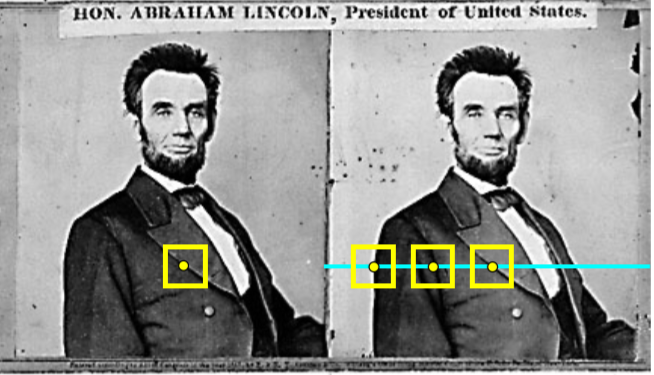

这样就找到了两个相同的点，然后计算深度。

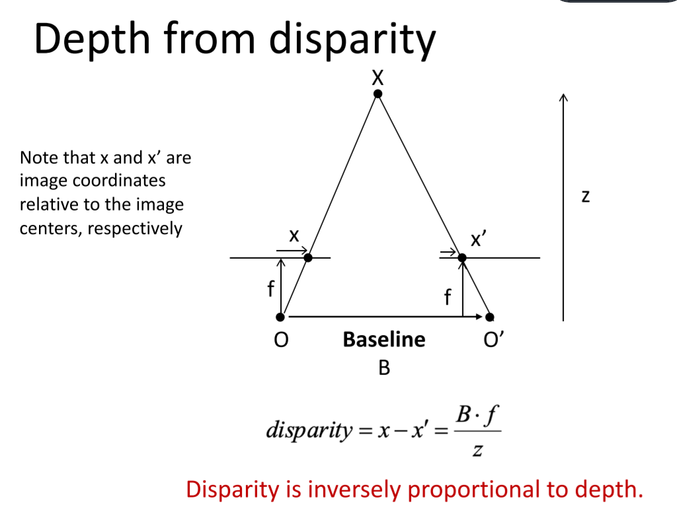

如果视角不在同一水平线上，就先把他们转到同一水平线。

Stereo as energy minimization：让当前像素的代价聚合过程受多个方向(或路径)上所有像素的影响，方向越多参与影响当前像素的邻域像素就越多

动态规划：

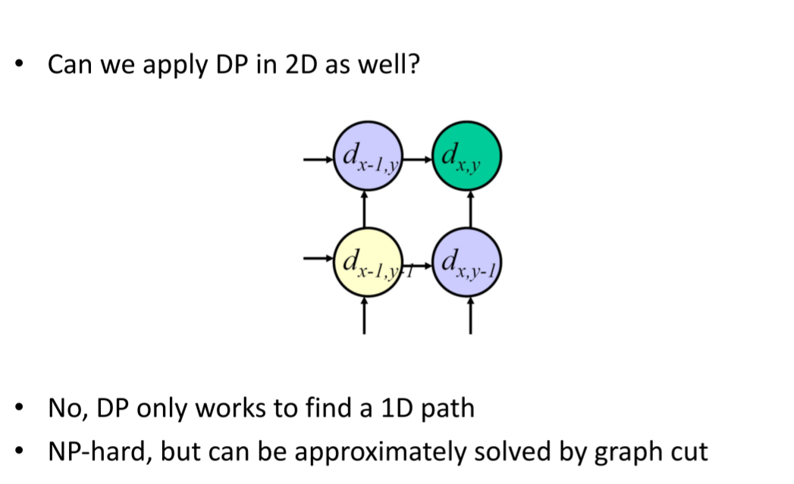

Choosing the stereo baseline：

- Too small: large depth error 
- Too large: difficult search problem

#### 1.3 Multi-view stereo

Plane-Sweep: [平面扫描算法](https://blog.csdn.net/xuangenihao/article/details/81392684)

PatchMatch: [PatchMatch](PatchMatch)

1. Initialize pixels with random patch offsets
2. Check if neighbors have better patch offsets
3. Search in concentric radius around the current offset for better better patch offsets
4. Go to Step 2 until converge.

### 2 3D reconstruction

#### 2.1 3D representations

- 点云

- mesh 用G(E, V)表示

- voxel

  

- SDF(Signed Distance Function)

  - The distance of a point to the shape boundary
  - The distance is defined by a metric, usually the Euclidean distance

  Truncated Signed Distance Function (TSDF): Truncation SDF’s distance value to [−1, 1]

#### 2.2 3D surface reconstruction

[KinectFusion](https://blog.csdn.net/qinqinxiansheng/article/details/119449196)

**[泊松重建](https://www.jianshu.com/p/8641e0db0367)**

[**Marching Cubes算法**](https://blog.csdn.net/weixin_38060850/article/details/109143025)

视频介绍Marching Cubes算法: 

<iframe src="//player.bilibili.com/player.html?aid=79262663&bvid=BV1yJ411r73v&cid=135644481&page=1" scrolling="no" border="0" frameborder="no" framespacing="0" allowfullscreen="true"> </iframe>

[Marching Squares](https://blog.csdn.net/whuawell/article/details/74998280) 基本和Marching cubes 类似。

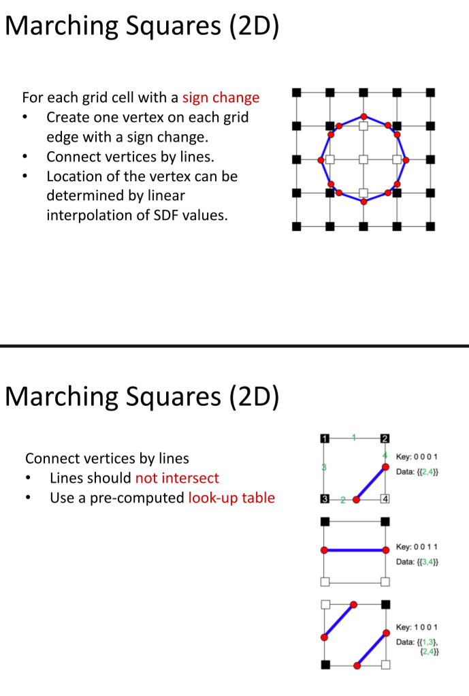

**[COLMAP](https://blog.csdn.net/jiankangyq/article/details/121808174)**: 一种通用的运动结构 (SfM) 和多视图立体 (MVS) 管道。

#### 2.3 Texture mapping

> Surface lives in 3D world space
>
> Every 3D surface point also has a place where it goes in the 2D image (texture).

[纹理映射(Texture mapping)](https://zhuanlan.zhihu.com/p/364045620)

## Lec 9 Deep Learning

### 1 Machine learning

> 传统程序是给电脑输入和程序，电脑给出输出。
>
> 机器学习是给电脑输入和输出，电脑给出程序。

#### 概念

- Model: $x$和$y$之间关系的数学表示

- Supervised learning(监督学习): 可以由训练资料中学到或建立一个模式（函数/learning model），并且依次模式推测出新的实例。

  labeled data: exisitng (x,y) pairs, called training data.

- 机器学习的两个阶段：

  - 训练(Training)
  - 测试(Testing)

### 2 Linear classifier

#### CLassification model

> 输入是一张图片
>
> 输出是每个分类的对应分数

有两部分组成：

- 评分函数
- 损失函数

#### Linear classifier

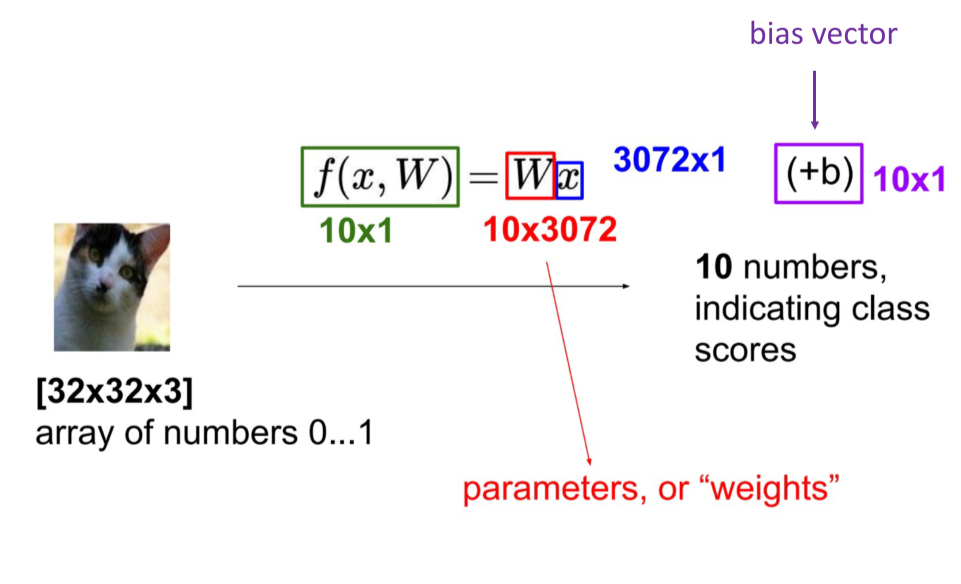

将一张照片里面的所有像素变成一个向量。

$f(x_i,W,b) = Wx_i + b$

参数**W**被称为**权重（weights）**，**b**被称为**偏差向量（bias vector）**。

- 首先，一个单独的矩阵乘法$Wx_i$就高效地并行评估10个不同的分类器（每个分类器针对一个分类），其中每个类的分类器就是W的一个行向量。
- 训练数据用来学习$W$和$b$
- 一张图像可看做高维空间的一个点，每个分类就是把这些点划分成若干个区域。

#### Loss function

> 判断一个权重矩阵是否足够好

> 回归问题使用均方误差(MSE)
>
> 分类问题使用交叉熵(Cross Entropy Loss)
>
> 参考资料：[简单谈谈Cross Entropy Loss](https://blog.csdn.net/xg123321123/article/details/80781611)

Softmax: 把K个实值转换为另外K个实值并使K个实值之和为1的函数。

### 3 Neural networks

> 参考资料：[激活函数（Activation Function）](https://blog.csdn.net/weixin_39910711/article/details/114849349)

​	**激活函数**：不使用激活函数的话，神经网络的每层都只是做**线性变换**，多层输入叠加后也还是线性变换。因为线性模型的表达能力通常不够，所以这时候就体现了激活函数的作用了，激活函数可以引入**非线性因素**。

​	在神经网络每一层神经元做完线性变换后，加上一个非线性激励函数对线性变换的结果进行转换，输出就可以变成一个非线性的函数。

**多层感知器**

**全连接神经网络**

### 4 Convolutional neural networks--卷积神经网络

> 参考资料：[卷积神经网络超详细介绍](https://blog.csdn.net/jiaoyangwm/article/details/80011656/)

#### Convolution = local connectivity + weight sharing

> 两者的关键作用就是减少参数数量，使运算变得简洁、高效，能够在超大规模数据集上运算

local connectivity(局部连接): 对于局部连接而言：层间神经只有局部范围内的连接，在这个范围内采用全连接的方式，超过这个范围的神经元则没有连接；连接与连接之间独立参数，相比于去全连接减少了感受域外的连接，有效减少参数规模。

weight sharing(权值共享): 从图像局部学习到的信息应用到图像的其他部位去。权值共享意味着每一个过滤器在遍历整个图像的时候，过滤器的参数(即过滤器的参数的值)是固定不变的

参考：[weight sharing](https://blog.csdn.net/malvas/article/details/86647781)

#### 感受野(Receptive fields)

- 若目标相对感受野过小，那训练参数只有少部分是对应于训练目标的，则在测试环节，也很难检测出类似的目标；
- 若目标相对感受野过大，那训练的参数都是对应于整个对象的局部信息，是不够利于检测小目标的。

#### 池化层(Pooling layer)

#### 总体框架

### 5 Training neural networks

#### 梯度下降训练CNN

#### 反向传播

> 参考：[反向传播-cs231n](https://zhuanlan.zhihu.com/p/21407711?refer=intelligentunit)

1. Forward data through the network, get loss
2. Backprop to calculate the gradients
3. Update the parameters using the gradient
4. Go to step 1 if not converged

#### 随机梯度下降法(SGD)

> 参考：[随机梯度下降详解](https://blog.csdn.net/weixin_41803874/article/details/114016587)

仅计算一批随机采样图像上的损失和梯度。

#### 超参数(hyper-parameters)

算法运行前需要决定的参数。

选择依据：

1. Train for original model
2. Validate to find hyperparameters
3. Test to understand generalizability

#### 过拟合(overfitting)

把噪音点也拟合上了，过分依赖数据集。

防止：

1. Cross validation(验证) and early stop

2. Regularization(正则化) or dropout

   **正则化**：在损失函数中给每个参数 w 加上权重，引入模型复杂度指标，从而抑制模型噪声，减小过拟合。 

   **dropout**：在前向传播的时候，让某个神经元的激活值以一定的概率p停止工作，这样可以使模型泛化性更强，因为它不会太依赖某些局部的特征

3. Data augmentation(数据增强)

   > 参考：[数据增强(Data Augmentation)](https://zhuanlan.zhihu.com/p/41679153)

   ​	为了获得更多的数据，我们只要对现有的数据集进行微小的改变。比如旋转（flips）、移位（translations）、旋转（rotations）等微小的改变。我们的网络会认为这是不同的图片。

#### 批标准化(Batch Normalization)

> 参考[深入理解BN](https://www.cnblogs.com/guoyaohua/p/8724433.html)

​	目的：Reduce internal covariate shift([内部协变量偏移](https://zhuanlan.zhihu.com/p/480425962))

​	神经网络的深度增加，每层特征值分布会逐渐的向激活函数的输出区间的上下两端（激活函数饱和区间）靠近，这样继续下去就会导致梯度消失。BN就是通过方法将**该层特征值分布重新拉回标准正态分布**，特征值将落在激活函数对于输入较为敏感的区间，输入的小变化可导致损失函数较大的变化，使得梯度变大，避免梯度消失，同时也可加快收敛。

​	训练时的使用方法：对每个隐层加上一层BN。

### 6 Network architectures

> 以前发展不好：
>
> - 数据集过小导致过拟合
> - 计算能力不够

[AlexNet](https://blog.csdn.net/qq_42076902/article/details/123864381)

[ResNet](https://blog.csdn.net/qq_45649076/article/details/120494328)

[DenseNet](https://blog.csdn.net/qq_44766883/article/details/112011420)：互相连接所有的层

[MobileNets](https://blog.csdn.net/qq_47233366/article/details/123029998)

[Neural Architecture Search](https://blog.csdn.net/fengmaomao1991/article/details/121247163)(神经架构搜索)

## Lec 10 Recognition

### 1 Semantic segmentation(语义分割)

> 在图像领域，语义指的是图像的内容，对图片意思的理解，比如左图的语义就是三个人骑着三辆自行车；分割的意思是从像素的角度分割出图片中的不同对象，对原图中的每个像素都进行标注。

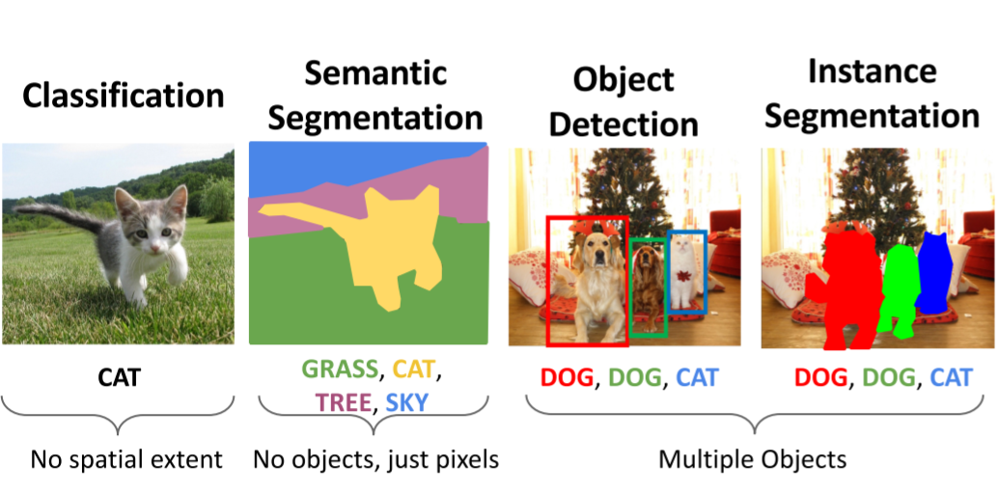

#### 名词解释

滑动窗口：时间复杂度高，有限的感受野。

全连接卷积网络：一次做出预测，损失函数是每个像素的交叉熵。

Unpolling：一种上采样方法，有很多种具体案例。

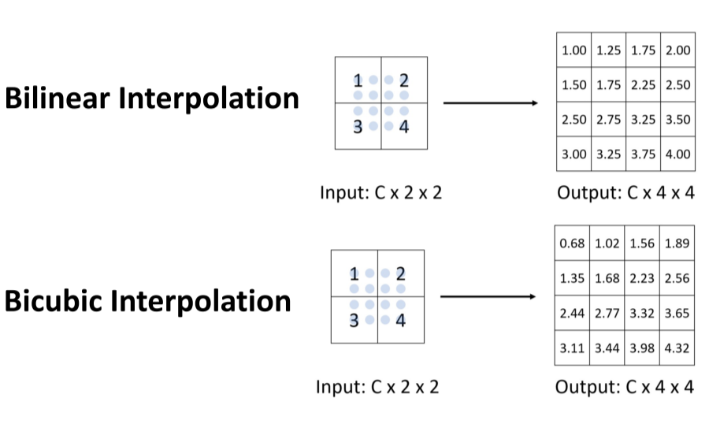

#### U-Net

Skip Connection: 跳过中间连接，使深层和浅层连接起来。

#### DeepLab

> 参考: [图像语义分割之FCN和CRF](https://blog.csdn.net/weixin_42137700/article/details/81835354)

图像语义分割步骤：

- FCN - 全卷积网络
- CRF - 条件随机场(Conditional random field)
- MRF - 马尔科夫随机场

#### 评估指标

Per-pixel Intersection-over-union

### 2 Object detection(目标检测)

> 输入：一张RGB图片
>
> 输出：表示对象的一组边界框(类别标签、框的位置，框的大小)

#### 单个物体检测

#### 多个物体检测

一张照片经过各种不同的神经网络，得出结果。

#### 滑动窗口

Apply a CNN to many different crops of the image, CNN classifies each crop as object or background.

一张图片可以被拆分成很多boxes，我们不能检测所有这些图片。

#### Region proposals(候选区域)

用图像分割算法先分割图像，然后再进行目标检测。

#### R-CNN

1. 选建议框并调整尺寸
2. 对每个类别使用SVM分类器进行打分
3. 进行筛选
4. 损失函数：$loU=\frac {Area Of Overlap}{Area Of Union}$

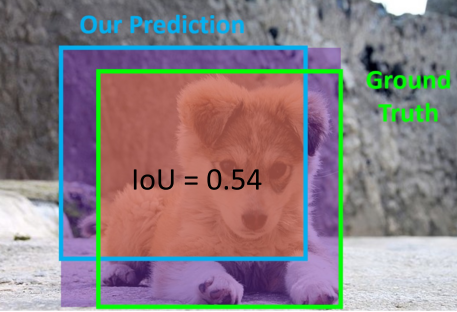

Mean Average Precision (mAP)：

1. Run object detector on all test images 
2. For each category, compute Average Precision (AP) = area under Precision vs Recall Curve 

   1. For each detection (highest score to lowest score) 

      1. If it matches some GT box with IoU > 0.5, mark it as positive and eliminate the GT

      2. Otherwise mark it as negative 

      3. Plot a point on PR Curve
   2. Average Precision (AP) = area under PR curve
3. Mean Average Precision (mAP) = average of AP for each category
4. For “COCO mAP”: Compute mAP@thresh for each IoU threshold (0.5, 0.55, 0.6, …, 0.95) and take average

非最大抑制(Non-Max Suppression):

1. Select the highest-scoring box 
2. Eliminate lower-scoring boxes with IoU > threshold 
3. If any boxes remain, goto 1

#### Fast R-CNN:

A two-stage object detector

- First stage: run once per image
  - Backbone network
  - RPN
- Second stage: run once per region
  - Crop features: RoI pool / align
  - Predict object class
  - Predict bbox offset

#### Rol Pool

[R-CNN中的ROIPool、ROIAlign](https://blog.csdn.net/qq_41021141/article/details/120617660)

#### RPN

> 参考：[详解RPN网络](https://blog.csdn.net/weixin_42912710/article/details/119872716)
>
> RPN（Region Proposal Network）是Faster-RCNN网络用于提取预选框（也就是RCNN中使用selective search算法进行Region Proposal的部分），R-CNN及Fast-RCNN中一个性能瓶颈就是提取预选框的部分，而RPN很好地对这个部分进行了优化，原因在于它将卷积神经网络引入了进来，使用特征提取的形式生成出预选框的位置从而降低了selective search算法带来的计算时间上的开销。

​	假设我们有一张大小为600×800的图像，在通过卷积神经网络（CNN）块后，这幅输入图像缩小为38×56的特征图，特征图的每个位置都有9个锚点盒。那么我们就有38 * 56 * 9=1192个建议或锚箱需要考虑。而每个锚箱都有两个可能的标签（前景或背景）。如果我们把特征图的深度定为18（9个锚点x 2个标签），我们将使每个锚点都有一个有两个值的向量（通常称为预测值），代表前景和背景。如果我们将预测值送入softmax/logistic回归激活函数，它将预测标签。

### 3 Instance segmentation(实例分割)

1. 语义分割的话只需要分出不同类就行，同类的不同个体不需要分，但是Instance Segmentation这里在语义分割的基础上又把不同的类进行了分割
2. 目标检测后，需要对检测的部分做进一步的语义分割

[Mask R-CNN](https://blog.csdn.net/qq_37392244/article/details/88844681):

在Faster R-CNN的基础上添加了一个预测分割mask的分支，如下图所示。其中黑色部分为原来的Faster-RCNN，红色部分为在Faster-RCNN网络上的修改。将RoI Pooling 层替换成了RoIAlign层；添加了并列的FCN层（mask层）。

> DeepSnake: 通过深度学习给出输入初始轮廓顶点需要调整的偏移量，以得到更为准确的实例分割结果。

Panoptic segmentation: 对每一个像素都分出类别

### 4 Human pose estimation(人体姿态估计)

> 通过定位一组关键点来表示人的姿势

单人：Represent joint location as the heatmap(现在把关键点用热力图(heat map)表示，不需要全连接层，加速算法减少参数量。对于每一个关键点输出一张heat map)

多人：

- Top-down(准确)：把多人转成单人，图像分割
- Bottom-up(快)：先检测出图中所有人的所有关键点，再对关键点进行分组，进而组装成多个人

> [人体姿态估计(Human Pose Estimation)经典方法整理](https://zhuanlan.zhihu.com/p/104917833)

### 5 Optical flow(光流)

> 参考：[计算机视觉--光流法(optical flow)简介](https://blog.csdn.net/qq_41368247/article/details/82562165)
>
> 光流(optical flow)是空间运动物体在观察成像平面上的像素运动的瞬时速度。在时间间隔很小（比如视频的连续前后两帧之间）时，也等同于目标点的位移。

#### 光流场：

​	光流场是一个二维矢量场，它反映了图像上每一点灰度的变化趋势，可看成是带有灰度的像素点在图像平面上运动而产生的瞬时速度场。它包含的信息即是各像点的瞬时运动速度矢量信息。

​	研究光流场的目的就是为了从序列图像中近似计算不能直接得到的运动场。光流场在理想情况下，光流场对应于运动场。

#### FlowNet

两部分：缩小和放大

- 缩小(卷积)部分
  1. 第一种缩小(卷积)方案是最朴素的方法的，就是将这一对图片的通道concat起来
  2. 第二中方案是这一对图片分开处理，分别进入卷积网路，得到各自的特征图，然后再找到它们特征图之间的联系。

- 放大部分

  一边向后unconv，一边直接在小的特征图上预测，然后把结果双线性插值然后concat在unconv后的特征图上，然后接着往后传，重复四次后，得到的预测光流分辨率依然是输入的1/4，再重复之前的操作已没有太多提升，所以可以直接双线性插值得到和输入相同分辨率的光流预测图。

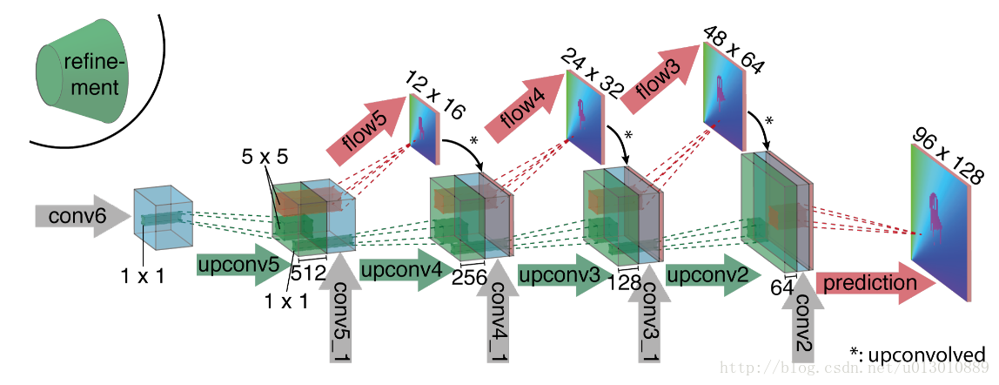

### 6 Other tasks

Video classification: Use 3D CNN

Temporal action localization: Generate proposals then classify

Multi-object tracking

## Lec 11  3D Deep Learning

### 1 Feature matching

#### Super Polint: 用于提取特征点

- CNN-based detectors: Representing feature point locations by heatmaps

  

- CNN-based descriptors: Extract descriptors from CNN feature maps(每一张图都是一层神经网络下的特征图，取所有图中对应的点做一个向量)

  

#### SuperGlue: 现在最好的检测方法

### 2 Object Pose Estimation

Estimate the 3D location and orientation (位置和方向) of an object  realtive to the camera frame.

Before that, we need to define the geometry center of the object.

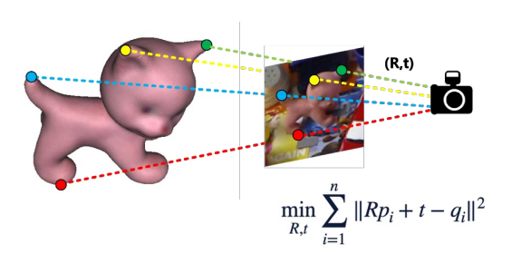

1. Find 3D-2D correspondences
2. Solve R and t by perspective-n-point (PnP) algorithm
3. Find 2D-3D correspondences: detecting keyponts using CNNs

### 3 Human Pose Estimation

#### Markerless MoCap: 相机照射关键点，标记物在人身体上，Markless就是不用贴标记物

#### Monocular 3D Human Pose Estimation: 参数化人体模型

Estimating 3D human pose using a single camera

Using networks to regress joint locations

### 4 Depth Estimation

> Multiview Depth Estimation: Reconstruct the dense 3D shape from a set of images and camera parameters

Learned multi-view stereo

Cost volume is a 3D array that stores the errors of all pixels at all depths

### 5 Single Image to 3D

• Depth • Point Cloud • Mesh • Volume

#### Monoculer depth estimation

> Learning to guess depth from large-scale training data

#### Single-view shape estimation

除了点云，mesh等方法也可应用。

### 6 PointNet

把点云放进神经网络，以前的神经网络都是光栅化的

挑战1：点顺序不确定——最后再做pooling

挑战2：位置变化不确定——估计姿态

## Lec 12 Computational Photography I

### 1 High Dynamic Range Imaging (HDR)

#### Exposure:曝光

**Exposure = Gain(增益) x Irradiance(光线) x Time(时间)**

- Gain is controlled by the ISO 
- Irradiance is controlled by the aperture 
- Time is controlled by the shutter speed

####  Dynamic Range

The ratio between the largest and smallest values of a certain quantity.

#### HDR

亮的地方和暗的地方能同时拍清楚

实现方法：

- Exposure bracketing: Capture multiple LDR images at different exposures(一次拍很多张)
- Merging: Combine them into a single HDR image(然后合在一起)

#### Merge

#### Tone mapping

Display the HDR image (12-bit) on a SDR (standard dynamic range, 8-bit) device.

> Gamma compression

X → aX^γ^, applied independently on R, G, B intend to keep more details on each parts.

- γ < 1:  keep more datails on dart parts

- γ > 1: keep more datails on light parts

### 2 Deblurring

#### Reason

- Defocus: the subject is not in the depth of view
- Motion blur: moving subjects or unstable camera
- ……

#### Modeling Image Blur

The blurring process can be described by convolution. H is called blur kernel.

Deblurring = Deconvolution

- NBID: Non-blind image deconvolution, the blur kernel is known.
- BID: Blind image deconvolution, the blur kernel is also unknown.

#### NBID

- G: The captured image (known) 
- F: Image to be solved (unknown) 
- H: Blur kernel (known)

Inverse Filter: will also amplify noise

Wiener Filter: Suppress high frequency when reverse filtering

Deconvolution by optimization

Deconvolution is ill-posed, these are several sets of solutions have the same MSE.

Objective function = likelihood function + regular term

#### BID

Blur kernel is non-negative and sparse.

Optimized objective function:

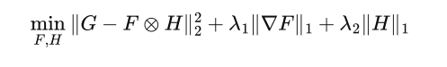

### 3 Colorization(黑白变彩色)

#### Sample-based colorization

把一张照片上的颜色迁移到另一张照片，主要任务是像素匹配

#### Interactive colorization

给出线条大致的颜色(user-guided)

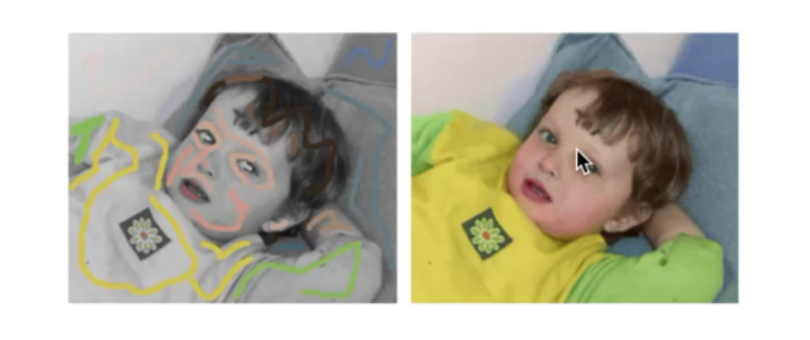

Constraint: User-specified colors of brushed pixels keep unchanged

#### Generative Adversarial Network (GAN)

D can be viewed as a loss function to train G：

- Called adversarial loss 
- Learned instead of being hand-designed 
- Can be applied to any image synthesis tasks

### 4 Super Resolution

Super Resolution using GAN

## Lec 13 Computational Photography II

### 1 Image-based Rendering

Rendering: from 3D models to images

Image-based: 基于照片进行渲染

#### Light Fields

The plenoptic function (7D) depicts light rays passing through.

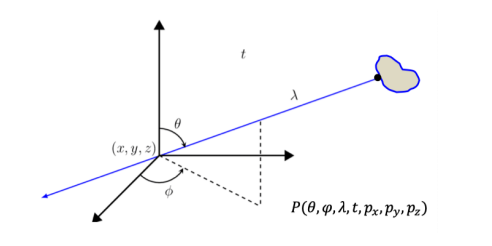

#### Multi-Plane Image (MPI)

A set of front-parallel planes at a fixed range of depths.

Each plane encodes an RGB color image and an alpha/transparency map α~d~.

#### NeRF

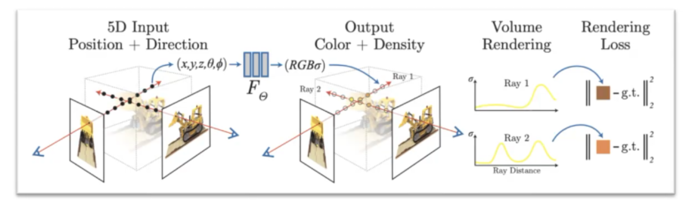

### 2 Neural Rendering

#### Pose Transfer & Garment Transfer

> Input: Image(s) of a person
>
> Output: Synthesised images of the persion in different poses (Pose Transfer),  or with different clothing (Garment Transfer).

Method:

- Use parametric mesh (SMPL) to represent body pose and shape 
- Use high-dimensional UV texture map to encode appearance 
- Transfer the pose and appearance
