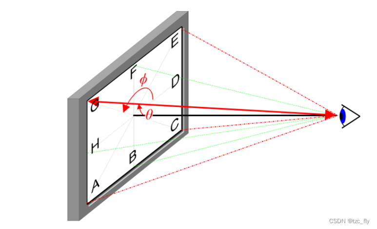
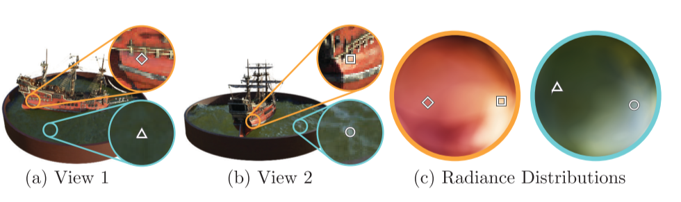

第一次阅读计算机视觉相关领域论文。

<!--more-->

> 原文链接：[NeRF: Representing Scenes as Neural Radiance Fields for View Synthesis](https://arxiv.org/pdf/2003.08934.pdf)

> NeRF框架总体介绍、原理详解及相关技术(有一些前置知识介绍)：

<iframe src="//player.bilibili.com/player.html?aid=852328703&bvid=BV1fL4y1T7Ag&cid=550491381&page=1" scrolling="no" border="0" frameborder="no" framespacing="0" allowfullscreen="true"> </iframe>

> 其他相关介绍视频（本人并未观看）:
>
> [NeRF源码解析](https://www.bilibili.com/video/BV1d841187tn/)
>
> [NeRF系列公开课](https://www.bilibili.com/video/BV1d34y1n7fn/)

下面开始正式论文阅读记录：

# 0 Abstract

这个算法用全连接深度网络来表示场景。

- 输入：5D坐标（空间位置$x,y,z$和观察方向$θ，φ$）

  

- 输出：每个空间位置的体积密度(volume density)和视景发射辐射度(view-dependent emitted radiance)

# 1 Introduction

将静态场景表示为一个连续的5D函数，这个函数输出空间中每个点的颜色(radiance)和密度(可理解为不透明度)。

> 以上图为例，即先将输入的100张图片变成第二张图的样子，找到每个相机的位置，然后用体渲染技术沿光线累积这个场景表示的采样点信息，最后从新的视角渲染图像。

这个程序的运行流程是：

1. 沿相机光线查询5D坐标
2. 利用神经网络合成视图
3. 用体渲染技术输出颜色和密度，投影到图像中

此算法还优化了神经辐射场：

​	对于复杂场景，优化神经辐射场的表示并没有收敛到足够高的清晰度，并且在每个摄像机光线所需要的采样数方面效率低下。所以作者还使用了**位置编码**输入的坐标来解决这些问题。

​	位置编码能使MLP表示频率更高的函数。作者还提出了**分层采样过程**，用来减少需要的输入视图的个数。

总而言之，这个算法的技术贡献有：

- 将具有复杂几何和材质的连续场景表现为5D神经辐射场，参数化为基本MLP网络。
- 基于经典体渲染技术的可微分渲染过程，包括分层采样策略，用于将MLP的容量分配给场景中的可见内容。
- 将每个5D空间坐标映射到更高维度空间的位置编码，成功优化神经辐射场从而表示高频内容。

​	沿着相机的光线采样5D坐标(图a)，将这些信息输入$F_θ$生成颜色和密度(图b)，用体渲染技术合成2D图像(图c)。该渲染函数是可微的，因此我们可以通过最小化合成图像和GT观测图像之间的error来优化场景表示(图d)。

# 2 Related Work

​	回顾了一些这项工作所用到的技术和前人所做的努力。

## 2.1 Neural 3D shape representations

​	通过优化将$xyz$坐标映射到有符号距离函数的深层网络。但是该函数仅允许使用2D图像优化神经隐式形状表示，只能表示几何复杂度较低的简单形状。

## 2.2 View synthesis and image-based rendering

- mesh方法：基于图像重投影的基于梯度的mesh优化通常非常困难，在优化前需要提供具有固定拓扑的末班网络作为初始化。这不适用于无约束的现实世界场景。
- 体积方法：能表示更复杂的材料和形状并且适合基于梯度的优化，视觉干扰也更少，现有的方法时间空间复杂度更高。本文提出在MLP的参数中编码连续volume来规避这个问题，渲染质量更高，存储成本更小。

# 3 Neural Radiance Field Scene Representation

​	本文将连续场景表现为5D向量值函数。输入为5D坐标，输出为每个点的颜色$c=(r,g,b)$和空间密度$σ$。

​	在实际表现中，我们将视角方向表示为3D向量**$d$**，用MLP网络近似这种连续的5D场景表示。

​	我们通过让网络把体积密度预测为仅与位置$x$有关，来保证这种方法在不同视图下是一致的。

​	同时RGB颜色$c$预测为位置和观察方向的函数：

- MLP首先把3D坐标$x$通过8层全连接层(激活函数为ReLU，每层256通道)，输出体积密度$σ$和一个256维的特征向量。
- 将特征向量与相机光线的观察方向连接起来，传递到额外的一个全连接层(激活函数为ReLU，每层128通道)，该层输出与视图相关的RGB颜色。

​	显示来自两个相机位置的两个固定3D点的外观，预测这两个3D点镜面反射外观的变化并持续推广。

​	没有视图依赖性(只有x输入)训练的模型难以表示镜面反射，会导致过度平滑的外观。

# 4 Volume Rendering with Radiance Fields

> 体渲染：[体渲染(Volume Rendering)与光线投射(Ray Casting)算法详解](https://blog.csdn.net/Aaron9489/article/details/127899392?spm=1001.2101.3001.6650.1&utm_medium=distribute.pc_relevant.none-task-blog-2%7Edefault%7EAD_ESQUERY%7Eyljh-1-127899392-blog-107904447.pc_relevant_3mothn_strategy_and_data_recovery&depth_1-utm_source=distribute.pc_relevant.none-task-blog-2%7Edefault%7EAD_ESQUERY%7Eyljh-1-127899392-blog-107904447.pc_relevant_3mothn_strategy_and_data_recovery&utm_relevant_index=2)

> alpha合成：图像与背景结合，可以产生部分透明或全透明的视觉效果，透明度用(0,1)表示
>
> alpha混合：半透明的前景色和背景结合的过程，加权计算。
> $
> \left\{
> \begin{array}{**l}
> out_A & = & src_A + dst_A(1-src_A) \\
> out_{RGB} & = & \frac {(src_{RGB}src_A+dst_{RGB}dst_A(1-src_A))}{out_A} \\
> out_A=0 & => & out_{RGB}=0
> \end{array}
> \right.
>$

体密度即为光线在x处终止的概率，相机光线$r_{(t)}=o+td$的预期颜色为：

$C_{(r)}\int_{t_n}^{t_f} T_{(t)}σ(r_{(t)}c(r_{(t)})，d) dt, where: T_{(t)}=exp(-\int_{t_n}^{t} σ(r_{(s)}) ds)$

$T_{(t)}$表示沿光线从$t_n$到$t$传播而不撞击任何其他粒子的概率，这个$T$可以避免渲染时过度引入对象背面的信息。

我们使用数值估计这个连续积分。我们将$[t_n,t_f]$划分为$N$个均匀间隔的区域，然后从每个区域内均匀随机抽取一个采样点。

# 5 Optimizing a Neural Radiance Field

​	上一节中已经描述了将场景建模为神经辐射场和从该表示中渲染新视图所需的核心组件，但是仍然不能达到最高的质量。因此，需要引入两项改进：

- 输入坐标的位置编码，有助于MLP表示高频函数
- 分层采样过程，有效地对高频进行采样

## 5.1 位置编码(Positional encoding)

​	将F~θ~重新表示为两个函数的组合$F_θ=F_{θ}^{'}○γ$，γ是从$R$空间到$R^{2L}$空间的函数，实际上$F_{θ}^{'}$还是一个MLP。

​	在流行的Transformer架构中也使用了类似的映射，在这里它被称为位置编码。然而，Transformers将其用于一个不同的目标，即提供序列中token的离散位置，作为不包含任何顺序概念的架构的输入。相反，我们使用这些函数将连续输入坐标映射到更高维空间，以使我们的MLP更容易逼近更高频的函数。

## 5.2 分层体积采样(Hierarchical volume sampling)

​	渲染策略是在每个相机光线的N个查询点处密集评估神将辐射场网络，这种策略效率低下，所以本文提出了一中分层表示法，通过按最终渲染的预期效果按比例分配采样点提高渲染效率。

​	不使用单个神经网络来表示场景，而同时优化两个神经网络："course"和"fine"

1. 首先，使用基本的分层采样对一组N~c~个位置进行采样，评估这些位置对应的course网络。
2. 然后沿着每一条光线生成一个更合理的点采样，其中采样点偏向于体积存在的相关部分。
3. 为此，我们首先从course网络生成合成颜色，然后在光线上采样体密度大的点，采样N~f~个作为第二组采样点，在第一组和第二组采样的并集上计算"fine"网络，并计算最终的渲染颜色。

## 5.3 实现细节

​	我们为每个场景优化一个单独的神经连续体积表示网络。需要的参数有：RGB图像数据集、相应的相机外参和内参以及场景边界。在每次优化迭代中，我们从数据集中的所有像素集合中随机采样一批相机光线，然后按照$5.2$中的分层采样。最后的损失只是course和fine的渲染像素和真实像素颜色之间的平方误差。

​	其中，$R$为batch中的光线集，$C(r),C_{c}(r),C_{f}(r)$为GT，course网络预测，fine网络预测的RGB颜色。

# 6 Results

两种数据集：

- Synthetic renderings of objects
- Real images of complex scenes

> nerf-pytorch代码阅读笔记：[nerf-notes](https://github.com/lhmd/nerf-notes)
>
> 上手pytorch：[60分钟教你上手PyTorch + 迁移学习](https://blog.csdn.net/jiaowoshouzi/article/details/102002468?spm=1001.2101.3001.6661.1&utm_medium=distribute.pc_relevant_t0.none-task-blog-2%7Edefault%7ECTRLIST%7ERate-1-102002468-blog-123333042.pc_relevant_default&depth_1-utm_source=distribute.pc_relevant_t0.none-task-blog-2%7Edefault%7ECTRLIST%7ERate-1-102002468-blog-123333042.pc_relevant_default&utm_relevant_index=1)
