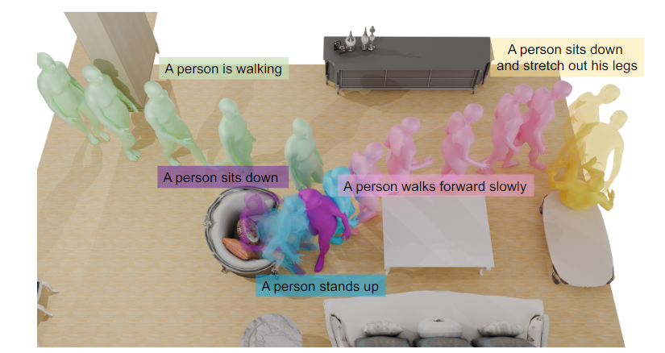
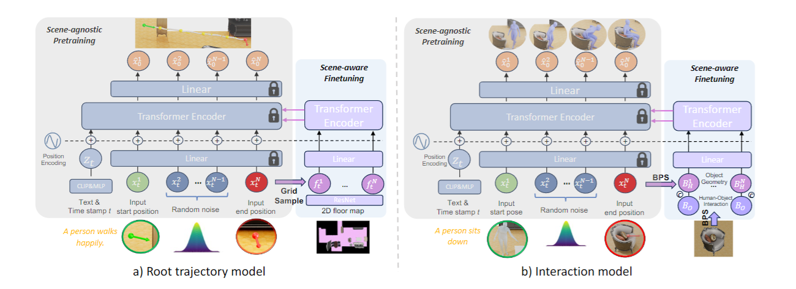
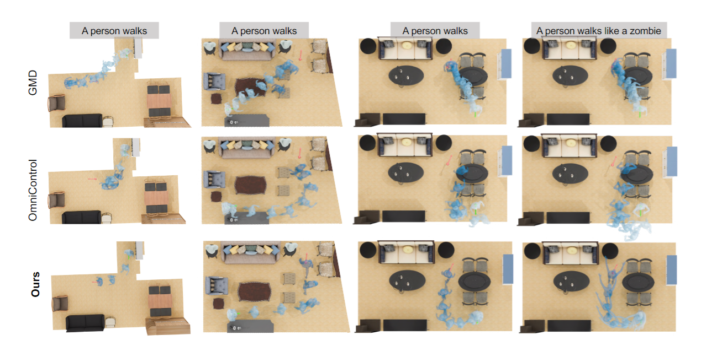
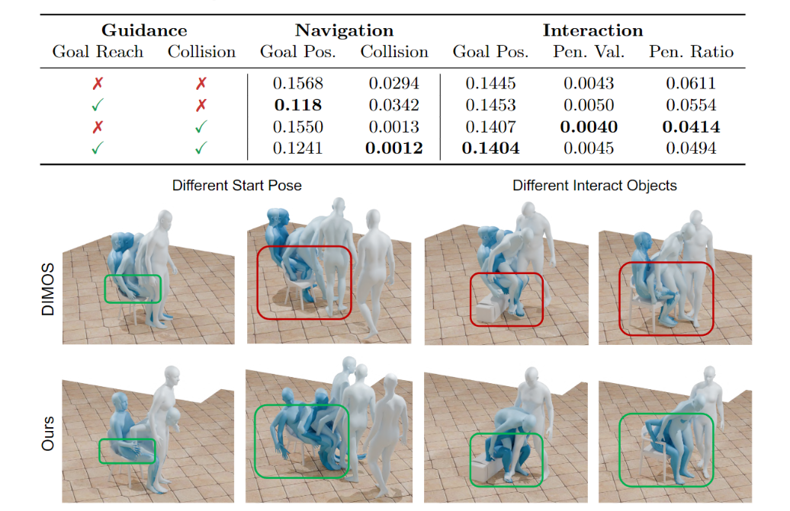
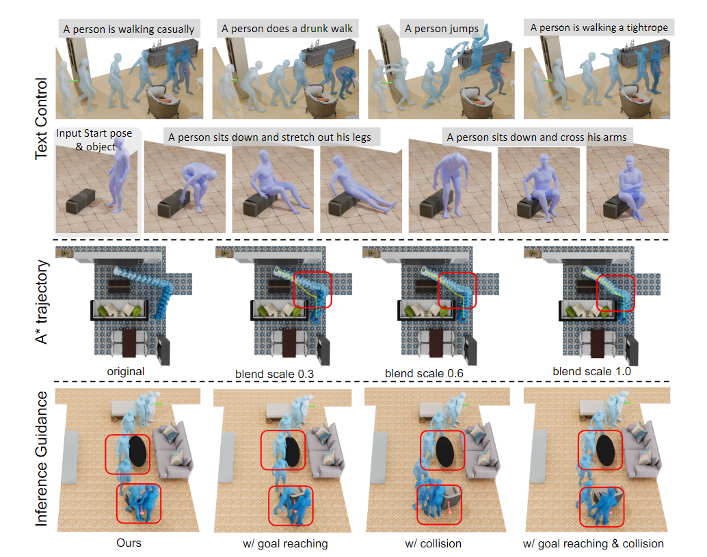

# Generating Human Interaction Motions in Scenes with Text Control

> 图 1：我们介绍的 TeSMo 是一种从文本输入生成多样化、可信的人与场景互动的方法。TeSMo 可根据三维场景生成场景感知动作，如在自由空间中行走和坐在椅子上。我们的模型可以通过文本描述、起始位置和目标位置轻松控制。

> 摘要 我们介绍了基于去噪扩散模型的文本控制场景感知运动生成方法 TeSMo。由于包含动作、文本描述和交互场景的数据集有限，以往的文本到动作方法只关注孤立的人物，而不考虑场景。我们的方法首先是预训练一个场景无关的文本到动作扩散模型，强调大规模动作捕捉数据集的目标限制。然后，我们使用场景感知组件来增强该模型，并使用包含详细场景信息（包括地平面和物体形状）的数据进行微调。为了便于训练，我们在场景中嵌入了注释导航和交互动作。所提出的方法能在具有各种物体形状、方向、初始身体位置和姿势的不同场景中产生逼真、多样的人-物交互，如导航和坐姿。大量实验证明，我们的方法在人与场景互动的可信度以及生成动作的真实性和多样性方面超越了之前的技术。代码将在本研究成果发表后发布，网址为 https://research.nvidia.com/labs/toronto-ai/tesmo 。

## Introduction

生成能与 3D 场景互动的逼真人体动作，对于从游戏到人工智能等多种应用都至关重要。例如，游戏和电影的角色动画师需要创作出能成功穿越杂乱场景并与目标对象进行逼真交互的动作，同时还要保持对动作风格的艺术控制。控制风格的一种自然方法是通过文字，例如 "愉快地跳到椅子上坐下"。最近，扩散模型在根据用户输入生成人体动作方面表现出了非凡的能力。文本提示[37, 48]可以让用户控制风格，而包含空间约束的方法则可以实现更精细的控制，例如指定所需的关节位置和轨迹[19, 34, 42]。不过，这些研究主要集中在孤立的角色上，没有考虑环境背景或物体之间的交互。

在这项工作中，我们旨在将场景感知纳入用户可控的人体动作生成模型。然而，即使没有文本提示，学习生成涉及场景交互的动作也是一项挑战。与单独描述人类的大规模运动捕捉数据集不同[27]，具有三维人类运动和场景/物体几何形状配对示例的数据集是有限的。之前的工作使用没有文本注释的小型配对数据集来训练 VAE [10, 35, 50] 或扩散模型 [17, 31]，这些模型生成的人类场景交互的范围和多样性有限。强化学习方法能够从有限的监督中学习交互动作[12, 23, 53]，并能生成训练动作数据集中不存在的行为。然而，设计奖励函数以产生各种互动的自然动作既困难又繁琐。

为了应对这些挑战，我们引入了一种以文本为条件的场景感知动作生成方法，称为 TeSMo。如图 1 所示，我们的方法可以生成逼真的动作，这些动作可以绕过障碍物并与物体互动，同时以文本提示为条件，从而实现风格的多样性。我们的主要想法是将通用但与场景无关的文本到动作扩散模型与捕捉真实互动的配对人类-场景数据相结合。首先，我们在一个没有物体的多样化运动数据集（如 HumanML3D [8]）上预训练一个文本条件扩散模型 [37]，使其能够学习逼真的运动先验和与文本的相关性。然后，我们利用场景感知增强组件对模型进行微调，该组件将场景信息作为输入，从而完善运动输出，使其与环境保持一致。

给定一个需要互动的目标对象和一个描述所需动作的文本提示，我们将在场景中生成合适动作的问题分解为两个部分：导航（例如，在避开障碍物的同时接近椅子）和互动（例如，坐在椅子上）。这两个阶段都利用了在与场景无关的数据上预先训练好的双融合模型，然后通过添加场景感知分支进行微调。导航模型会生成一个骨盆轨迹，该轨迹会到达交互对象附近的目标姿势。在微调过程中，场景感知分支将自上而下的二维场景地面地图作为输入，并在我们的新数据集上进行训练，该数据集包含三维室内房间[7]中的运动序列[27]。然后，生成的骨盆轨迹将通过运动内绘制[34]提升为全身运动。接下来，交互模型根据目标骨盆姿势和目标物体的详细 3D 表示生成全身运动。为了进一步提高对新物体的泛化能力，我们使用增强数据对模型进行了微调，在保持逼真的人-物接触的同时，将交互[10]重新定位到各种物体形状上。

实验证明，我们的导航方法在到达目标和避开障碍物方面优于之前的研究，同时产生的全身运动与场景无关的扩散模型相当[19, 42]。同时，与最先进的方法相比，我们的交互模型产生的运动穿透物体的次数更少[53]，在一项感知研究中，71.9%的情况下，我们的交互模型更受青睐。这项工作的核心贡献包括 (1)一种新颖的方法，通过在预训练的文本到运动扩散模型之上微调增强模型，实现场景感知和文本条件下的运动生成；(2)一种名为 TeSMo 的方法，利用这种方法为导航和交互组件生成高质量的文本场景运动；(3)数据增强策略，将带有文本注释的导航和交互运动真实地放置在场景中，实现场景感知微调。

## Related Work

### Scene-aware Motion Generation

计算机图形学中的运动合成有着悠久的历史，涵盖了运动[1, 20, 24, 51]、人-场景/物体交互[22, 36]和动态物体交互[4,25,26]等领域。读者可参阅详尽的调查报告[54]以了解概况，本节将重点讨论场景感知运动生成。

场景感知运动建模面临的一个特殊挑战是缺乏成对的高质量人体场景数据集。有一种方法 [38,39] 采用了两阶段方法，首先预测根路径，然后根据场景和预测路径进行全身运动。然而，这些方法都存在运动生成质量低的问题，这是由于从单目 RGB-D 视频中捕获的训练数据集存在噪声[11]。神经状态机（NSM）[35] 建议使用相位标记[16] 和本地专家网络[6, 18, 46]，在小型人-物 mocap 数据集上进行训练后，生成高质量的物体交互，如坐姿和背负。尽管如此，它在识别三维场景中的可行走区域时仍有困难，经常无法避开障碍物。因此，后来的相关工作需要使用 A* 算法进行无碰撞路径规划[10]。此外，这些方法和相关方法[49, 50]受限于没有文本注释的小型人机交互数据集的多样性。

有多种方法可以改善数据问题，如通过捕捉 [43, 44] 或生成 [21] 运动并将其启发式地置于场景中来创建合成数据。HU-MANISE[40]针对文本条件下的场景交互采用了这种方法，但完全依赖于短合成序列进行训练，其真实性受到所使用的数据生成启发式方法的限制。强化学习（RL）方法 DI-MOS [53]学习自回归策略，以达到场景中的目标姿势，而不需要配对的人类-场景数据进行训练，但仍依赖于 A*，并受限于目标姿势生成的准确性[52]。物理模拟器 RL [3, 12, 29, 41] 已被用于生成物理上可信的动作，但在不同场景和物体之间的泛化方面面临挑战。

与之前的大多数作品不同，我们的方法是以文本为条件，同时利用场景无关数据和配对的人类场景数据。预训练使用不同的场景无关数据集，而场景感知微调则使用具有场景背景的运动数据。在训练过程中，我们既使用真实运动数据创建合成数据，也使用真实世界中人-物互动的数据增强[10]。

### Diffusion-Based Motion Generation

最近，扩散模型已证明有能力生成高质量的人体动作，尤其是以文字提示为条件时[30,37,48]。除了文本，一些扩散模型还增加了空间可控性。一些研究[34, 37]采用图像内绘技术，将空间关节约束的密集轨迹纳入生成的运动中。OmniControl [42] 和 GMD [19] 分别允许使用稀疏信号和预定义根路径进行控制。

有几项扩散研究处理了与物体或场景的交互。TRACE [33] 基于光栅化街道地图生成行人的 2D 轨迹。SceneD-iffuser [17] 的生成条件是完整扫描的场景点云，但由于训练数据存在噪声，运动质量受到限制[11]。另一种方法[31]通过分层生成里程碑姿势和密集运动来实现单个物体的交互，但缺乏文本控制。与之并行的一种方法可对单个物体的交互进行文本调节[5, 28]，但其重点是人类操纵动态物体，而非完整场景中的交互。

我们利用预先训练的文本到运动扩散模型 [37] 和微调的场景感知分支，通过扩散实现文本可控性和场景感知。我们将运动生成分为导航和与静态物体的交互，分别以二维平面图和三维几何图形为条件，并创建专门的人类场景数据，以实现多样性和高质量。

## Text-Conditioned Scene-Aware Motion Generation

### Overview

> 图 2：流水线概览：给定起始位置（绿色箭头）、目标位置（红色箭头）、三维场景和文本描述后，首先生成导航根轨迹，然后通过内部绘制完成全身运动。随后，根据起始姿势（即导航的结束姿势）、目标位置和目标对象生成交互，从而生成特定对象的运动。

给定一个三维场景和一个目标交互对象，我们的目标是生成一个可视的人-场景交互，其中运动风格可由用户指定的文本提示控制。如图 2 所示，我们的方法将这一任务分解为导航和交互两个部分。这两个部分都是扩散模型，利用微调程序实现场景感知，同时又不失去用户的可控性，如第 3.2 节所介绍。要与物体进行交互，角色必须首先导航到物体附近的场景中的一个位置，这个位置很容易通过启发式方法计算出来，或者根据需要由用户指定。如第 3.3 节所述，我们设计了一个分层导航模型，它能生成一条从初始位置出发的根轨迹，在绕过场景中的障碍物的同时移动到目标位置。生成的根轨迹会通过内部绘制技术提升为全身运动轨迹[34, 42]。由于导航模型在第一阶段就已经接近物体，因此在生成与物体的实际交互时，我们可以将重点放在角色已经接近物体的场景上。这样就可以建立一个单阶段运动生成模型，直接从起始姿势（即导航的最后一个姿势）、目标骨盆姿势和物体（详见第 3.4 节）预测全身运动。

### Background: Controllable Human Motion Diffusion Models

**运动扩散模型。**扩散模型已成功用于生成自上而下的运动轨迹[33] 和全身运动[37,48]。这些模型通过对 N 个姿势（如根部位置或全身关节位置/角度）的时间序列 x = x1, . , xN 。在训练过程中，模型学会反向正向扩散过程，该过程从训练数据中采样的干净运动 x0 ∼ q (x0) 开始，经过 T 个扩散步骤后近似高斯 xT ∼ N (0, I)。然后在运动去噪的每一步 t，反向过程定义为
$$
p_\phi(\mathbf{x}_{t-1}|\mathbf{x}_t,\mathbf{c})=\mathcal{N}\left(\mathbf{x}_{t-1};\boldsymbol{\mu}_\phi(\mathbf{x}_t,\mathbf{c},t),\beta_t\mathbf{I}\right)
$$
其中，c 是某种调节信号（如文本提示），βt 取决于预先确定的方差表。带参数 φ 的去噪模型 μφ 可以预测来自噪声输入运动 xt 的去噪运动 ˆx0 [14]。模型的训练方法是从数据集中采样一个运动 x0，加入随机噪声，然后用重建损失 ∥x0 - ˆx0∥2 对去噪器进行监督。

**增强可控性。**在图像领域，一般的预训练扩散模型通过增强控制网 [47] 分支针对新任务进行专业化处理，该分支接收新的调节信号，并在冻结的基础扩散模型上进行微调。OmniControl [42] 将这一理念应用于人体运动领域。对于采用变压器编码器架构的运动扩散模型，他们提出了一个增强型变压器分支，该分支接收运动学关节约束（如骨盆或其他关节位置），并在每一层通过初始化为全零的线性层连接回基础模型。

如第 3.3 和 3.4 节所述，我们的主要观点是使用增强控制分支来实现场景感知。我们首先训练一个与场景无关的强大运动扩散模型，以便根据文本提示生成逼真的运动，然后微调一个将场景信息（如二维平面图或三维几何图形）作为输入的增强分支。这一新分支可调整生成的运动，使其符合场景要求，同时还能保持逼真度和文本可控性。

**测试时的指导。**在测试时，可通过引导控制扩散模型以达到特定目标。我们直接对模型 xˆ0 的干净运动预测进行引导 [15, 33]。在每个去噪步骤中，用解析目标函数 J 的梯度对预估的 ˆx0 进行扰动，即 ˜x0 = xˆ0 - α∇xt J (ˆx0)，其中 α 控制引导的强度，xt 是步骤 t 的噪声输入运动。如后文详述，我们定义了避免碰撞和达到目标的制导目标。

### Navigation Motion Generation

> 图 3：(a) 根轨迹模型和 (b) 交互作用模型的网络结构。首先，使用起始姿势、目标姿势和文本作为输入，在与场景无关的运动数据上训练基础变换器编码器。随后，对场景感知组件进行微调，将二维地面地图（a）或三维物体（b）纳入其中。

导航阶段的目标是让角色通过逼真的运动行为到达目标物体附近的目标位置，用户可以通过文本控制这些运动行为。我们设计了一种分层方法，首先利用扩散模型生成密集的根轨迹，然后利用强大的内绘模型 [34] 为预测轨迹生成全身运动。这种方法既能通过纯根模型实现准确的目标到达，又能通过内绘模型实现多样化的文本控制。

根轨迹生成 我们的根轨迹扩散模型如图 3(a) 所示，其中 xn = [x、y、z、cos θ、sin θ]n，(x、y、z) 为骨盆位置，θ 为骨盆旋转，二者均在序列中第一个姿势的坐标系中表示。该模型以文字提示以及起始和终止目标姿势和方向为条件。之前的研究[8]使用相对骨盆速度和旋转来表示模型，与之不同的是，我们使用绝对坐标来表示模型，这样就可以根据目标姿势对模型的输出进行约束。

受运动内绘模型[34, 37]的启发，给定一个起始姿势 s 和终点姿势 g，在每个去噪步骤中，我们屏蔽掉输入的 xt，使 x1 t = s 和 xN t = g，从而直接为模型提供干净的目标姿势。为了实现这一目标，我们需要一个二元掩码 m = m1, . mN 的维度与 xt 相同，其中 m1 和 mN 是 1 的向量，所有其他 mn 都是 0。在训练过程中，会以 ̃xt = m ∗ x0 + (1 - m) ∗ xt 的方式进行覆盖，其中 ∗ 表示元素相乘，x0 是地面真实的根轨迹。然后，我们将掩码与覆盖运动[̃xt; m]连接起来，并将其作为模型的输入，以指示哪些帧被覆盖。

在测试时，利用引导目标 Jg = (ˆx0N -g)2 来改进目标到达情况，该目标用于测量预测的干净轨迹 ˆx0N 的骨盆末端位置和方向与最终目标姿势之间的误差。

结合场景表示。目前所描述的模型是在 HumanML3D 数据集[8]的运动子集上进行训练的，以便生成逼真的、以文本为条件的根轨迹。然而，该模型完全不了解给定的三维场景。为了将场景考虑在内，避免降低文本跟随和目标到达性能，我们在基础扩散模型中增加了一个控制分支，将场景表示作为输入。这个场景感知分支是一个独立的变换器编码器，在冻结的基础模型之上进行微调。按照文献[33]，Resnet-18[13]将地图 M 编码为特征网格，在去噪步骤 t，每个二维投影骨盆位置（x，z）∈ xn t 在特征网格 M 中被查询，以获得相应的特征 f n t。得到的特征序列 ft= f 1 t , . , f N t，连同文本提示和噪声运动 xt，成为分离变换器分支的输入。

在测试时，碰撞引导目标会进一步鼓励遵守场景规定。其定义为 Jc = SDF（ˆx0，M），其中 SDF 根据二维地面图计算二维变换距离图，然后在根轨迹的每个时间步查询二维距离值。正距离表示骨盆位置在可行走区域之外，取平均值得到最终损失。

场景感知训练和数据。要训练场景感知分支，必须要有一个数据集，该数据集具有在场景中导航的逼真动作和相应的文本提示。为此，我们创建了 Loco-3D-FRONT 数据集，将 HumanML3D 中的运动序列整合到 3D-FRONT [7] 中的各种 3D 环境中。如图 4(a)所示，按照文献[44]中概述的方法，每个动作都被放置在不同的场景中，初始平移和方向随机化。此外，我们还对动作及其交互式 3D 场景应用左右镜像，以增强数据集[8]。这样，我们就得到了一个包含约 9,500 个行走动作的数据集，每个动作都附有文字描述和平均 10 个可信的 3D 场景，从而产生了 95k 个运动-场景训练对。

通过轨迹混合增加控制。我们的根轨迹扩散模型可生成场景感知运动，与之前的许多作品[10,53]不同，它不需要导航网格来计算 A* [9] 路径。然而，用户可能希望角色按照 A* 路径以最短路径到达目标，或者通过自己绘制 2D 路线来控制路径的大致形状。为了实现这一点，我们建议在每个去噪步骤中将输入的二维轨迹 p∈RN×2 与我们模型预测的干净轨迹进行融合。在第 t 步，我们从预测的根轨迹 ˆx0 中提取 2D (x, z) 分量 ˆp0 并将其与输入轨迹 ˜p0 = s∗ ˆp0 + (1 - s) ∗ p 插值，其中 s 是混合比例，用于控制生成的轨迹与输入轨迹的匹配程度。然后，我们用 ˜p0 覆盖 xˆ0 的二维分量，并继续去噪。这种混合程序可确保输出大致遵循所需的路径，但仍能保持训练有素的扩散模型所固有的真实感。

提升为全身姿势 为了将生成的骨盆轨迹提升为全身动作，我们利用了现有的文本到动作内绘方法 PriorMDM [34]，该方法将密集的二维根轨迹作为输入。通过使用这种预先针对文本到运动进行过训练的强大模型，我们可以有效地生成自然的、场景感知的全身运动，同时通过文本提供多样化的风格控制。

### Object-Driven Interaction Motion Generation

> 图 4：(a) Loco-3D-FRONT 包含放置在 3D-FRONT [7] 场景中的无碰撞运动。(b) 我们从 3D-FRONT 中随机选取与运动相匹配的椅子，并为每个子序列标注文字说明，从而增强了 SAMP [10]。

导航结束后，角色已到达目标物体附近的位置，接下来应执行所需的交互动作。与 3.3 节中的两阶段导航方法不同，由于在交互过程中身体和物体几何形状之间的关系非常微妙，我们建议使用单一的扩散模型来直接生成全身运动。

交互动作生成。交互运动模型基于一系列全身姿势，如图 3(b) 所示。我们的姿势表示法扩展了 HumanML3D [8]，增加了骨盆的绝对位置和方向（x, y, z, cos θ, sin θ），这与我们的导航模型类似。运动中的每个姿势均为 xn = x、y、z、sin θ、cos θ、̇ra、̇rx、̇rz、ry、jp、jv、jr、cf n∈ R268，其中̇ra 为根角速度，（ Õrx、  rz）为线速度根，ry 为高度根，cf 为脚接触点，jp、jv、jr 分别为局部关节位置、速度和旋转。

该模型以文字提示、起始全身姿势（即导航阶段的最终姿势）和最终目标骨盆位置和方向为条件。目标骨盆姿势通常可以启发式计算，也可以由用户提供或由其他网络预测[10]。3.3 节中描述的相同屏蔽程序用于将开始和结束目标作为输入传递给模型。在测试时，我们也会使用相同的目标引导来提高最终骨盆姿势的准确性。

对象表示。基础交互扩散模型首先是在来自 HumanML3D 和 SAMP [10] 的交互动作数据集上进行训练的，其中不包含任何物体，这有助于为文本提示驱动的交互动作建立强大的先验。与导航类似，我们随后使用新的对象感知变换编码器来增强基础模型，并分别对该编码器进行微调。

在每个去噪步骤 t，我们利用基点集（BPS）[32] 来计算两个关键特征：物体的几何形状和人与物体的关系。首先，在物体中心周围定义一个半径为 1.0 米的球体，然后在该球体内随机抽取 1024 个点组成 BPS。然后计算 BPS 中每个点与物体表面之间的距离，捕捉物体的几何特征并存储为 BO ∈ R1024。接下来，对于噪声输入序列中时间步 n 的每个身体姿态 xtn，我们计算 BPS 中每个点到任何身体关节 t 的最小距离，得出 Bn∈ R1024。由此得到的特征序列 BH = B1, . , BN 代表了整个运动过程中人与物体的关系。最后，在每个时间步[xnt; Bn; BO ]，将物体和人-物互动特征与原始姿势表示合并，并输入 MLP 以生成合并表示，作为场景感知分支的输入。

测试时，碰撞目标用于阻止人与物体之间的穿透。这与第 3.3 节中描述的碰撞损失非常相似，但 SDF 体积是为三维物体计算的，位于物体内部的身体顶点会受到惩罚。详情请参见补充材料。

场景感知训练和数据。为了训练场景感知分支，我们使用了 SAMP 数据集[10]，该数据集可同时捕捉运动和物体。具体来说，我们将重点放在从 SAMP 数据集中涉及不同高度椅子的 80 个坐姿运动序列中提取的 "坐姿 "和 "站姿 "交互上，如图 4(b)所示。为了使对象的几何形状多样化，我们从 3D-FRONT [7] 中随机选择对象，以匹配原始 SAMP 运动序列中人体姿势上的接触顶点。这种匹配是利用 MOVER [45] 中概述的接触损失和碰撞损失技术实现的。

原始的 SAMP 动作通常较长（∼100 秒），而且缺乏成对的文字描述。例如，一个 "坐 "的动作序列包括走到一个物体前、坐下、站起和离开。为了有效地学习个人技能，我们提取了包含以坐姿开始或结束的特定交互的子序列，如 "走然后坐"、"站起来然后坐"、"从坐姿站起来 "和 "从坐姿走"。此外，我们还为每个子序列注释了文字说明，这些文字说明通常包含坐姿的风格，例如 "一个人走到椅子上坐下，同时双手交叉"。对运动和物体进行左右数据扩增后，每个运动序列可产生约 200 个子序列，每个子序列都配有相应的文字说明，并以各种物体为特征。

## Experimental Evaluation

### Implementation Details

训练 我们根据 Loco-3D-FRONT 数据集的三维运动和文本描述对导航模型的场景识别分支进行了 420k 步优化训练。随后，我们冻结基础模型权重，并利用额外的 2D 地图输入对场景感知分支进行微调，共进行了 20k 步。同样，我们交互模型的场景无关基础模型首先在不包含物体的 HumanML3D [8] 和 SAMP [10] 混合数据上进行 400k 步训练。然后，在带有三维物体输入的文本注释 SAMP 数据上对物体感知分支进行微调，再进行 20k 步训练。

测试时间引导。在导航模型中，我们将目标到达引导权重α设为30，碰撞引导权重α设为1000。在交互模型中，我们将目标到达损失权重设为 1000，碰撞 SDF 损失权重设为 10。为确保生成结果的平滑性，我们在去噪的最后一个时间步排除了推理引导。为了与基线进行公平比较，除非实验中明确说明，否则我们不使用推理引导。

### Evaluation Data and Metrics

> 表 1：在 Loco-3D-FRONT 测试集上对导航运动生成的评估。（左图）对于生成的骨盆轨迹，我们的方法以较低的碰撞率实现了最佳的目标到达精度。(右图）在对全身运动进行内绘制后，我们的方法保持了与给定文本提示一致的多样化真实运动，与基于扩散的场景无关 GMD 和 OmniControl 相比具有竞争力。

导航 导航性能使用 Loco-3D-FRONT 测试集进行评估，该测试集由大约 1000 个序列组成。我们的指标分别评估生成的根轨迹和内绘制后的全身运动。对于根轨迹，我们测量的是二维（水平 xz）根位置（米）、方向（弧度）和根高度（米）的目标到达精度。碰撞概率是指在生成的轨迹中发生碰撞的帧数，用于评估根运动与环境的一致性。对于内绘制后的全身运动，我们采用了先前工作中的通用指标[8]。FID 衡量运动的逼真度，R-精度（top-3）评估文本与运动之间的一致性，多样性则根据采样运动之间的平均成对距离计算。此外，脚部滑行轨迹[19] 通过任一脚在与地面接触（脚高小于 5 厘米）时滑动距离大于指定阈值（2.5 厘米）的帧比例来评估运动与地面交互的物理可信度。

互动 为了评估全身的人-物互动，我们使用了 SAMP 数据集[10]中已建立的测试分集，其中包含与坐姿相关的动作。与导航一样，我们通过位置、方向和高度误差来分析到达目标的准确性。此外，我们还通过计算生成运动和交互对象之间的平均穿透值和穿透比来评估物理可信度。穿透值是生成动作中所有相互穿透的身体顶点的平均 SDF 值，而穿透比则是所有生成动作帧中包含穿透（即 SDF 值<-3 厘米）的生成姿势的分数。我们还进行了一项用户研究，以比较各种方法。我们使用 Amazon Mechanical Turk（AMT）[2] 征集了 30 位用户的评估。我们向评分者展示了两段并排生成的互动视频，并询问他们哪段视频更逼真。详情请参见补充材料。

### Comparisons

> 图 5：导航生成性能。绿色箭头为起始姿势，红色箭头为目标姿势。我们的方法能更准确地到达目标并避开障碍物，而风格则由文字提示控制。

> 表 2：在 SAMP [10] 坐姿测试集上对人-物交互运动生成的评估。与 DIMOS 相比，我们的方法能更准确地达到目标姿势，并且穿透物体的次数更少，从而获得更高的人类偏好度。

导航 我们将我们的方法与之前的场景感知和场景无关运动生成方法进行了比较分析，如表 1 所示。1. 如 3.3 节所述，每种方法都以文本提示以及开始和结束目标姿势为条件。TRACE 基线和我们的方法 TeSMo 也接收二维地面地图作为输入。

我们首先比较了 GMD [19] 和 OmniControl [42]，它们是之前在 HumanML3D 上训练的场景无关文本到运动的扩散模型，可以遵循各种运动学运动约束。GMD 利用开始和结束目标的水平骨盆位置（x、z）生成密集的根轨迹，然后生成全身运动。OmniControl 将水平骨盆位置（x、z）和高度 y 作为输入，在一个阶段内直接生成全身运动。我们的导航模型实现了更高的目标到达精度，例如，根部位置的精度为 16.9 厘米，因为它是专门针对目标到达运动任务而训练的。更重要的是，在表 1 的右半部分，我们的导航模型的全身运动轨迹是在一个单一阶段完成的。在表 1 的右半部分，我们的方法经过内绘制后的全身运动在逼真度、文本跟随性和多样性方面都不相上下，同时还取得了最佳的脚部滑行效果。这表明，我们的方法在运动生成过程中增加了场景感知功能，而不会影响逼真度或文本控制。

为了证明我们的双分支模型架构的合理性，我们对 TRACE [33]进行了改编，这是一种最新的根轨迹生成模型，旨在将环境的二维地图作为输入。经过改编的 TRACE 架构与图 3(a) 中的模型非常相似，但基础转换器没有使用单独的场景感知分支，而是直接将编码后的二维地面地图特征作为输入。因此，与我们的双分支微调方法相比，单分支架构必须从头开始训练。表 1 表 1 显示，我们的方法能生成更合理的根轨迹，碰撞更少，目标更准确。我们还发现，从头开始训练我们的完整双分支架构（表 1 中的 1 级训练），而不是先进行预训练再进行微调，会降低目标到达率和内绘制后的最终全身运动效果。

图 5 显示了在不同房间中生成的运动的定性比较。GMD 倾向于生成简单的直线行走轨迹。OmniControl 和 GMD 无法准确到达目标姿势，并且会忽略周围环境，导致与环境发生碰撞。与其他方法相比，我们的方法 TeSMo 能够在各种场景中生成由文本控制的多种运动方式，并实现更高的目标到达精度。

互动。表 2 将我们的方法与 DIMOS [53] 进行了比较。表 2 比较了我们的方法和 DIMOS [53]，后者是利用强化学习训练生成交互的最先进方法。DIMOS 要求将全身的最终目标姿势作为策略输入，而我们的方法仅使用骨盆姿势。尽管如此，DIMOS 仍难以准确到达目标，这可能是由于自回归滚动过程中的误差累积造成的。我们的方法与交互对象发生相互穿插的情况较少，而且用户研究显示，与 DIMOS 生成的动作相比，用户明显更喜欢我们的方法生成的动作（喜欢率为 71.9%）。图 6 对这两种方法进行了定性比较，我们可以看到，更准确的目标捕捉减少了坐着时漂浮或穿透椅子的情况。此外，DIMOS 生成的交互缺乏多样性，而且不能以文本为条件。

> 表 3：测试时间引导评估。在推理过程中，为达到目标姿态和避免碰撞而添加引导功能可提高性能。所有指标都是越低越好。

> 图 6：与 DIMOS [53]相比，我们的方法生成的人与物体之间的互动更加逼真，减少了浮动和穿插。

### Analysis of Capabilities

在图 1 中，我们的方法执行了一连串的操作，实现了与场景中多个对象的遍历和交互。图 7 展示了其他关键功能。在顶部部分，我们的方法通过各种文本提示进行控制。特别是在交互方面，不同的文本描述可以区分坐或站等动作，并允许坐姿动作风格化，例如交叉双臂。在中间部分，我们通过遵循预定义的 A* 路径来实现用户对轨迹的控制。通过调整混合比例，用户可以调整生成的轨迹与 A* 的紧密程度。在图 7 的底部，我们在测试时利用引导功能，鼓励运动以达到目标，同时避免碰撞和穿透。如表 3 所示 如表 3 所示，将引导损失结合起来，可以改善导航和交互效果。

> 图 7：TeSMo 的功能。(上图）多样化的文本控制；（中图）遵循 A* 路径，并通过混合标度控制粘附性；（下图）测试时间引导鼓励运动，以准确到达目标而不与环境发生碰撞。

## Discussion

我们介绍了一种用于文本控制场景感知运动生成的新方法 TeSMo。通过首先在大规模运动捕捉数据上预先训练场景无关的文本到运动扩散模型，然后使用场景感知组件进行微调，我们的文本条件方法能够在三维场景中生成逼真、多样的人-物互动。为了支持这种训练，我们引入了新的 Loco-3D-FRONT 数据集，该数据集包含三维场景中的逼真导航动作，并使用额外的对象和文本注释扩展了 SAMP 数据集。实验证明，我们生成的运动与最先进的扩散模型相当，同时与之前的工作相比，提高了交互的可信度和真实性。

局限性与未来工作。虽然我们的导航模型能够实现精确的目标到达和文本到动作的可控性，但两阶段过程有时会导致生成的骨盆轨迹与绘制的全身姿势脱节。探索能同时生成骨盆轨迹和姿势的新的单阶段模型将简化这一过程。此外，我们目前的方法是在二维地面地图上运行，这限制了处理复杂交互的能力，例如一个人跨过一个小凳子。

我们目前的方法以可控性为目标，允许用户指定文本提示或目标对象和位置。不过，我们的方法也可能适用于最近提出的管道[41]，该管道采用 LLM 计划器来指定一系列动作和联系信息，这些信息可用于指导我们的动作生成。展望未来，我们的目标还包括扩大系统建模的动作范围，以涵盖躺下和触摸等活动。此外，实现与动态物体的互动将使我们能够创造出更具互动性和真实性的场景。

## Appendix

### Ablation Study

> 表 4：使用 Loco-3D-FRONT 测试集对各种全身填充方法和导航运动生成的不同表示方法进行的消融研究比较。（左）对于生成的骨盆轨迹，我们的方法实现了最佳的目标到达准确性和较低的碰撞率。(右图）在对全身运动进行内绘制后，我们的方法保留了与所提供的文本提示一致的多种逼真运动，这与采用另一种 OminiControl 全身内绘制技术的模型非常相似。不过，我们的方法明显优于采用全身表示的模型。

> 图 8：我们为评估人-物互动的合理性而进行的感知研究布局。

另一种全身绘制方法。虽然我们的根轨迹生成方法可以与多种运动内绘制技术相结合，但在本文中我们使用的是 PriorMDM [34]。作为替代方案，我们在表 4 中评估了使用 OminiControl [42] 进行内绘制的方法。4. 然而，OmniControl 会覆盖我们生成的密集骨盆轨迹，并与新的骨盆轨迹共同生成全身运动轨迹。如表 4 所示，这严重降低了目标到达能力（从 0.169 厘米降至 0.459 厘米）。因此，我们选择使用 PriorMDM 作为身体运动内绘制方法。它能很好地与我们生成的轨迹保持一致，从而生成可信的运动轨迹，同时保持与目标位置的一致性。

单阶段导航运动生成。为了评估两阶段导航模型设计的有效性，我们将其与单阶段全身运动生成消融模型进行了比较。该模型采用相同的输入数据，但直接生成全身运动。然而，如表 4 所示，这种方法限制了目标的实现。如表 4 所示，这种方法限制了目标达成能力，无法生成与输入文本一致的运动风格。局部姿势在某种程度上与整体骨盆轨迹相分离，允许轨迹变化，同时保持相同的运动风格。例如，个体可以沿着不同的路径行走，同时保持运动风格的一致性。

### Details on User Study for Interaction Motions

为了评估人-物互动的可信度，我们进行了一项用户研究，以比较我们的方法和 DIMOS [53]。我们使用 Amazon Mechanical Turk（AMT）[2] 征集了 30 个人的评估。我们向评测者展示了两段并排的视频，视频描述了生成的交互，并要求评测者判断哪段视频看起来更逼真，尤其要关注人物的臀部和背部与椅子或长凳的接触，以及身体与物体之间是否存在最小程度的相互渗透。我们展示了 70 个测试视频，其中我们生成的视频和 DIMO 的结果在水平方向上随机排列。为了过滤掉不佳的回答，我们重复了 5 个测试示例，在这 5 个示例中，两个视频结果之间存在明显的偏好，作为捕捉试验。最终，我们从 70 名评分者中获得了 65 个有用的回答。完整的调查页面如图 8 所示。用户研究显示，与 DIMOS 生成的结果相比，用户明显更喜欢我们的方法生成的运动结果（首选 71.9%）。

### Details on Collision Guidance Used in Interaction Motion Generation

在测试时，碰撞目标用于阻止人类与物体之间的穿透。值得注意的是，我们的交互运动生成模型可以输出三维关节位置。然后，我们将 SMPL 网格表面的随机采样顶点与 A 姿态中的三维骨架连接起来，从而获得每个新姿势的姿势采样顶点。其定义为 Jc = SDF（ˆx0，SO），其中 SDF 计算物体 O 的 SDF 体积，然后查询身体顶点在每个时间步长的符号距离值。正距离表示交互对象内部的体顶点，取平均值得到最终损失。