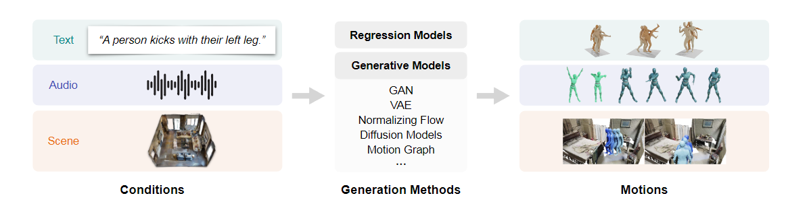
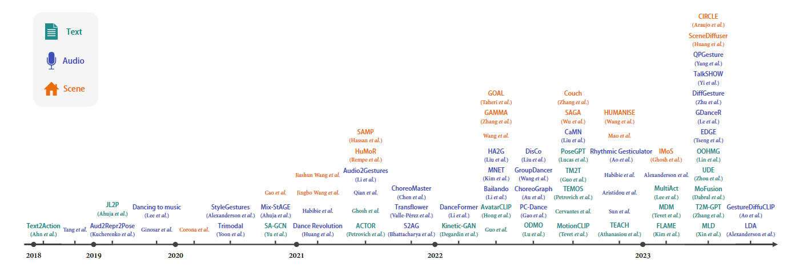
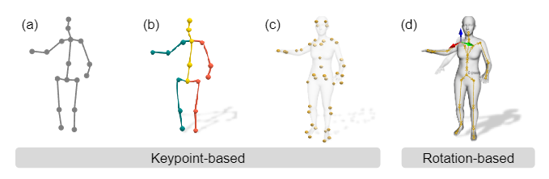
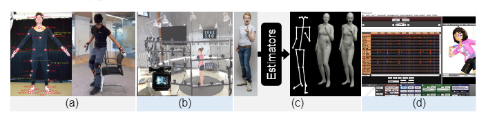
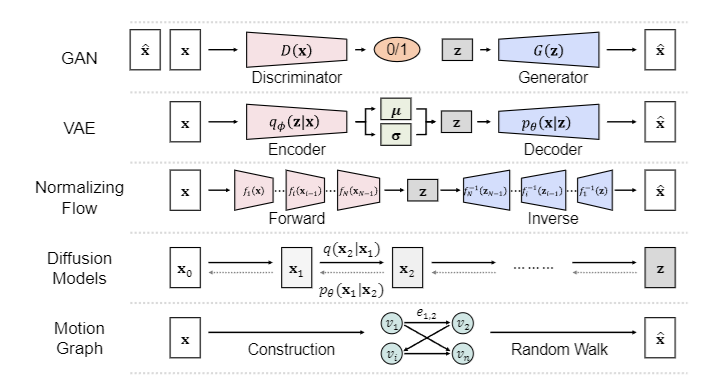
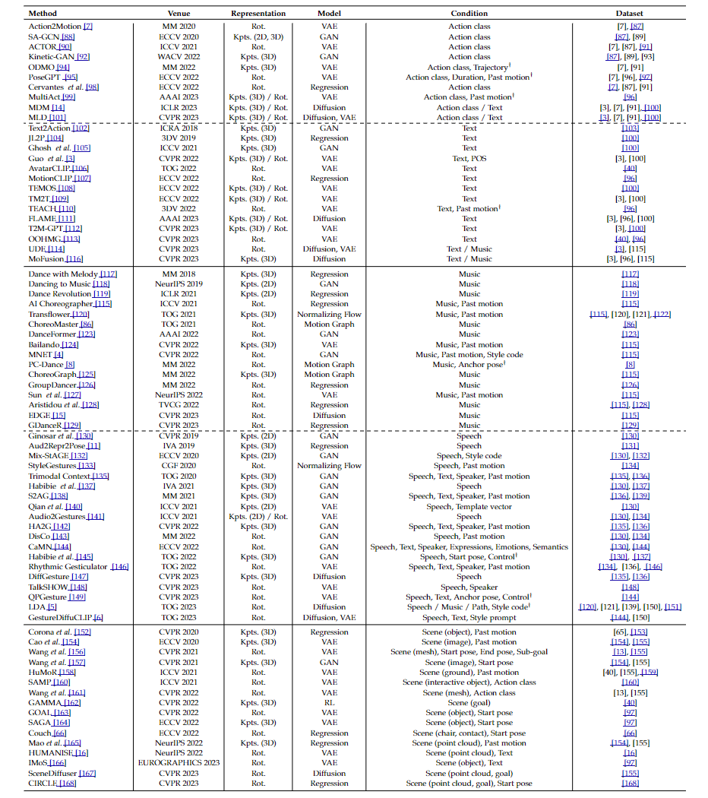
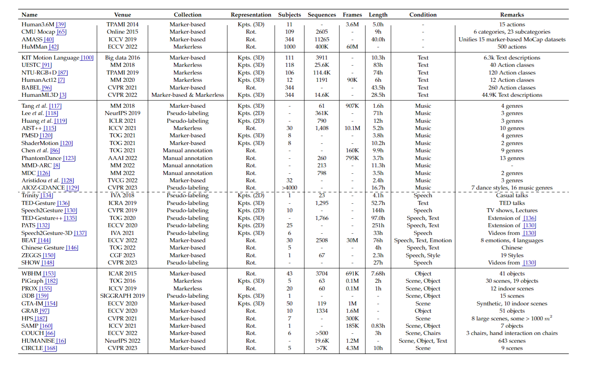
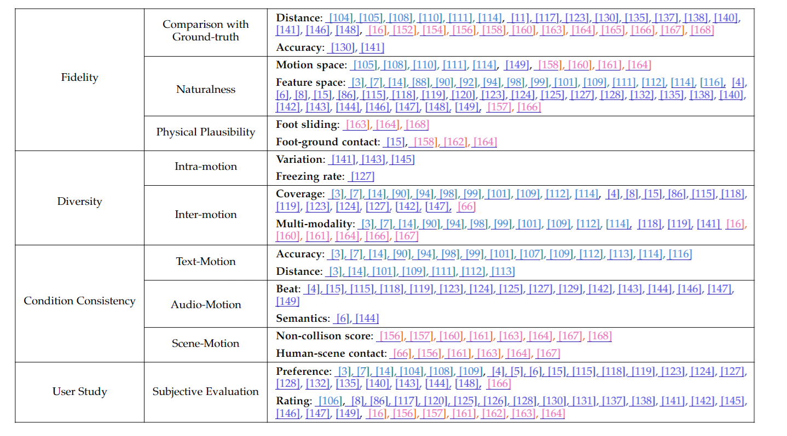

# Human Motion Generation: A Survey

> 摘要--人体运动生成旨在生成自然的人体姿势序列，在现实世界的应用中显示出巨大的潜力。近来，运动数据采集技术和生成方法取得了长足进步，为人类运动生成领域日益增长的兴趣奠定了基础。该领域的大部分研究都集中在根据条件信号（如文本、音频和场景背景）生成人体运动。虽然近年来取得了重大进展，但由于人体运动的复杂性及其与条件信号之间的隐含关系，这项任务仍面临挑战。在本调查报告中，我们对人类运动生成进行了全面的文献综述，据我们所知，这在该领域尚属首次。我们首先介绍了人体运动和生成模型的背景，然后研究了三个主流子任务的代表性方法：文本条件、音频条件和场景条件人体运动生成。此外，我们还概述了常见的数据集和评估指标。最后，我们讨论了尚未解决的问题，并概述了潜在的未来研究方向。我们希望这份调查报告能为社会各界提供对这一快速发展领域的全面了解，并启发新的想法，以解决悬而未决的挑战。

## INTRODUCTION

人类根据自己的意图和环境刺激来计划和执行身体动作[1], [2]。作为人工智能的一个基本目标，生成类似人类的运动模式越来越受到各个研究领域的关注，包括计算机视觉 [3]、[4]、计算机图形学 [5]、[6]、多媒体 [7]、[8]、机器人学 [9]、[10] 和人机交互 [11]、[12]。人类动作生成的目标是生成自然、逼真和多样化的人类动作，这些动作可用于电影制作、视频游戏、AR/VR、人机交互和数字人类等广泛应用。

随着深度学习[17]的兴起，近年来各种生成方法得到了快速发展，例如自回归模型[18]、变异自动编码器（VAE）[19]、归一化流[20]、生成对抗网络（GAN）[21]和去噪扩散概率模型（DDPM）[22]。这些方法在不同领域都取得了巨大成功，包括文本[23]、[24]、图像[25]、[26]、[27]、视频[28]、[29]、[30]和三维物体[31]、[32]。另一方面，人体建模技术的显著进步 [33]、[34]、[35] 使得从视频 [36]、[37]、[38] 中提取人体运动数据和构建大规模人体运动数据集变得更加容易 [39]、[40]、[41]、[42]。因此，在过去几年里，人们对数据驱动的人体运动生成越来越感兴趣。

然而，人类运动生成是一个复杂的挑战，它不仅仅是将深度生成模型应用于人类运动数据集。首先，人类运动具有高度的非线性和衔接性，受到物理和生物力学的限制。此外，人类大脑拥有感知生物运动的专门神经机制[2], [43]，对即使是轻微不自然的运动学也很敏感[44], [45]。因此，生成的运动在自然度、平滑度和可信度方面都需要较高的视觉质量。其次，如图 1 所示，对人体运动生成的要求通常包括作为条件信号的上下文，如文字描述、背景音频或周围环境。生成的动作不仅本身要可信，还要与条件信号相协调。第三，人类动作是一种重要的非语言交流媒介，反映了各种潜在因素，如目标、个人风格、社会规范和文化表达[46]。理想情况下，动作生成模型应该学会捕捉微妙的变化以及与条件信号之间的语义联系。

鉴于该领域的快速发展和新出现的挑战，我们对该领域进行了一次全面调查，以帮助业界跟踪其进展情况。在图 2 中，我们总结了近年来人类运动生成方法的发展。调查报告的其余部分安排如下。在第 2 节中，我们讨论了本调查的范围。第 3 节介绍任务的基本原理，包括人体运动的表征、运动数据采集技术和各种生成方法。在第 4、5 和 6 节中，我们分别总结了基于不同条件信号（包括文本、音频和场景）的现有人体运动生成方法。第 7 节介绍了常用的数据集及其属性。第 8 节从不同角度总结了评估指标。最后，我们在第 9 节中得出结论，并提供了该领域的一些未来发展方向。

> 图 1：典型人体运动生成方法概览。示例图片改编自 [13]、[14]、[15]、[16]。

> 图 2：不同条件下人体运动生成方法的最新进展。

## SCOPE

本研究主要关注根据给定条件信号生成人体运动。我们主要讨论文本、音频和场景条件。一些研究还提出了基于其他条件生成人体运动的方法（如他人的运动 [47]）。关于生成目标，我们纳入了不同类型的人体运动表示，如 2D/3D 人体关键点序列、关节旋转和参数化人体模型 [33], [34]。我们不涉及人体运动完成（如运动预测、运动插值）或人体运动编辑（如运动重定位、运动风格转移）的方法。有关这些方法的评论，我们建议读者参阅 [48]、[49]、[50]、[51]。此外，我们不讨论利用物理模拟环境生成人体运动的作品（如角色控制、运动）；有关此类方法的摘要，请参阅 [52]。本调查报告是对现有调查报告的补充，现有调查报告主要关注人体姿势估计 [53]、[54]、运动捕捉 [55]、[56] 和深度生成模型 [57]、[58]、[59]。

## PRELIMINARIES

###  Motion Data

我们首先介绍人体运动数据表示，然后讨论各种人体运动数据收集技术及其特点。

#### Motion Data Representation

人体运动数据可以通过时间维度上的人体姿势序列来有效表示。更具体地说，我们将数据表示分为基于关键点的数据表示和基于旋转的数据表示。值得注意的是，这两种表示法之间可以进行转换。我们可以使用正向运动学（FK）将关节旋转转换为关键点，也可以使用反向运动学（IK）将关键点转换为关节旋转。

**基于关键点。**人体由一组关键点表示，这些关键点是人体上的特定点，与解剖地标（如关节或其他重要位置）相对应。如图 3 (a) (b) 所示，每个关键点都由其在像素或世界坐标系中的 2D/3D 坐标表示。然后，运动数据就被表示为随时间变化的关键点配置序列。基于关键点的表示法可直接从运动捕捉系统中提取，并具有很好的可解释性。然而，为了将基于关键点的数据用于动画或机器人技术，通常需要解决逆运动学（IK）问题，并将关键点转换为旋转。最近，一些研究 [60]、[61]、[62] 提出用人体表面的更多地标（即人体标记）来表示人体姿势，如图 3 (c) 所示。与传统的骨架关键点相比，身体标记能提供更全面的身体形状和肢体扭曲信息。

**基于旋转。**人体姿态也可以用关节角度来表示，即在分层结构中，身体部位或节段相对于其上一级的旋转角度。大多数研究都考虑了 SO(3) 中的三维关节旋转，并且可以使用各种格式（如欧拉角、轴角和四元数）对旋转进行参数化。在关节角度的基础上，一些研究[33]和[34]使用统计网格模型对人体进行建模，进一步捕捉身体的形状和运动过程中发生的变形。广泛使用的统计人体模型是带皮肤的多人线性模型（SMPL）[33]。

如图 3（d）所示，SMPL 模型由一组姿势和形状参数构成，可用于生成特定姿势和形状的人体三维网格。每个关节的姿势参数θ∈RK×3 是由 K = 24 个关节的标准骨骼运动学树中相对于其父关节的相对旋转来定义的。为简单起见，我们将根方向作为根关节姿态参数的一部分。形状参数 β∈ R10 表示身体形状配置，如高度。给定姿势和形状参数后，模型会发生相应的变形，并生成由 N = 6890 个顶点组成的三角网格 M(θ, β) ∈ RN×3。变形过程 M(θ，β) 相对于姿态 θ 和形状 β 参数是可微的。获得最终网格后，可通过预训练的线性回归器从顶点映射稀疏的三维关键点。其他模型，如 SMPL-X [34] 扩展了 SMPL [33] 模型并构建了一个综合模型，其中身体、面部和手部被联合建模。除了基于 SMPL 的线性模型外，人们还探索了其他建模方法，如 GHUM [63] 和 STAR [64]。为简明起见，我们在下文表格中使用 "Rot. "这一速记术语来涵盖基于关节的三维旋转及其在统计人体模型（如 SMPL）中的应用，而不对两者进行复杂的区分。

> 图 3：具有相同姿势的典型人体姿态和形状表示，分别为 (a) 二维关键点、(b) 三维关键点、(c) 三维标记关键点和 (d) 基于旋转的模型。

> 图 4：人体运动数据采集方法。(a) 基于标记的运动捕捉设置示例，其中（左）光学标记[65]或（右）IMU[66]附着在被摄体的体表。(b) 无标记多视角运动捕捉系统示例[41]。(c) 伪标记管道包括使用姿势或网格估计器生成伪标记[67]。(d) 使用 MikuMikuDance (MMD) 资源进行手动采集的界面示例。

#### Motion Data Collection

收集人体运动数据的方法主要有四种：(i) 基于标记的运动捕捉；(ii) 无标记运动捕捉；(iii) 伪标记；(iv) 人工标注。

**基于标记的运动捕捉**是指在主体身体的特定位置放置小型反射标记或惯性测量单元（IMU），然后在三维空间中跟踪这些标记的移动。示意图见图 4 (a)。然后，在 MoSh[68] 的帮助下，通过应用前向运动学[39]或参数化人体网格（如 SMPL[33] ），可以利用这些数据获得三维关键点。光学标记提供的数据比 IMU 更精确，但便携性较差，通常用于室内环境，而 IMU 可用于室外环境。

如图 4 (b) 所示，**无标记运动捕捉**解决方案无需一个或多个摄像头的标记即可跟踪拍摄对象的身体运动，并使用计算机视觉算法（如[69]、[70]、[71]）利用多视角几何图形获取三维运动。在捕捉过程中，将设置多个 RGB 或 RGB-D 摄像机并进行同步。与基于标记的运动捕捉相比，这种解决方案的精确度较低，但更加方便，可用于更广泛的场合。

**伪标注人体运动**主要用于野外捕获的单目 RGB 图像或视频。这包括使用现有的人体姿态估算器（如 OpenPose [72] 和 VideoPose3D [37]）预测二维或三维人体关键点，或将人体模型与图像证据进行拟合，以生成伪三维网格标签，如使用 SMPLify-X [67]。见图 4 (c)。不过，与动作捕捉系统相比，伪标签往往误差更大。

**手动标注**是指使用动画引擎手动设计人体动作，通常是使用一个熟练的美工团队。图 4 (d) 显示了 MikuMikuDance (MMD) 的引擎界面示例。虽然这种方法可以制作高质量的动画，但成本高、耗时长，而且无法扩展。

### Motion Generation Methods

> 图 5：不同生成模型概览。

我们将人体运动生成方法大致分为两类。第一类方法基于回归模型，利用输入条件编码的特征预测人体运动。这些方法属于监督学习范式，旨在建立从输入条件到目标运动的直接映射。另一类方法以生成模型为基础。它们侧重于以无监督的方式对运动的基本分布（或与条件的联合分布）进行建模。典型的深度生成模型包括生成对抗网络 (GAN)、Varia-tional Autoencoders (VAE)、归一化流 (Normalizing Flows) 和 Denois-ing 扩散概率模型 (DDPM)。除了一般的生成模型外，一种针对特定任务的模型--运动图也得到了广泛应用，尤其是在计算机图形学和动画领域。图 5 显示了不同生成模型的概况。下面，我们将简要介绍运动生成中常用的生成模型。

**生成对抗网络。**生成对抗网络[21]是一类生成模型，由两个神经网络组成：生成器 G 和判别器 D。相反，判别器则试图区分真实数据和生成器生成的合成数据。生成器和鉴别器之间的这种动态关系可以看作是零和博弈或最小最大博弈。代表它们之间相互作用的损失函数可以表述为：
$$
\mathcal{L}_{D}=-\mathbb{E}_{\mathbf{x}\sim p_{\mathbf{x}}}[\log(D(\mathbf{x}))]-\mathbb{E}_{\mathbf{z}\sim p_{\mathbf{z}}}[\log(1-D(G(\mathbf{z})))], (1)\\\mathcal{L}_{G}=-\mathbb{E}_{\mathbf{z}\sim p_{\mathbf{z}}}[\log(D(G(\mathbf{z})))].\text{(2)}
$$
随着深度学习的兴起，人们提出了各种基于深度学习的 GAN。DCGAN [73]、PGGAN [74]、StyleGAN [75]、[76] 等模型都取得了显著的成就，展现了巨大的潜力。GANs 的这些进步极大地促进了生成模型领域的发展，尤其是在生成合成数据方面。然而，GANs 也面临着一些挑战，包括训练不稳定、收敛问题和模式崩溃。

**变异自编码器。**变分自编码器 [19] 是一种显著的生成模型，可为数据表示提供稳健的解决方案。它们通过使用前馈模型（表示为 qj(z|x)）来逼近难以处理的后验，从而应对可交互似然的挑战。主要优化目标是最小化该近似值与原始后验之间的 KL 分歧。VAE 采用证据下限（ELBO）作为损失函数：
$$
\text{ELBO}=\mathbb{E}_{\mathbf{z}\sim q_{\phi(\mathbf{z}|\mathbf{x})}}\log(p_\theta(\mathbf{x}|\mathbf{z}))-D_{KL}(q_\phi(\mathbf{z}|\mathbf{x})||p_\theta(\mathbf{z})) \text{(3)}
$$
由于 qj(z|x)的前馈模式，VAE 可以高效地生成和推断新样本。此外，重参数化技巧还能生成可微分样本，并利用基于重建的损失函数，最终提高训练效率和稳定性。这些优点促使 VAEs 变体在各个领域得到广泛应用，如 CVAE [77]、LVAE [78] 和 VQ-VAE [79]，并推动了生成模型的发展。然而，与 GANs 相比，VAEs 有后验崩溃的风险，产生的样本也可能不够清晰。

**流量归一化。**GAN 和 VAE 隐式地学习数据的概率密度。它们很难计算前行为似然。相比之下，归一化流量模型[20]是一类显式学习数据分布 p (x)的生成模型，可以进行可控的概率密度估计。这些模型采用一系列可逆变换 {fi}1:N 将简单的先验分布 p(z0)（如标准高斯分布）映射到复杂的数据分布 p(x)：
$$
\mathbf{z}_{i}=f_i\left(\mathbf{z}_{i-1}\right)\text{(4)}\\\mathbf{x}=\mathbf{z}_N=f_N\circ f_{N-1}\circ\cdots\circ f_1(\mathbf{z}_0)\text{(5)}
$$
目标分布的密度可以通过应用变量变化定理得到：
$$
\log p(\mathbf{z}_i)=\log p(\mathbf{z}_{i-1})-\log\left|\det\frac{df_i}{d\mathbf{z}_{i-1}}\right|\text{(6)}\\\log p(\mathbf{x})=\log p(\mathbf{z}_0)-\sum_{i=1}^K\log\left|\det\frac{df_i}{d\mathbf{z}_{i-1}}\right|\text{(7)}
$$
其中，det 是正方形矩阵行列式的简称。归一化流程通常可以通过最大化观测数据的对数似然来进行训练。由于可反转变换，归一化流具有灵活性、精确的似然计算和简便的数据采样。然而，它们需要大量的变换才能对复杂的分布建模，而且计算成本高、训练困难。

**扩散模型。**扩散模型 [22]、[80]、[81] 定义了一个前向扩散过程，该过程以 T 步为单位逐渐向输入数据 x0 中添加少量高斯噪声，从而产生一系列噪声样本 {xt}1:T 。噪声由 {βt}1:T 调度。
$$
q(\mathbf{x}_t|\mathbf{x}_{t-1})=\mathcal{N}(\mathbf{x}_t;\sqrt{1-\beta_t}\mathbf{x}_{t-1},\beta_t\mathbf{I}),\text{(8)}\\q(\mathbf{x}_{1:T}|\mathbf{x}_0)=\prod_{t=1}^Tq(\mathbf{x}_t|\mathbf{x}_{t-1}).\text{(9)}
$$
由于 T → ∞，xT 实际上是一个高斯分布。如果我们知道反向过渡 q(xt-1|xt)，就可以从高斯先验 xt∼ N (0, I) 中采样，然后反向运行扩散过程，从真实数据分布 p(x0) 中采样。然而，由于 q(xt-1|xt) 取决于整个数据集且难以估计，因此我们训练神经网络 pθ 来匹配后验 q(xt-1|xt，x0)，即一个可处理的高斯分布，而不是 q(xt-1|xt)：
$$
p_\theta(\mathbf{x}_{t-1}|\mathbf{x}_t)=\mathcal{N}(\mathbf{x}_{t-1};\boldsymbol{\mu}_\theta(\mathbf{x}_t,t),\boldsymbol{\Sigma}_\theta(\mathbf{x}_t,t))\quad(10)
$$
pθ 是通过优化类似于 VAE 的 ELBO 来学习的。实际上，扩散模型能够生成高质量的样本，并能从稳定的训练中获益。不过，它依赖于反向扩散步骤的长马尔可夫链来生成样本，因此计算成本较高，速度也比 GAN 和 VAE 慢。

**运动图** 运动图 [82]、[83]、[84] 可以用数学方法表示为有向图 G = ⟨V, E⟩，其中 V 表示节点或顶点集，E 表示有向边或转换集。每个节点 v∈V 代表一个姿势或关键帧，每条有向边 e∈E 连接两个顶点（v1，v2），代表相应姿势之间的可行转换。运动图首先根据运动片段集合构建。为确保平稳过渡，算法会识别运动片段中的兼容姿势，并用边将它们连接起来，形成一个可遍历的图，以生成新的运动序列。在构建运动图之后，可以在图上执行随机行走 W = (v1, v2, ... , vn)，从初始节点开始，沿着有向边缘行走。输出的运动序列是与遍历节点相对应的姿势的串联，确保连续姿势之间的平滑过渡。同时，还可以将更多约束条件作为优化目标纳入其中 [85]，[86]。这一过程可有效创建新的运动序列，这些序列在原始数据集中并不明确存在，但与数据的整体特征相一致。

## TEXT-CONDITIONED MOTION GENERATION

文字具有以明示或暗示的方式传达各种类型的动作、速度、方向和目的地的非凡能力。这一特点使得文本成为生成人类动作的一个极具吸引力的条件。本节旨在阐释以文本为条件的人体动作生成任务（见表 1 顶部图块），主要分为两类：动作到动作和文本到动作。

### Action to Motion

从动作到动作的任务主要是根据 "走"、"踢 "或 "投 "等特定动作类别生成人类动作序列。这些动作通常使用单次编码等技术来表示，从而简化了动作生成过程。与处理复杂的自然语言处理的文本到动作任务相比，由于动作类别有限且定义明确，这种表示方法提供了更直接的任务。

Yu 等人[88]介绍了 SA-GAN，它利用了基于自我注意的图卷积网络（GCN）和 GAN 架构。他们还建议通过使用两个判别器（一个基于帧，另一个基于序列）来增强生成能力。与此类似，Kinetic-GAN [92] 结合了 GAN 和 GCN 的优势，并进一步利用潜空间解缠和随机变化来生成高质量和多样化的人体动作。Guo 等人[7]引入了 Action2Motion，这是一种基于门控递归单元（GRU）的每帧 VAE 架构，用于生成运动序列。同样，ACTOR [90] 采用了序列级 CVAE 模型，该模型使用变换器作为骨干，以非自回归方式生成运动序列。这种非自回归方法允许一次生成运动序列。ODMO [94] 采用一种新颖的策略，在低维潜在空间内应用对比学习，从而生成运动序列的分层嵌入。该模型在生成运动序列之前首先创建运动轨迹，从而有利于轨迹控制。此外，PoseGPT [95] 利用自动回归变换器将人体运动编码为量化的潜在表示，随后在此离散空间内采用类似 GPT 的模型进行下一步运动指数预测。塞万提斯等人[98]介绍了一种使用隐式神经再现（INR）和拟合条件高斯混合模型（GMM）的方法。这种方法通过从每个训练序列的变异分布中提取表征来控制序列的长度和动作类别。此外，MDM [14] 利用扩散模型来预测每个扩散步骤的样本，而不仅仅是噪声。MLD [101] 从潜在扩散模型（LDM）[169] 中汲取灵感，利用潜在级扩散和 VAE 生成动作。

虽然这些方法极大地推动了 "动作到动作 "领域的发展，但它们主要擅长生成单一动作。要过渡到生成涉及多个动作的复杂序列仍然是一个挑战，而且往往需要额外的后处理来连接不同的动作。为此，最近的一项研究成果 MultiAct [99]，利用过去的动作循环生成长期的多动作三维人体运动，并提出了一种新颖的面前规范化方法，以确保本地坐标系在每个循环步骤中共享地面几何图形。

### Text to Motion

文本到动作任务旨在利用语言的巨大表达能力，从自然语言描述中生成人类动作序列。与使用有限的预定义标签的 "动作到动作 "相比，"文本到动作 "有可能根据不同的文本描述生成更多种类的动作。然而，如何准确地将复杂的文本转换成相应的动作是一个挑战，这需要对语言的细微差别和物理运动动态有深刻的理解。

Text2Action [102] 首次利用 GAN 从给定的自然语言描述中生成各种动作。还有一些方法探索了学习文本和动作联合嵌入的潜力。例如，JL2P [104] 使用基于 GRU 的文本编码器和动作编码器-解码器将文本映射为相应的人体动作。Ghosh 等人[105] 进一步开发了一种双流编码器-解码器模型，用于共同嵌入文本和肢体动作，同时还采用了 GAN 结构来生成更自然的动作。Guo 等人[3]提出了一种基于 VAE 的方法，该方法在每帧中利用长度估计模块和单词级关注模块来生成多样化的多长度运动。此外，TEMOS[108] 通过带有变换器层的 VAE 学习运动和文本的联合分布，从而生成多种运动序列。TEACH [110] 进一步将过去的运动作为编码器模块的补充输入，从而生成更自然、更连贯的运动序列，尤其是在处理多个文本输入序列时。

虽然上述方法注重根据给定数据集生成运动潜空间，但在生成零镜头时可能会遇到固有的挑战。为解决这一难题，MotionCLIP [107] 利用基于变换器的自动编码器，将运动潜空间与预先训练的视觉语言模型 CLIP [170] 的文本和图像空间对齐，以增强零镜头生成能力。AvatarCLIP [106] 也采用了 CLIP [170] 和基于参考的运动合成方法，根据自然语言描述生成各种动画。此外，OOHMG[113] 使用文本姿势生成器获取与文本一致的姿势，然后将其作为屏蔽提示输入预训练生成器。这样就能实现高效的全动作重建，无需配对数据或在线优化。值得注意的是，虽然这些方法使用文本作为输入，但它们只使用了主要由动作类别名称组成的简短文本。

近年来，由于 VQ-VAE 和 Diffusion 模型在文本到图像生成领域取得了巨大成功，人们对它们的兴趣与日俱增。例如，TM2T [109] 利用 VQ-VAE 同步训练文本到运动和运动到文本模块。同样，T2M-GPT [112] 将 VQ-VAE 与指数移动平均（EMA）和代码重置策略相结合，为运动序列生成应用了类似 GPT 的转换器架构。FLAME [111] 建议将运动长度标记、语言池标记、时间步长标记和运动嵌入连接起来，然后由扩散模型利用这些标记生成可变长度和多样化的运动。在动作到动作部分已经介绍过的 MDM [14] 和 MLD [101] 也将上述方法用于文本到动作的生成。还有一些作品进一步探索了从各种条件生成动作的方法。例如，MoFu-sion[116] 利用带有一维 U-Net 风格变换器模块的扩散模型，从自然语言或音频输入中生成人体动作序列。此外，Zhou 等人[114] 提出了 UDE 框架，该框架将运动序列离散化为潜在代码，将条件映射到统一空间，使用 GPT 式变换器预测量化代码，并通过扩散模型生成运动。

## AUDIO-CONDITIONED MOTION GENERATION

除文字描述外，人们还探索从音频信号中生成人体动作。与文本不同，音频信号通常不提供相应人体动作的明确描述，因此生成任务的自由度更高。同时，生成的人体动作应在高级语义和低级节奏方面与音频相协调。在本节中，我们将主要讨论两个日益受到关注的子任务：音乐-舞蹈和语音-手势。音频条件可以用原始音频波形、频谱图和旋律-频率倒谱系数（MFCC）来表示。为了增强可控性，有些作品还加入了额外的条件，如风格代码或文字誊本。请参阅表 1 中间部分，了解各种方法的概要。

### Music to Dance

音乐-舞蹈生成任务旨在根据输入的音乐序列生成相应的舞蹈动作。一个直接的想法是使用全监督回归模型来解决这个问题，类似于序列到序列的转换。例如，Tang 等人[117] 采用 LSTM 自动编码器提取声音特征并将其转换为动作特征。AI Choreographer [115] 利用全注意力跨模态转换器 (FACT)，以自动回归的方式预测未来的 N 个运动帧。GroupDancer [126] 提出了一个额外的舞者协作阶段，以选择活跃的舞者生成多人舞蹈。GDancer [129] 引入了全局-局部运动表示法，以确保局部一致性和全局一致性。上述方法采用完全监督学习的视角，以最小化预测运动与地面真实运动之间的距离。然而，对于一个给定的音乐序列，存在着各种各样可信的舞蹈动作。简单的重构监督无法充分解决这种一对多的映射关系。

从生成的角度来看，基于 GAN 的方法
[118]、[123] 采用对抗学习来正则化生成的运动数据流形与真实运动数据流形之间的距离。MNET [4] 还为生成器加入了音乐风格代码，并设计了一个多任务判别器来执行每种风格的分类。Transflower [120] 利用归一化流来表达有效运动的复杂概率分布。Bailando [124] 首先使用 VQ-VAE 编码簿对 3D 运动进行量化，然后利用演员评判生成预训练变换器 (GPT) 从学习到的潜在编码中组成共相干序列。EDGE [15] 建立在扩散模型的基础上，将任务表述为以音乐为条件的运动去噪问题。另一类方法以经典的运动图框架为基础，将运动生成视为在预先构建的图中求解最优路径。ChoreoMaster [86] 建议学习音乐和舞蹈的共享嵌入空间，然后将学习到的嵌入和专家知识整合到基于图的运动合成框架中。PC-Dance [8] 通过将锚姿势作为额外输入，进一步实现了可控的动作生成。ChoreoGraph [125] 利用运动片段扭曲来解决节奏对齐问题，从而减少图中的运动节点和计算成本。

虽然大多数方法都利用简短的音乐舞蹈片段进行训练，但用户的一个重要需求是为整首歌曲生成永恒的舞蹈。然而，长序列生成往往会产生错误积累问题，导致动作冻结。为了克服这一难题，Huang 等人[119] 提出了一种课程学习方法，随着训练的深入，该方法会从教师强迫方案逐步过渡到自回归方案。Sun 等人[127] 采用 VQ-VAE 学习低维流形，从而有效地去噪运动序列。他们还开发了过去-未来运动动态库，为未来运动提供明确的前验。Aristidou 等人[128]从姿势、主题和舞蹈编排等三个层面解决了这一问题，生成了保持特定流派全局结构的长舞蹈。

### Speech to Gesture

语音到手势生成（或协同语音手势合成）任务旨在根据输入的语音音频和某些情况下的文本记录生成一系列人类手势。协同语音手势在非语言交流中起着至关重要的作用，它能传达说话者的信息和情感，增进亲密感和信任感[171]。针对这项任务的现有研究一般侧重于上半身运动，因为下半身运动往往是静态的。

一些研究根据文本记录生成语音手势 [136]、[172]、[173]。更多的研究工作侧重于语音音频条件。例如，Ginosar 等人[130] 收集了一个特定人物手势的语音视频数据集，并利用对抗损失训练了一个生成模型。Aud2Repr2Pose [11] 首先构建运动自动编码器，然后训练语音编码器，将语音 au-dio 映射到运动表示。StyleGestures [133] 对 MoGlow [174] 进行了改编，并进一步对生成的动作风格进行了指导性控制。钱等人[140]认识到语音不能完全决定手势，因此建议学习一组手势模板向量，为生成的手势的一般外观建模。Audio2Gestures [141]将动作表示分为音频-动作共享信息和特定动作信息，以反映音频和动作之间一对多的映射关系。Habibie 等人[137] 应用了一个音频编码器和三个独立的解码器，分别用于面部、身体和手部。DisCo [143] 首先将运动序列聚类为内容段和节奏段，然后在内容平衡的数据分布上进行训练。Habibie 等人[145] 建议首先使用 k-Nearest Neighbors（k-NN）算法从数据库中搜索最合理的动作，然后对动作进行细化。DiffGesture [147]利用带有跨模态变换器网络的扩散模型，探索无分类器指导，以平衡多样性和手势质量。

然而，由于个人性格的不同，人与人之间的共同语音手势可能会有很大的差异。上述方法没有明确考虑说话者的身份，因此必须为每个说话者建立单独的模型，这就阻碍了将这些方法应用到一般场景中。此外，这些方法仅限于对文本或语音音频建模，无法将两种模式结合起来。受这些缺陷的启发，Yoon 等人[135] 提出了一个考虑文本、音频和说话人身份三模态上下文的生成框架。Bhattacharya 等人[138] 通过情感编码器和 MFCC 编码器进一步提高了情感表达的生成质量。Mix-StAGE [132] 为每个说话者学习独特的风格嵌入，并同时为多个说话者生成动作。HA2G [142] 采用分层音频学习器提取音频表征，并采用分层姿势推理器混合音频和身体部位之间的特征。Liu 等人[144] 基于大规模数据集开发了级联运动网络 (CaMN)，进一步考虑了面部表情、情绪和语义。Rhythmic Gesticulator [146] 从语言理论中汲取灵感，明确模拟了语音和手势之间的节奏和语义关系。TalkSHOW [148] 采用了一个面部动作自动编码器，以及一个基于语音音频和说话者身份的身体和手部动作合成 VQ-VAE。QPGesture [149] 利用 VQ-VAE 和莱文斯坦距离引入了基于量化和相位引导的动作匹配框架。LDA[5]展示了在音乐-舞蹈、语音-手势和路径驱动运动中使用无分类器引导扩散模型的风格控制。GestureDiffuCLIP [6] 为语音手势生成适配了一个潜在扩散模型，并可通过风格提示（文本、动作或视频）进行控制。

## SCENE-CONDITIONED MOTION GENERATION

人类运动是以目标为导向的，并受到周围场景布局的影响，人在移动身体与环境互动的同时，也受到环境物理特性的制约。场景到运动生成任务旨在生成符合场景背景的合理人体运动，是计算机图形学和计算机视觉领域长期存在的问题。本研究主要关注第 2 节中讨论的数据驱动的场景条件运动生成方法，不包括基于物理模拟的方法 [175]、[176]、[177]、[178]、[179]。在人类运动生成之前，也有一些研究提出了在场景条件下合成静态人类姿势的方法 [180]、[181]、[182]、[183]、[184]，由于这些方法也不在本研究范围内，因此不再进一步讨论。下面，我们将从场景表示和生成管道两个角度讨论现有方法。请参见表 1 底部图块。

### Scene representation

目前的方法利用了多种场景表示方法，包括二维图像[154]、[157]、点云[16]、[165]、[167]、[168]、网格[156]、[161]、三维物体[66]、[152]、[160]、[163]、[164]、[166]和特定目标位置[156]、[162]、[167]、[168]。Cao 等人[154]和 Wang 等人[157]使用 RGB 图像作为场景约束条件，并通过提取图像中的特征进行隐式融合。许多研究 [16]、[156]、[161]、[165]、[167]、[168] 使用点云或网格来表示场景，例如有家具的房间，并通常使用 PointNet [185] 提取场景特征作为条件信号。对于三维物体，配置包括物体的三维位置[152]、[163]、物体类型[152]、[166]和物体的体素表示[66]、[160]。例如，Corona 等人[152] 使用物体的三维边界框表示物体，并将物体类型（如杯子）作为单击向量，然后引入有向语义图，共同对人体运动和物体进行参数化。他们使用递归神经网络（RNN）生成人的动作，以便与物体互动。COUCH [66] 的目标是生成可控的、接触驱动的人椅互动，并使用占位体素网格来表示椅子，从而准确捕捉人与椅子之间的空间关系。另一个使用三维物体作为场景条件的典型例子是生成全身抓取运动的作品[163]、[164]、[166]，其中提供了三维物体位置[163]、[166]或点云[164]。一些研究给出了目标位置 [156]、[162]、[167]、[168] 以指导运动生成。例如，GAMMA[162] 使用强化学习来学习策略网络，以合成给出地面目标位置的合理运动。SceneDiffuser [167] 为各种三维场景理解任务提出了一个通用框架，并使用扩散模型 [22] 根据点云场景和目标生成可信的人体运动。

需要注意的是，大多数方法都采用一种以上的场景表示作为输入，其中许多方法将过去的运动或起始姿势[66]、[152]、[154]、[156]、[157]、[158]、[165]、[168]一起作为输入。此外，还有一些方法利用额外的语言指令[16]或动作标签[160]、[161]生成动作。例如，HUMANISE[16] 结合了语言描述（如走到桌边）来生成场景中的人体动作。IMoS [166] 结合了预期动作指令（如喝水），根据物体的位置和类型生成可控的全身抓取动作。

### Generation pipeline

大多数现有方法都提出了一个多阶段流水线。一种常见的流水线是首先预测目标位置 [154],[157] 或目标交互锚点 [66], [160], [161]，然后规划路径或轨迹，最后沿轨迹填充运动 [66], [154], [157], [160], [161], [165], [167]。例如，Cao 等人[154] 提出了一种三阶段运动生成方法，即在场景为二维图像的情况下，首先预测二维目标，然后规划二维和三维路径，最后通过 VAE 模型沿路径生成三维运动。与 Cao 等人[154]类似，Wang 等人[157]使用 RGB 图像作为场景上下文，通过首先生成轨迹然后引导运动生成来合成人类未来的运动。他们还进一步增加了一个判别分支，以强调对场景背景的考虑。SAMP [160] 也采用了多阶段流水线，首先估计目标位置和物体的交互方向，然后根据起始身体姿势规划三维路径，最后利用自回归 VAE 生成合理的人体运动。SAMP [160] 只在最后一帧建立粗略的人-物交互模型，相比之下，Mao 等人[165]提出使用每关节接触图为未来每一帧的每个人体关节提供更详细的接触信息，以提高生成质量。Wang 等人[161]首先预测了多样化的人与场景交互锚点，然后将标准 A∗ 算法与场景感知随机探索相结合，实现了多样化的路径规划。最后，使用基于 VAE 的框架合成锚点姿势并完成运动。GOAL [163] 和 SAGA [164] 以生成全身抓取运动为目标，提出了两步法，即首先生成结束抓取姿势，然后生成全身运动。与 GOAL[163]不同，SAGA[164]通过使用 VAE 模型，进一步捕捉到了抓取结束姿势和中间运动的多样性。

还有一些研究利用给定的目标位置，而不是预测目标位置。例如，Wang 等人[156] 提出了一种分层管道，利用 VAE 模型[19] 在每个给定的子目标上生成静态人体，并利用双向 LSTM[186] 为场景中的每对子目标生成中间的人体运动。通过拼接这些运动片段，可以合成长期的人体运动。CIRCLE [168] 最近提出的一种模式是，首先使用线性插值对给定的起始姿势和目标位置进行运动初始化，然后提出一个场景感知运动细化模块来生成最终运动。场景特征从三维点云中提取并融合到细化模块中。

> 表 1： 人体运动生成的代表作品。"Kpts. "和 "Rot. "分别表示关键点和三维旋转。† 表示可选条件。

## DATASETS

在本节中，我们将讨论用于生成人体运动的数据集。常用的数据集可以根据其伴随的条件信号进行分类。我们将分别介绍文本、音频和场景的配对人体运动和条件信号数据集。在表 2 中，我们总结了这些数据集的主要特性，同时还列出了没有额外条件信号的大规模人体运动数据集作为参考。

### Text-Motion Datasets

KIT 运动语言[100]是一个由运动数据和语言数据组成的配对数据集。运动数据通过基于光学标记的系统收集，而语言数据则由描述每个运动数据的注释组成。

UESTC [91] 包含使用微软 Kinect V2 传感器以三种模式（RGB 视频、深度和骨骼序列）捕获的运动数据。该数据集包括 15 个站姿和坐姿动作类别，以及 25 个仅站姿动作类别，共计 40 个不同类别。

NTU-RGB+D 120 [87] 是 NTU-RGB+D [93] 数据集的扩展，增加了 60 个类别和 57600 个 RGB+D 视频样本。该数据集包含 120 个不同的动作类别，代表了日常活动和健康相关活动的混合。

HumanAct12 [7]源自 PHSPD [188]，它提供了一个专门的三维运动片段集，分为一系列典型的人类行为动作。该数据集包括走、跑、坐和热身等日常动作，分为 12 个动作类别和 34 个子类别。

BABEL. Bodies, Action and Behavior with English Labels [96]，为综合动作数据集 AMASS [40]中的动作序列提供文本标签。该数据集提供两个独特级别的标签：整个序列的序列级标签和单个帧的帧级标签。该数据集涵盖 250 个运动类别的 28k 多个序列和 63k 个帧。

HumanML3D [3] 是由 HumanAct12 [7] 和 AMASS [40] 数据集组合而成的数据集，它包括与每个运动序列相对应的三个不同的文本描述。该数据集涵盖了日常生活、体育、杂技和艺术中的各种活动。

### Audio-Motion Datasets

根据第 3.1.2 节中讨论的数据收集技术，音频运动数据集可分为受控数据集和野生数据集。受控音频-动作对是通过动作捕捉系统（基于标记或无标记）或人工标注获得的。相反，野外音频运动对通常是通过搜索和下载带有特定关键字的在线视频，并利用现成的姿势估计器提取人体运动来获得的。虽然野外数据具有更高的动作多样性和更强的可扩展性，但提取的动作往往不够准确。

#### Controlled Datasets

Tang 等人[117]率先捕捉了 4 种类型（华尔兹、探戈、恰恰和伦巴）的 3D 舞蹈和相应音乐。

AIST++ [115] 由 AIST 舞蹈视频数据库 [189] 构建。他们利用多视角视频来估计摄像机参数、三维关键点和 SMPL 参数。PATS. Pose-Audio-Transcript-Style [120] 数据集由各种舞者和舞蹈风格的同步音频和录音组成。

ShaderMotion[120]从社交虚拟现实平台中提取舞蹈，其中头像的运动是通过 6 点跟踪系统从参与者的裤子中重新定位的。

Aristidou 等人[128]邀请了一组专业舞者进行动作捕捉，并以长序列的音乐-舞蹈配对为特色。

Trinity [134] 是一个会话语音的多模态数据集，包含一名演员 4 小时的音频、动作和视频数据。通过基于标记的动作捕捉（MoCap）系统可获得精确的三维动作。

BEAT. 身体-表情-音频-文本数据集[144]是一个用于对话手势合成的大规模语义和情感数据集，具有丰富的帧级情感和语义相关性注释。它还包括面部表情和多语言演讲。

中文手势 [146] 是一个中文语音手势数据集，可用于探索跨语言手势生成。

除了基于 MoCap 的解决方案外，一些研究还建议从动画师制作的角色动画资源中提取音频-动作对。例如，Chen 等人[86] 和 MMD-ARC [8] 利用动漫社区的 MikuMikuDance (MMD) 资源。Phantom-Dance [123] 由专业舞者组成的经验丰富的动画师团队创作舞蹈动作。

MDC。多舞者编舞[126]数据集侧重于群舞，他们邀请舞者编排动作短语，并注释舞者的时间激活序列。

#### In-the-wild Datasets

Lee 等人[118]从互联网上收集带有关键字（芭蕾、尊巴和嘻哈）的舞蹈视频，并利用 OpenPose[72] 提取二维身体关键点。

Huang 等人[119] 解决了缺乏长期舞蹈生成数据集的问题。该数据集以互联网上的一分钟音乐-舞蹈对为特征。

AIOZ-GDANCE [129] 收集了野外群舞视频和音乐，并使用 SMPLify-X [67] 的时间扩展将 SMPL 序列拟合到跟踪的二维关键点上。他们手动修正了二维关键点和三维运动的错误情况，并使用人类注释来确定多人的相对深度。

TED-Gesture[136]是 TED 演讲的协同语音手势，其中包含视频和英文文本（以及短语的时间戳）。作者使用 OpenPose [72] 提取二维姿势，然后设计一个神经网络将二维姿势转换为三维姿势。

Speech2Gesture [130] 是一个针对特定说话人的手势数据集。该数据集基于电视节目和大学讲座的无标记野外视频。伪地面实况是通过现成的 2D 姿态估计算法 [72] 获得的。该数据集包含 10 位具有不同运动风格的演讲者，包括电视节目主持人、大学讲师和电视布道家，因此可以研究特定人的运动生成。

TED-Gesture++[135]扩展了TED-Gesture[136]，增加了同步视频、语音音频和转录英文语音文本。三维身体关键点是通过一种时间三维姿态估计方法 [37] 获得的。

PATS. Pose-Audio-Transcript-Style [132] 将 [130] 扩展到更多的演讲者，包括 15 位脱口秀主持人、5 位讲师、3 位优酷主播和 2 位电视布道家。同样，他们用 OpenPose [72] 提取了骨架关键点。此外，PATS 还提供了与运动和音频信号相对应的文本。

Speech2Gesture-3D [137] 使用最先进的 3D 人脸[190]、[191]、身体[192]和手[193]姿态估计算法对 Speech2Gesture 数据集[130]进行注释。由于分辨率低、三维重建效果差，[130] 中的一些视频和主题被排除在外。

SHOW。野外同步整体优化[148] 在 Speech2Gesture 数据集[130]上用手势和面部表情拟合 SMPL-X[67] 参数模型。它采用基于回归的先进方法 [194]、[195]、[196] 改进了 SMPLify-X [67]。

### Scene-Motion Datasets

WBHM。全身人体运动[153] 包含由 Vicon 运动捕捉系统采集的多人和多物体的三维全身运动数据。运动数据不仅考虑了人体的运动，还考虑了与人体互动的物体的位置和运动。其中包括 41 种不同物体的三维模型，如楼梯、杯子、食物等。

PiGraph。原型交互图[182]扫描真实世界的三维场景[197]，并使用 Kinect.v2 捕捉人与环境交互时的骨骼。三维场景中的所有物体都人工标注了语义标签。多重交互也有注释。

PROX. Proximal Relationships with Object eXclusion [155] 包含人们与真实室内环境互动的 RGB-D 视频，由 Kinect-One 传感器捕捉。物体的姿势也是通过附加标记捕捉到的，每个物体都有 CAD 模型。

i3DB [159] 包含多个人与场景的交互，每个捕获的 RGB 视频都标注了物体位置和三维人体运动。每个物体都有一个类别标签，如椅子或桌子。三维人体运动是通过估计二维运动[198]并进行人工校正获得的。

GTA-IM GTA Indoor Motion[154]是一个大型合成数据集，基于《侠盗猎车手》（GTA）游戏引擎捕捉人与场景的互动。该数据集包含 RGB-D 视频、三维人体姿势、场景实例标签等。请注意，GTA 游戏引擎中的动作来自基于标记的动作捕捉系统。

GRAB。GRasping Actions with Bodies[97]是一个大规模数据集，通过 Vicon 动作捕捉系统捕捉真实世界中对三维物体的全身抓取。注释中包括人体运动、物体运动、手部操作和接触区域。

HPS。Human POSEitioning System（人体姿势定位系统）[187] 利用头戴式摄像机捕捉的图像以及被摄体在预先扫描的三维场景中的三维姿势和位置，捕捉三维人体与大型三维场景（300-1000 平方米，最大可达 2500 平方米）的互动。

SAMP. 场景感知运动预测[160]是一个丰富多样的人与场景交互数据集，由配备 54 台 Vicon 摄像机的高分辨率光学标记 MoCap 系统收集。在动作捕捉过程中使用了多种类型的物体，如沙发和扶手椅。

COUCH [66] 则捕捉了人类与椅子在不同坐姿和自由移动方式下的互动。该数据集使用 IMU 和 Kinects 采集，具有多个主体、真实的椅子几何形状、精确注释的手部接触以及 RGB-D 图像。

HUMANISE [16] 是一个大规模、语义丰富的合成数据集，它将 AMASS 数据集 [199] 中捕获的人体运动序列与 ScanNet 数据集 [200] 中扫描的室内场景进行对齐。每个运动片段都有关于动作类型和相应交互对象的丰富语义，这些语义由语言描述指定。CIRCLE [168] 收集了 9 个场景中长达 10 小时的左右手伸展动作，这些动作是在现实世界（使用 Vicon 系统）和 VR 应用程序中捕获的。其中包括爬行、弯曲等多种运动。

上述数据集不仅包含场景，还包含人体运动。同时，还有一些只包含场景的数据集经常被用作测试集，如 Matterport3D [13]、Replica [201] 和 ScanNet [200]。

> 表 2：用于生成人体运动的数据集。"Kpts. "和 "Rot. "分别表示关键点和三维旋转。

## EVALUATION METRICS

适当的评估指标对于比较不同的方法和推动该领域的进步至关重要。然而，由于 "一对多 "的映射性质、人类评价的主观性以及条件信号的高级线索，对合成人体运动的评价是一个非难事。在本节中，我们将从不同方面总结常用的评估指标，并讨论它们的优势和局限性。总结见表 3。

### Fidelity

保真度指标旨在从自然度、平滑度、可信度等方面评估生成运动的总体质量。

#### Comparison with Ground-truth

在评估生成的运动质量时，将其与地面实况进行比较是最直接的方法。

**距离。**大多数研究[11]、[16]、[104]、[105]、[108]、[110]、[111]、[114]、[117]、[130]、[135]、[137]、[138]、[140]、[141]、[146]、[152]、[154]、[156]、[158]、[160]、[163]、[164]、[165]、[166]、[167]、[168]采用距离指标来测量合成运动与地面真实运动之间的差异。Li 等人[123]利用归一化功率谱相似度（NPSS）[202]评估长期运动合成能力。NPSS 在频域运行，与 MSE 相比，对帧错位的敏感性较低。同时，归一化方向运动相似性（NDMS）[203] 被提出来测量运动预测场中运动方向的相似性和运动幅度的比率。

**准确性。**由于仅直接计算距离可能无法提供全面的评估，一些研究[130]、[141]进一步计算了三维关键点正确率（PCK）[204]，该指标一直是姿势估计的常用评估指标。为了计算 PCK，需要确定准确生成的关节比例，如果一个关节与目标的距离保持在预定义的阈值内，则认为该关节是准确的。

然而，对于给定的条件输入，地面实况只代表一种可行的结果，无数种备选方案都有可能满足要求。因此，仅仅依靠地面实况比较来进行运动生成评估可能缺乏全面性。

#### Naturalness

运动质量评估生成运动的自然度，通常通过比较生成的运动流形与真实运动流形来衡量。根据用于评估的空间，现有指标可分为运动空间和特征空间。

**运动空间。**有些方法根据运动空间的几何统计来测量分布距离。例如，一些研究 [105]、[108]、[110]、[111]、[114] 报告了平均方差误差 (AVE)，计算真实运动与合成运动之间的方差。QPGesture [149] 测量速度分布直方图之间的海灵格距离 [205]。一些研究 [149]、[158] 还比较了关节位置的高阶导数（加速度、挺举）。SAMP [160] 和 Wang 等人 [161] 根据姿势旋转计算两个分布的弗雷谢特距离 (FD)。在运动预测文献中，功率谱熵 (PSEnt) 和 KL 分歧 (PSKL) [206] 被用于计算分布距离。SAGA [164] 利用 PSKL-J [206]、[207] 来测量生成运动和真实运动的加速度分布，以评估运动平滑度。

**特征空间。**第二类是使用独立的神经网络作为运动特征提取器，计算特征空间中的分布距离。为此，一些研究利用辅助动作分类器计算弗雷谢特起始距离（FID）[3]、[14]、[90]、[94]、[99]、[101]、[109]、 [111], [112], [116], [118], [119], [166] 或自动编码器 [5],[6], [8], [86], [135], [138], [140], [142], [143], [144], [146], [147], [149], [157]. 通过将运动特征分解为几何（姿势）和动力学（运动）两个方面，可以扩展该指标[5]、[15]、[115]、[120]、[123]、[124]、[125]、[127]。这些研究利用精心设计的运动特征提取器 [3]、[7]、[208]、[209]、[210] 来计算特征距离。Kim 等人[4]进一步训练了一个舞蹈流派分类器，以提取风格特征并计算相应的 FID。除 FID 外，还有其他一些指标可用于计算生成与真实之间的分布距离，包括初始得分（IS）[132]、[211]、卡方距离（chi-square distance）[128]、最大平均差异（MMD）[88]、[92]、平均最大相似度（MMS）[98]、典型相关分析（CCA）[149]、[212]和现实得分[148]。

虽然这些指标都很直观，但也存在一些关键挑战。它们对自然度的评估在很大程度上取决于数据集的分布和预训练运动特征提取器的有效性，而预训练运动特征提取器可能无法全面反映整体运动质量。例如，EDGE[15] 的研究表明，目前流行的 FID 分数与人类的评估结果不一致，这就对常见做法的有效性提出了质疑。

#### Physical Plausibility

物理合理性是指生成的运动在多大程度上符合物理规则，尤其是与脚与地面的相互作用相关的物理规则：（1）脚的滑动，以及（2）脚与地面的接触。

**脚部滑动。**一些研究 [163]、[164]、[168] 测量了生成运动的脚部滑动假象。例如，SAGA [164] 将滑行定义为脚跟与地面的距离在阈值内，且双脚的脚跟速度超过阈值。CIRCLE [168] 报告了序列中脚滑动帧的百分比。

**脚与地面接触** 之前的研究提出了几种不同的指标。例如，EDGE [15] 报告了物理脚接触得分 (PFC)。SAGA [164] 报告的非碰撞得分定义为地面以上的车身网格顶点数除以顶点总数。HuMoR [158] 报告了人地接触的二元分类准确率和生成运动的脚底穿透频率。GAMMA [162] 通过设置距离地平面的阈值高度和滑行速度阈值来计算接触得分。不过，目前还缺乏量化物理可信度的标准化指标。各种方法可能会采用不同的参数选择，甚至设计不同的评估方法。因此，有可能需要开发一种更稳健、更普遍适用的指标，以有效衡量物理可信度。

### Diversity

另一个重要目标是生成各种人体动作，避免重复内容。为此，研究人员从不同层面衡量生成结果：单个运动序列内的多样性（运动内多样性）和不同运动序列间的多样性（运动间多样性）。

#### Intra-motion Diversity

长序列运动生成往往会产生 "冻结 "问题 [119], [127]。为了评估 "非冻结性 "和区分静态运动，一些研究采用了运动内部多样性指标。

**差异。**例如，一些研究[141]、[143] 将生成的运动分割为等长的非重叠运动片段，并计算它们的平均成对距离。Habibie 等人[145] 测量了时间位置和速度变化。

**冻结率。**Sun 等人[127]建议计算姿势和平移参数的时间差异，并报告冻结率。

#### Inter-motion Diversity

为了评估生成的运动流形的运动间多样性，现有的指标可分为覆盖率和多模态。

**覆盖率。**生成的运动流形的覆盖率通常是通过首先在验证集上采样 N 个不同的条件信号，然后计算生成运动的多样性来评估的。例如，[3], [7], [8], [14], [86], [90], [94], [98], [99], [101], [109], [112], [114], [118], [119], [129], [142], [147], [149] 报告了模型结果的平均特征距离。与 FID 类似，特征距离可分为几何距离、动力学距离 [15]、[115]、[124]、[127] 和风格距离 [4]。一些研究 [66], [123], [149] 还计算了运动空间的多样性。

**多模态。**在给定相同条件信号的情况下，概率生成方法可生成可信的相应运动的分布。多模态度量旨在评估分布的变化。通常的做法是首先在验证集上采样 N 个不同的条件信号，然后为每个条件生成 M 个运动，并计算每个条件的平均成对距离。现有方法报告的是平均特征距离[3], [7], [14], [90], [94], [98], [99], [101], [109], [112], [114], [118], [119], [148], [160], [164], [166] 或平均姿势距离[16], [141], [160], [161], [167]。ODMO [94]也使用归一化 APD（n-APD）[213]，该值由生成的运动与地面实况之间的 APD 值之比决定。基于运动预测问题的多模态性质，Yuan 等人[213] 还使用了平均位移误差 (ADE)、最终位移误差 (FDE)、多模态 ADE (MMADE) 和多模态 FDE (MMFDE)。一些研究还进一步评估了交互锚点或规划路径层面的生成多样性[161]。

### Condition Consistency

上述指标都侧重于生成运动本身的属性，而评估生成运动与相应条件信号之间的一致性也至关重要。由于这些评估指标与条件类型高度相关，我们将根据不同的任务对它们进行讨论。

#### Text-Motion Consistency

**准确性** 在评估 "动作到动作 "任务中生成的动作与相应文本之间的一致性时，现有的各种方法都会利用识别准确率 [7]、[90]、[94]、[98]、[99]、[107] 来评估生成结果。该指标基于预先训练的动作识别模型，确定生成的动作是否能被正确识别为相应的动作类别。识别准确率的使用提供了一个高层次的视角，即根据文本描述，生成的样本在多大程度上符合预期的动作类别。此外，一些方法 [3]、[14]、[101]、[109]、[112]、[113]、[114]、[116] 使用 R 精确度来评估生成的动作与其相关描述之间的对应关系。该指标计算特征之间的欧氏距离并进行排序，然后求出前 k 个结果的平均精确度，从而提供了文本-动作一致性的精细度量。

**距离。**另一方面，有些方法会深入研究特征级距离来衡量文本运动的一致性。例如，Multimodal Distance [3], [14], [101], [109], [112] 量化了给定描述中的特征与生成结果中的运动特征之间的差异，提供了文本与运动之间特征级一致性的直接衡量标准。同样，运动 CLIP Score（mCLIP）[111]、[113] 利用余弦相似度来捕捉 CLIP 空间中文本特征与运动特征之间的接近度，从而提供了一种可量化的方法来衡量模态之间的匹配程度。Flame [111] 则进一步利用互信息发散（MID）[214] 来衡量不同模态之间的一致性。

不过，这些指标受预训练模型的性能以及训练所用数据的质量和分布的影响很大。因此，这些指标在提供客观评价方面可能存在局限性。

#### Audio-Motion Consistency

**节拍** 现有方法通常评估生成动作的运动节拍与输入音频节拍的一致程度。为此，节拍覆盖率和命中率 [118],[119], [146] 代表对齐节拍与所有节拍的比率。Li 等人[115]提出了用节拍距离计算的节拍对齐得分，随后又有[4]、[127]、[129]、[143]、[144]等人提出了这一方法。后来的一些作品[5]、[15]、[123]、[124]、[125]、[149]进一步完善了乐谱定义，强调音乐节拍匹配。此外，[142]、[147] 等研究建议使用平均角速度代替位置速度。语义。为了进一步评估语义一致性，Liu 等人[144] 提出了语义相关手势召回 (SRGR)，根据地面实况数据的语义分数来权衡 PCK。他们认为，与 L1 差异相比，SRGR 更符合人类的主观感知。GestureDiffuCLIP [6] 提出了语义分数 (SC)，以确保生成的动作和文本在其联合嵌入空间中的语义相似性。

目前，大多数评估指标主要关注音频和动作之间的基本联系，往往忽略了风格和情感等更微妙的文化联系。例如，按照人类的标准，嘻哈音乐和芭蕾舞蹈即使节拍完全一致，也可能不被认为是和谐的。同样的道理也适用于用悲伤的语调和欢快的手势讲话。遗憾的是，这些细微差别并没有被现有的音频-动作一致性指标完全解决。

#### Scene-Motion Consistency

我们将场景分为地面和其他物体，以此区分物理合理性（第 8.1.3 节）和场景运动一致性。场景运动一致性是指生成的运动与给定场景条件（地面除外）的一致性。评价一致性主要有两个角度：(1) 非碰撞得分；(2) 人与场景的接触。

**非碰撞得分**是用来评价生成的运动与环境中其他物体或障碍物发生碰撞的安全性和物理合理性的指标[156], [157], [160], [161], [163], [164], [167], [168]。例如，Wang 等人[157] 以圆柱体模型表示的人体运动与给定场景点云之间的交点来计算人与场景的碰撞。非碰撞率的定义是没有发生人体-场景碰撞的人体运动数量与所有采样运动数量之比。一些研究 [163]、[164] 使用人体-场景穿透率来衡量这一指标。例如，SAGA [164] 测量了人体与物体网格之间的穿透体积，而 GOAL [163] 则报告了穿透体积（立方厘米）。

**人体与场景的接触**主要是通过接触面积来评估场景与运动的一致性[66]、[156]、[161]、[163]、[164]、[167]，不同的场景条件有不同的定义。SAGA [164] 测量身体网格与物体网格最小接触的比率，以评估抓取稳定性。COUCH [66] 使用平均接触误差 (ACE) 和平均接触精度 (AP@k)，前者是指预测的手部接触与相应给定接触之间的均方误差，后者是指如果接触距离小于 k 厘米，则视为预测正确。

还有一些其他指标旨在评估生成的运动达到最终目标状态的程度，如执行时间 [160]、角色在多次尝试后达到目标的成功率 [162]、身体到目标的距离 [16]、[162]、[168]。执行时间 [160] 是指从空闲状态过渡到目标动作标签所需的时间。HUMANISE [16] 和 CIRCLE [168] 对身体到目标的距离进行评估，以评价生成的动作与正确对象的互动或到达正确对象的程度。总之，人们提出了各种新颖的指标来衡量场景运动的一致性，这反映了场景表征的多样性和复杂性。然而，这些度量标准往往是针对各自研究领域的独特方面而专门设计的，可能会限制其广泛的通用性和普遍的适用性。

### User Study

用户研究或主观评价是评估生成运动的重要组成部分，因为它可以揭示运动质量的一些方面，而这些方面可能无法仅通过客观指标来捕捉。首先，人类对生物运动中的微小假象非常敏感，例如抖动和脚滑[44]、[45]。其次，目前的客观指标无法涵盖生成运动的细微文化方面，如美学和情感影响。现有方法设计的用户研究侧重于上述一个或几个方面（质量、多样性、一致性），使用偏好或评级。

**偏好。**许多研究采用用户研究的方法，在生成结果与基线或 GT 之间进行成对偏好比较。具体来说，参与者观察一对人类动作，并回答问题，如 "哪个动作更符合文字描述？"、"无论音乐如何，哪个舞蹈更逼真？"、"哪个舞蹈在风格上更符合音乐？"或 "哪个动作最符合场景限制？"等。随后，研究人员计算出他们的方法相对于基线的胜率。基于偏好的用户研究提供了比较方法之间的直接评估，但可能不足以比较多种方法。为了解决这个问题，EDGE [15] 在所有生成方法之间进行成对比较，并同时使用 Elo Rating [215] 来表示它们的生成质量。

**评级。**另一种流行的用户研究方法是指导志愿者为生成结果打分。参与者通常会看到多个运动生成结果，并被要求给每个运动打分（例如，从 1 到 5 分）。有些研究还要求对每个方面（质量、多样性、一致性）进行单独评分。

> 表 3：人体动作生成的评估指标。绿色、蓝色和橙色分别表示以文本、音频和场景为条件的动作生成作品。

## CONCLUSION AND FUTURE WORK

在本调查报告中，我们将全面概述人类运动生成方面的最新进展。我们首先研究了这一问题的基本方面，特别是人体运动和生成方法。随后，我们根据条件信号对研究进行分类，并详细讨论每一类研究。此外，我们还总结了可用的数据集资源和常用的评估指标。尽管该领域进展迅速，但仍存在重大挑战，需要在未来进行探索。有鉴于此，我们从不同角度概述了几个前景广阔的未来方向，希望能为人类运动生成研究带来新的突破。

**数据。**与图像或视频不同，收集高质量的人体运动数据要困难得多，成本也高得多，这就需要在数据数量和数据质量之间做出权衡。此外，运动表征和条件信号的差异性也阻碍了现有数据集的广泛适用性。为了解决这些问题，未来的研究可以探索使用异构数据源，通过弱监督学习方法 [216], [217] 或多模态基础模型 [107], [218]，整合这些数据源的优势。

**语义学。**值得注意的是，人类运动不仅仅是身体部位的运动，它还是一种重要的非语言交流工具，在文化和社会环境中传递语义信息。捕捉人体运动与环境信号（如高级文字描述、音乐/语音风格和环境承受能力）之间的语义关系，对于获得符合人的感知的视觉效果和美感至关重要。该领域的一个具体挑战是如何为生成模型配备人类运动语义的先验知识。一些研究[6]、[107]采用了带有语言先验的预训练基础模型。我们认为，未来的研究可以从数据、方法论和评估等多个角度深入探索语义联系。

**评估。**如第 8 节所述，适当的人体运动评估指标至关重要，但也极具挑战性。虽然已经探索出了各种客观的评估指标，但它们都存在固有的局限性，无法取代主观的用户研究[15]。未来的工作重点是设计更有原则性的客观评价指标，这些指标不仅要与人类感知紧密结合，还要保持可解释性。

**可控性。**控制生成内容的能力在实际应用中非常重要，这也是图像生成模型的一个热门话题[219], [220], [221]。最近的一些作品探索了利用关节遮罩[15]或风格提示[6]生成可控的人体动作。我们认为，未来的工作可以进一步探索可控性，以创造更加友好的用户体验，例如，交互式和细粒度编辑[222]。

**交互性。**人体运动的交互性非常重要，但尚未得到充分探索。目前的大多数研究主要侧重于在静态环境中生成单人动作。未来的研究可以深入探讨在人与人以及人与环境互动的背景下生成人体运动。潜在的探索领域包括为密切互动的社会群体（如对话、集体舞等）生成动作，以及在动态、可操作场景中生成动作 [223]、[224]、[225]。