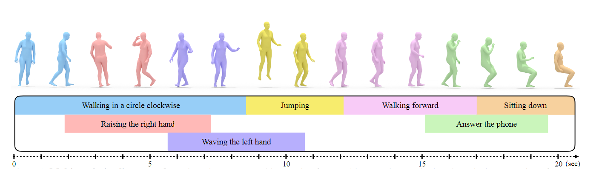
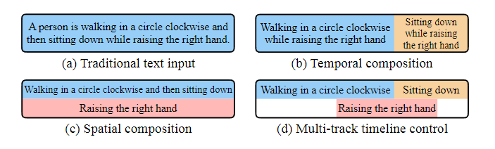
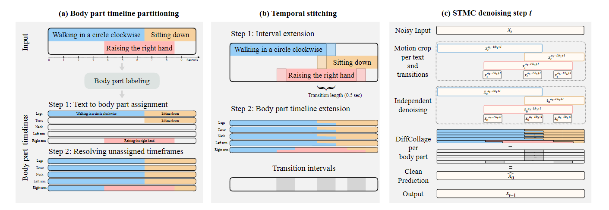
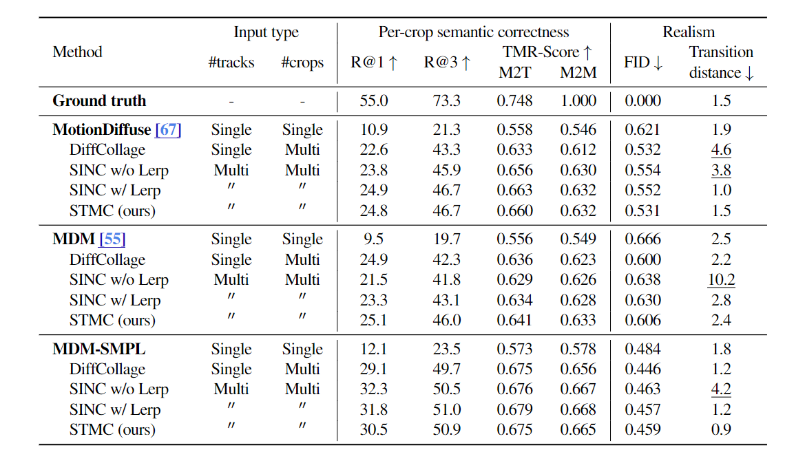
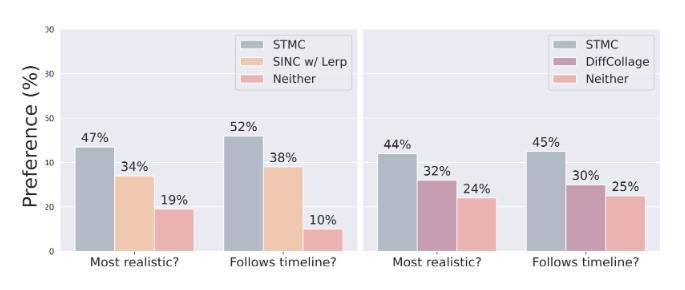

# Multi-Track Timeline Control for Text-Driven 3D Human Motion Generation

> 图 1. 多轨道时间轴控制 我们为文本驱动的动作合成引入了一种新的问题设置，即输入由允许同时动作的平行轨迹和允许顺序动作的连续时间间隔组成。在多个简单文字描述的结构化输入下，可以生成一个长而复杂的动作（上图），每个简单文字描述对应一个时间间隔（下图）。

> Abstract: 最近，生成建模技术取得了长足进步，可以根据简短的提示和指定的持续时间生成三维人体动作。然而，使用单个文本提示作为输入缺乏动画制作者所需的细粒度控制，例如合成多个动作和定义部分动作的精确持续时间。为了解决这个问题，我们提出了文本驱动动作合成的时间线控制这一新问题，为用户提供直观但细粒度的输入界面。用户可以指定由多个提示组成的多轨时间轴，而不是单一的提示。这样，用户就可以指定每个动作的准确时间，并按顺序或以重叠的时间间隔合成多个动作。为了从多轨道时间轴生成合成动画，我们提出了一种新的测试时间分解方法。这种方法可与任何预先训练好的运动扩散模型相结合，合成能准确反映时间轴的逼真运动。在去噪的每一个步骤中，我们的方法都会单独处理每个时间线区间（文本提示），然后根据每个动作涉及的特定身体部位汇总预测结果。实验对比和消融验证了我们的方法能产生符合语义和给定文本提示时间的逼真动作。我们的代码和模型可通过 https://mathis.petrovich.fr/stmc 公开获取。

## Introduction

在视频游戏、娱乐和虚拟化身创建等应用的推动下，最近的研究工作在学习生成三维人体动作方面取得了重大进展[29, 39, 46, 62]。根据文字描述生成动作尤其引人关注；它有可能通过自然语言界面使动画民主化，让初学者和专家用户都能直观地了解动作。为此，人们提出了几种方法，在输入单一文本提示和固定时长的情况下合成合理的角色动画[40, 55, 67]。

虽然这些方法是实现更快、更易用的动画界面的第一步，但它们缺乏对许多动画制作者来说至关重要的精确控制。请看输入提示（见图 2d）： "一个人顺时针走一圈，然后坐下，在走到终点时同时举起右手，在坐下动作的中途停止举手"。由于缺乏有代表性的训练数据，之前的研究在处理这种复杂的文本提示时遇到了困难[40, 55]。也就是说，提示包括时间构成[4]，即多个动作依次进行（如先走后坐），以及空间构成[5]，即多个动作同时进行，身体部位各不相同（如边走边举手）。此外，这种冗长的提示很快就会让用户感到不便，而且尽管有详细的说明，但在组成动作的时间和持续时间方面仍然模糊不清。

为了提高可控性，我们提出了文本驱动三维人体运动合成的多轨时间线控制这一新问题。在这项任务中，用户提供一个结构化的直观时间轴作为输入（图 1），其中包含多个（可能重叠的）时间间隔。每个时间间隔对应一个动作的精确文字描述。如图 2d 所示，前面讨论的复杂示例提示在时间轴中变得简单明了，动画师可以控制每个动作的时间。这样的时间轴界面在动画和视频编辑软件中已经很常见，类似于最近在文本到图像领域出现的控制界面[66]，例如从分割掩码生成图像。

文本驱动运动合成的多轨时间轴控制是多项运动合成任务的综合，因此带来了许多挑战。特别是，多轨时间轴输入可以实现（见图 2）：

- 文本-动作合成 [20, 40] - 用一个文本描述指定一个时间间隔（即持续时间）、
- 时间合成 [4, 68] - 与不重叠的时间间隔相对应的一系列文字描述、
- 空间（身体部位）合成[5] - 用不同的身体部位同时执行一组文本提示。

由于缺乏包含复杂合成和长持续时间的训练数据，解决这一任务十分困难。例如，时间线控制模型必须处理包含多个提示的多轨输入，而不是单一的文本描述。此外，该模型还必须考虑空间和时间的合成，以确保无缝过渡，这与之前单独解决这两个问题的工作不同。时间轴还放宽了最近许多文本到动作方法（text-to-motion approaches）所假设的有限持续时间（<10 秒）[12, 55, 67]。

为了应对这些挑战，我们引入了一种时空运动拼贴（STMC）方法。我们的方法通过在测试时利用预先训练好的运动扩散模型（如现成的 MDM [55] 或 MotionDiffuse [67]）来应对缺乏适当训练数据的问题。在每个去噪步骤中，STMC 首先对时间线中的每个文本提示独立应用扩散模型，以预测相应时间间隔的去噪运动。我们的主要见解是，在继续去噪之前，将空间和时间上的独立生成拼接在一起。对于空间组合，自动身体部位关联[5]可以将预测连贯地连接在一起。分数运算[68]用于确保时间合成的平稳过渡。为了进一步提高 STMC 的性能，我们引入了 MDM-SMPL，它对之前的运动扩散模型[55]进行了多项改进，包括直接使用 SMPL [36] 身体表示法。

通过综合比较和用户感知研究，验证了 STMC 在文本驱动运动合成的时间线控制方面的性能。总之，这项工作的核心贡献包括 (i) 文本驱动三维人体动作合成的多轨时间线控制新问题；(ii) 新型测试时间技术 STMC，该技术可有效构建去噪过程，确保忠实执行时间线中的所有提示。此外，(iii) 我们对 MDM 进行了升级，以直接支持 SMPL 身体表示法，而不是骨架，并通过减少去噪步骤来缩短运行时间。我们的代码和模型可在我们的网站上公开获取。

> 图 2. 文本驱动的运动合成任务： 我们的框架概括了 (a) 给定一个文本和一个持续时间的传统文本到动作合成，(b) 给定非重叠时间间隔的文本序列的时间合成，以及 (c) 给定单一时间间隔的文本集的空间合成。(d) 多轨时间线控制使用一组任意时间间隔的文本，允许对多个复杂动作的时间进行精细控制。

## Related Work

**人体运动合成。**在虚拟现实和图形学领域都有大量工作致力于生成三维胡人动作[73]。生成过程可以是无条件的[38, 58]，也可以以动作[10, 19, 39]、肢体[34, 52, 54, 59]、语音[3, 72]、目标[32, 53, 62]、之前的动作[14, 17, 46, 64]（即未来动作预测）、物体[23, 33, 60, 61]和文本[1, 2, 12, 18, 21, 31, 55, 67]为条件。技术方法多种多样，从早期的统计模型 [8, 17] 到现代的生成模型，如 VAE [22, 39, 40]、GAN [6, 13, 51, 63]、归一化流 [24, 59] 和 diffu-sion [12, 31, 32, 62, 70]。我们的工作与最近的文本条件扩散模型[55, 67]最为相关，但我们解决的是一个新问题，即模型的条件是包含多个文本输入的时间轴，而不是单一的提示。

**动作合成。**由于缺乏训练数据，动作和文本条件动作合成面临的一个特殊挑战是合成合成动作。一些研究[4, 43, 68]侧重于从一系列文本提示和持续时间中生成动作，即时间合成。TEACH [4] 每次自动生成一个动作（每个文本提示），并用前一个动作作为序列中下一个动作的条件。EMS [43] 提出了一种两阶段方法，首先单独生成每个动作，然后通过后续网络将它们合并。扩散模型 EDGE [56] 和 PriorMDM [50] 通过在转换时强制执行时间约束来确保相邻动作之间的一致性。我们的时序合成方法基于 DiffCollage [68]，它在整个去噪过程中，通过在重叠转换处进行分数运算，将动作（或图像）缝合在一起。

其他研究则从一组文本中生成同时执行的动作，即空间（身体部位）合成。SINC [5] 通过提示 GPT-3 [9]，将地面真实动作捕捉（mocap）序列与相应的身体部位进行标注。这些标签用于创建一个由具有兼容身体部位的 mocap 序列拼接而成的合成运动数据集，从而提高基于 VAE 的三维运动生成方法 [40] 在空间合成方面的性能。MotionDiffuse [67] 提出了一种噪声插值方法，可分别控制不同身体部位的运动。我们的 STMC 方法从 SINC [5] 中获得灵感，在测试时间去噪过程中使用身体部位标签将运动拼接在一起。总的来说，我们的时间线条件生成问题概括了时间和空间的构成，STMC 必须同时解决这两个问题，这与之前的大多数工作不同。

**可控运动扩散。**继在图像[45, 48, 49]、视频[28]和三维[35, 42, 65]领域取得成功之后，运动扩散已成为生成高质量三维人体运动[3, 30, 56]的有效方法，尤其是根据文本输入生成运动[12, 15, 55, 67]。一些研究侧重于提高运动扩散模型的可控性，例如通过文本提示的时间[50, 68]和空间[67]组合。其他控制方法，如遵循特定的关键帧姿势、关节轨迹和航点，也是通过混合使用测试时间扩散引导[30, 32, 47]、内部绘制[50, 55]和直接调节[62]来实现的。我们的重点是通过合成去噪处理，以细粒度时间轴格式处理多个文本提示，从而使文本到动作的生成更加可控。

## Human Motion Synthesis from Timelines

我们首先提出了多轨时间线控制的新问题设置（第 3.1 节），然后提出了处理时间线输入的运动去噪策略（第 3.2 节和第 3.3 节），最后总结了我们改进的扩散模型（第 3.4 节）。

### Timeline Control Problem Formulation

**输入。**如图 1 所示，多轨时间轴允许用户定义多个时间间隔，每个时间间隔与描述所需人体运动的自然语言提示相关联。对于时间轴中的第 j 个提示，我们将其时间间隔表示为 [aj,bj]，相应的提示表示为 Cj。时间间隔在时间轴上以多轨道布局排列，允许重叠。每个时间间隔和整个时间轴的持续时间都是可变的，用户可以在时间轴上添加任意数量的轨道（行）（尽管在实践中，一个角色通常只能同时执行几个动作）。

**输出。**我们的目标是按照指定的时间间隔生成一个遵循所有文本指令的三维人体运动。持续 N 个时间步的人体运动 x 表示为一系列姿势向量 x=（x1,...,xN），每个姿势 xi∈Rd 。最近的几项研究[55, 67]使用了郭等人[20]的姿势表示法（d=263），其中包含根速度以及局部关节位置、旋转和速度。也可使用其他姿势表示法，如 SMPL [36]（见第 3.4 节）。

### Background: Motion Diffusion Models

我们的生成方法（第 3.3 节）利用了预先训练好的运动扩散模型，如 MDM [55] 或 MotionDiffuse [67]，这些模型是在单个文本提示上训练好的，我们在此简要回顾一下。这些方法采用去噪扩散方案，通过对有噪声的姿势序列进行迭代去噪来合成动画。给定一个干净的动作 x0，采用高斯扩散过程将数据去噪为近似 N (0,I)。该过程的每一步由以下公式给出
$$
q(\boldsymbol{x}_t|\boldsymbol{x}_{t-1})=\mathcal{N}(\boldsymbol{x}_t;\sqrt{1-\beta_t}\boldsymbol{x}_{t-1},\beta_t\mathbf{I})\quad(1)
$$
其中 βt 由噪声时间表定义。请注意，去噪步骤 t 不能与时间步骤 i 混淆，后者是运动中姿势序列的索引。在实践中，我们可以使用重参数化技巧来简化 x_t 的采样过程$\boldsymbol{x}_t=\sqrt{\bar{\alpha}_t}\boldsymbol{x}_0+\sqrt{1-\bar{\alpha}_t}\boldsymbol{\epsilon},\mathrm{~where~}\boldsymbol{\epsilon}\sim\mathcal{N}(\boldsymbol{0},\mathbf{I}), \alpha_t=1-\beta_t,$, 和 $\bar{\alpha}_t=\prod_{s=0}^t\alpha_s.$

从扩散模型采样需要逆转这一过程，以便从随机噪声中恢复干净的运动。q(xt-1|xt)很难计算，但以 x0 为条件的概率却很容易计算[27]：
$$
q(\boldsymbol{x}_{t-1}|\boldsymbol{x}_t,\boldsymbol{x}_0)=\mathcal{N}(\boldsymbol{x}_{t-1};\mu_t(\boldsymbol{x}_t,\boldsymbol{x}_0),\boldsymbol{\Sigma}_t) ,\quad(2)
$$
条件为：
$$
\begin{aligned}
\mu_t(\boldsymbol{x}_t,\boldsymbol{x}_0)=& \frac{\sqrt{\alpha_{t}}(1-\bar{\alpha}_{t-1})}{1-\bar{\alpha}_{t}}x_{t}+\frac{\sqrt{\bar{\alpha}_{t-1}}\beta_{t}}{1-\bar{\alpha}_{t}}\boldsymbol{x}_{0} && \text{(3)} \\
\Sigma_{t}=& \frac{1-\bar{\alpha}_{t-1}}{1-\bar{\alpha}_{t}}\beta_{t}\mathbf{I} . && \text{(4)} 
\end{aligned}
$$
由于 xt 在采样时是已知的，我们通过训练去噪模型 ˆxθ(xt,t,C) 来估计 x0（其中 C 是文本条件），从而近似反向分布。该模型使用 Ho 等人[27]的简化损失函数进行训练（即不使用 t 依赖因子）：
$$
\mathcal{L}=\mathbb{E}_{\boldsymbol{\epsilon},t,\boldsymbol{x}_0,C}\|\hat{\boldsymbol{x}}_{\boldsymbol{\theta}}(\boldsymbol{x}_t,t,C)-\boldsymbol{x}_0\|_2^2
$$
其中 x0 和 C 取样于运动文本对数据集，步长 t 取样均匀，噪声ϵ∼N (0,I) 用于破坏地面真实运动。为了在采样时实现无分类器引导[26]，每次训练迭代时都会以一定概率放弃文本条件 C。在测试时，采样（反向）过程从随机噪声开始，经过 T 步迭代去噪，获得干净的三维人体运动。在每个去噪步骤中，模型都以单个输入文本提示为条件（如图 2a）。

> 图 3 STMC 概述 STMC 概述：在去噪之前，首先 (a) 将多轨时间线划分为每个文本的相关身体部分（使用基于 LLM 的标注 [5]），以创建身体部分时间线，然后 (b) 扩展这些时间线，使其重叠，从而形成用于使用 DiffCollage [68] 对每个身体部分进行时间缝合的过渡间隔。(c) 在每个去噪步骤中，根据身体各部分的时间轴对每个提示的运动进行独立去噪，然后再进行组合。在进入下一步之前，将从 N(μt(xt,xˆ0),Σt)（如公式 (2)）中采样 xt-1 对合成运动进行重新去噪。

### STMC: Spatio-Temporal Motion Collage

STMC 仅在测试时运行，使现成的、预先训练好的去噪模型能够生成以多轨时间轴为条件的运动。在每一个去噪步骤中，我们的方法将当前包含整个时间轴的噪声运动 xt 作为输入，并输出相应的干净运动 ˆx0。如图 3c 所示，STMC 使用去噪模型来独立预测与每个输入文本提示相对应的干净运动轨迹。这些预测结果将利用每个文本提示的身体部位注释进行局部拼接（图 3a），并进行时间拼接，以确保干净的运动流畅地跨越整个时间线（图 3b）。这一最终的复合运动是当前步骤 ˆx0 的输出，用于根据公式 (2) 对 xt-1 进行采样，并继续进行去噪处理。为了实现身体部位的拼接，STMC 假设去噪器是在显式姿势[55, 67]，而不是在潜空间[12]中工作。

**运动裁剪和去噪** 在去噪步骤 t 的输入 xt 跨越了整个时间线的持续时间。如图 3c 所示，我们首先在时间上将输入分割成运动 "裁剪"，以分别对每个文本提示进行去噪。对于每个时间间隔 [aj,bj]，运动在时间上被裁剪为 xaj :bj =xt[aj :bj]。裁剪结果与文本提示 Cj 一起提供给去噪模型，以预测相应的干净运动裁剪 xˆ0aj :bj。由于每个文本提示通常只包含一个动作，且间隔时间较短（小于 10 秒），因此对每个文本提示进行独立去噪后，预训练模型就能生成高质量的动作。

时间轴上的两个或多个文本提示可能会在时间上重叠，这意味着预测的清洁作物也会重叠。举个具体例子，假设 "绕圈行走 "和 "举起右手 "的动作重叠，如图 3 所示。在这种情况下，不清楚应该将两个生成的动作中的哪一个分配给重叠区域。要构建一个同时符合这两个提示的动作，我们需要 "绕圈行走 "的腿部动作和 "举起右手 "的右臂动作。因此，我们根据自动标注的身体部位将重叠提示的输出拼接在一起，详见下文。

**空间（身体部分）拼接。**空间拼接技术沿用了 SINC [5]，该技术建议通过简单的连接将来自 mocap 序列的兼容肢体动作组合在一起。SINC 只进行一次拼接，而 STMC 则在去噪的每个步骤中都进行拼接，通过允许去噪器纠正任何伪影来鼓励更连贯的动作组合。之所以能做到这一点，是因为去噪器会输出明确的人体姿势（即我们知道姿势向量中的哪些指数对应于手臂、腿等），因此我们可以从单独的作物中提取身体部分的运动轨迹，并将它们进行空间组合，以获得合成运动。为此，我们首先对输入时间线进行预处理，在每个时间步为每个身体部位分配一个文本提示，从而为每个身体部位创建一个单独的运动时间线（见图 3a）：左臂、右臂、躯干、腿部和头部。

如图 3a 所示，多轨时间轴中的每个文本提示都会首先标注一组参与动作的身体部位。这可以像在 SINC 中那样通过查询 GPT-3 [9]自动完成，也可以由用户直接提供，以实现额外的创造性控制。然后，在相应的时间间隔内，将每个文本提示分配给其注释的身体部位，并假定重叠时间间隔内的身体部位是相容的（例如，如果一个提示注释为 "腿"，那么在整个时间间隔内，其他提示都不应涉及腿）。为了填补身体部位时间轴的剩余部分，即身体部位没有注释到文本提示的部分，我们使用了类似于 SINC 的启发式方法。详情请参见附录 B 和图 A.1。最后，在去噪步骤（图 3c）中，每个裁剪 xaj :bj 都会被分割成独立的身体部分动作，并按照身体部分时间轴的规定串联起来，从而得到输出ˆx0。

**时间拼接。**由于运动裁剪是独立去噪的，因此将来自不同文本提示的肢体运动进行简单的时间拼接会造成突然的过渡。为了减少这些潜在的伪影，我们对每个肢体动作应用了 DiffCollage [68]。如图 3b 所示，我们不是直接对每个文本提示的 xaj :bj 进行去噪，而是对一个扩展的时间间隔 [aj -l,bj +l]进行去噪，其中 l 是相邻运动作物之间所需的重叠长度（例如，固定为 0.25 秒）。具体来说，对于提示 j 和 k 之间的时间转换，我们在去噪后得到 xˆaj-l:bj+l。然后，我们以 j 和 k 之间的重叠部分为中心，对一小部分（0.5 秒）运动进行无条件去噪，得到 ˆxuncond。跨越 j 和 k 间隔的最终预测运动计算公式为 $\hat{\boldsymbol{x}}_0=\hat{\boldsymbol{x}}_0^{a_j-l:b_j+l}+\hat{\boldsymbol{x}}_0^{a_k-l:b_k+l}-\hat{\boldsymbol{x}}_0^\text{uncond},$ 如图 3c 所示。这个等式源于问题的因子图表示，详见 DiffCollage [68]。

### SMPL Support for Motion Diffusion Model

虽然 STMC 与现成的模型 [55, 67]（见第 4 章）配合得很好，但我们对 MDM [55] 提出了几项实用的改进，以进一步提高效果。我们的模型 MDM-SMPL 采用了带皮肤的人体 SMPL [36]：我们使用 SMPL 姿态参数代替 Guo 等人 [20] 原始姿态表示中的关节旋转特征。与使用[20]姿势表示法中关节位置输出的模型相比，这种基于 SMPL 的表示法避免了在 SMPL 人体上进行耗费大量测试时间的优化[7, 74]来拟合生成的运动。此外，SMPL 中的局部关节旋转是相对于运动学树中的父关节而言的，与根相关关节位置相比，它更适合于身体部分的拼接。这是因为关节旋转的任何变化都会传播到运动学树中的所有子节点，而与根相关关节位置不同的是，根相关关节位置在简单连接在一起时可能不连贯。其他改进还包括将扩散步数从 1000 步降低到 T=100，以大幅加快采样速度，以及各种架构上的变化。我们在附录 D 中提供了有关 MDM-SMPL 的更多细节。

## Experiments

我们首先介绍了实验中使用的数据（第 4.1 节）和评估协议（第 4.2 节）。然后，我们展示了与基线的定量比较（第 4.3 节）和与感知研究的比较（第 4.4 节），最后是定性结果（第 4.5 节）。最后，我们讨论了实验的局限性（第 4.6 节）。

### Datasets

**HumanML3D** [20] 是一个文本运动数据集，为 AMASS [37] 和 Human-Act12 [19] 运动捕捉数据集的一个子集提供文本-虚拟描述。该数据集包含 14616 个动作的 44970 个文本注释。该数据集用于训练我们实验中使用的所有扩散模型。对于 MDM [55] 和 MotionDiffuse [67]，我们使用的是在已发布的 HumanML3D 版本上预先训练好的公开可用模型，这些模型使用的是 Guo 等人[20]的原始运动表示法。因此，这些方法需要在测试时进行优化，以获得 SMPL 姿态参数输出。为了训练我们的 MDM-SMPL 差分模型（该模型旨在直接生成 SMPL 姿态参数），我们重新处理了数据集，并排除了 Human-Act12 子集，因为该数据集没有 SMPL 姿态。

**多轨时间线 (MTT) 数据集**。为了正确评估我们的新任务，我们引入了一个包含 500 条多轨时间线的新挑战性数据集。数据集中的每条时间轴都是自动构建的，包含双轨时间轴上的三个提示（如图 2d）。为了构建这些时间轴，我们首先手动收集了一组 60 个文本，涵盖了各种 "原子 "动作（例如，"右手出拳"、"向前跳"、"向后跑"，完整列表见附录 C），并为每个文本所涉及的身体部位添加了注释。为了作为计算评估指标（第 4.2 节）的基本事实，我们还从 AMASS 中选择了与每个文本相对应的动作样本。根据原子文本，我们自动生成了包含三个提示和两个轨迹（行）的时间轴。对于每条时间线，第一条轨道由两个连续的提示音填充，提示音从文本集中抽取并随机赋予持续时间。第三个随机文本带有补充的身体部分注释，然后被放置在第二个轨道的随机位置。

将评估限制在三个提示的主要原因是：(i) 在感知研究中保持较低的用户认知负荷，从而提高结果的可靠性；(ii) 构建一个最小的设置，使我们能够在受控环境中与基线进行公平比较，消除提示数量等干扰因素。虽然这些时间轴只包含三个提示，但它们已经构成了巨大的挑战（见第 4.3 节）。数据集中的时间线示例见图 A.2，三个提示以外的定性结果见项目页面。

### Evaluation Metrics

鉴于这项任务的新颖性，确定评估不同方法的相关指标至关重要。我们没有依赖单一指标，而是将语义正确性（单个运动作物与文本描述的忠实程度）评估与真实性（如时间平滑度）评估分开。

**语义度量**。首先，我们评估生成的动作与文本描述在时间轴上特定区间内的一致性，我们称之为 "每作物语义正确性"。为了评估这一点，我们使用了最新的文本到运动检索模型 TMR [41]。与 CLIP [44] 对图像和文本的作用类似，TMR 提供了一个联合嵌入空间，可用于确定文本和动作之间的相似性。通过使用 TMR，我们对 MTT 数据集中的每个原子文本提示和相应的动作进行编码，以分别获得真实文本和动作嵌入。每个生成的运动裁剪也会被嵌入，并计算生成的运动嵌入和地面实况之间的 TMR 分数，这是一种余弦相似度量，范围在 0 到 1 之间。我们通过与地面实况文本嵌入（TMR-Score M2T）和与地面实况运动嵌入（TMR-Score M2M）的比较来报告运动到文本的相似性。这种嵌入相似性度量类似于用于文本-文本的 BERT-Score [69]、用于图像-文本的 CLIP-Score [25]，以及最近用于运动-运动相似性的 TEMOS-Score [4]。由于 TMR 是以对比方式进行训练的，其检索性能优于 TEMOS [40]，后者只对正对进行训练，因此我们决定改用 TMR-Score。此外，TMR 的嵌入空间通过余弦相似性进行了优化，使得其值在不同样本间的校准性更强。

理想情况下，生成的运动裁剪与相应输入文本提示之间的 TMR 分数 M2T 应超过其他文本。因此，我们还测量了运动到文本的检索指标（如文献[20]），包括正确文本提示在整个原子文本集检索文本中排名前 1（R@1）和前 3（R@3）的频率。

**逼真度指标**。其次，我们评估了生成动作的逼真度，其中包括动作之间的平滑过渡。虽然在学习特征空间（如 TMR）中生成的动作与地面真实动作之间的弗雷谢特起始距离（FID）是衡量质量的常用指标，但 TMR 的嵌入空间并没有对超过 10 秒的动作进行训练，因此对于较长的动作来说可能并不可靠。因此，我们效仿 DiffCollage [68]，计算 FID+ 来评估转场。FID+ 指标基于每次时间线条件运动生成中的 5 个随机 5 秒运动剪辑来衡量 FID。按照 TEACH [4]，我们还测量了过渡距离，即过渡时间前后两个连续帧中姿势之间的欧氏距离（单位：厘米）。我们选择在身体的局部坐标系中计算这一距离，以便更有效地捕捉单个身体部位的过渡，而不是由全局运动主导。这一指标对突然的姿势变化很敏感，为了保持真实，运动的过渡距离不应过大。

**感知研究**。由于任何量化指标都无法完全捕捉人体运动的微妙之处，因此我们还进行了感知研究，由亚马逊 Mechanical Turk 上的人类评分者来评判生成运动的质量[57]。为了比较两种生成方法，我们向评分者展示了两段在骨架上并排渲染的生成动作视频。多轨时间轴也是可见的，视频播放时，动画条会沿着时间轴前进。用户会被问到哪一个动作更逼真，哪一个动作更适合跟随时间轴上的文字；他们可以从两个动作中选择一个，也可以标注 "无偏好"。4.3 节中介绍的研究是在一组 100 个动作中进行的，每个动作都有多个评分者进行评判。每个视频的偏好由所有评分者的多数票决定。在每个 15 个问题的调查开始时，我们会使用三个 "热身 "问题和两个答案客观正确的 "蜜罐 "示例来筛选回答的质量。蜜罐示例测试评分者对任务的理解：一个示例显示了一个肢体明显严重拉伸的动作（真实性理解测试），另一个示例显示了一个从不同时间线生成的动作（时间线理解测试）。如果评分者未能正确回答其中任何一个问题，他们的所有回答都将被放弃。

### Quantitative Comparison with Baselines

我们将 STMC 测试时间方法应用于 MotionDiffuse [67]、MDM [55] 和 MDM-SMPL（我们的）的预训练扩散模型。对于每种去噪器，我们都将现有方法重新用于时间线条件下的生成任务，从而建立了几种强大的基线进行比较。结果见表 1。1. 表中每种方法的旁边都标明了输入时间线的轨道数（#tracks）和一个轨道中可包含的文本提示数（#crops）。接下来，我们将介绍每种基线并分析结果。

> 表 1. 定量基线比较： 在使用三种不同的去噪模型时，我们的 STMC 方法与几种强大的基线进行了比较。单文本基线和 DiffCollage 基线难以处理复杂的合成提示，这是因为将时间线缩减为单轨的结果。SINC 基线与 STMC 一样，通过独立去噪提示产生合理的语义准确性，但在过渡距离（下划线）或 FID 较高时，会造成突然或不自然的过渡。

**单一文本输入** [55, 67] 基线。在时间轴上调节运动扩散的最简单方法是将时间轴转换为单一文本描述，这与模型的训练输入格式一致（如图 2a）。鉴于我们的时间轴数据集始终由三个动作（A、B 和 C）组成，我们将单个文本提示制定如下： "A，然后是 B，同时是 C"。虽然时间信息也可以包含在提示中，例如 "A 为 4 秒"，但这对于在 HumanML3D 上训练的模型来说是不合适的，会导致更差的结果。这种方法与 SINC [5] 用于空间合成和 TEACH [4] 用于时间合成的基本策略相似。

如表 1 中每个去噪器所示。如表 1 所示，这种方法对语义正确性指标和逼真度都没有效果。由于这些模型无法生成超过 10 秒的动作，而且提示中也没有时间信息，因此在本实验中，输出被限制为最长持续时间为 10 秒，语义正确性指标报告的是动作的整个持续时间，而不是每一帧。之所以表现不佳，是因为模型没有接受过将时间轴折叠为单一文本描述所产生的复杂合成提示类型的训练。

**DiffCollage** [68] 基线。与其将多轨时间线转换为单个提示，不如将其折叠为包含一系列连续文本提示的单轨时间线，也就是将问题转换为时间组合问题。然后，就可以使用 DiffCollage 对一系列操作进行时间上的组合。例如，图 2d 中的时间线将被拆分为["绕圈走"、"绕圈走的同时举起右手"、"坐下的同时举起右手"、"坐下"]。请注意，与单文本基线不同，这种分割保留了时间轴中的时间（#crops）。

虽然 DiffCollage 基线通常能产生平滑的过渡和合理的 FID 分数，但其语义准确性一直比 STMC 差。这是因为在将时间线折叠成单一轨道后，提示中的空间组合非常复杂，而在 HumanML3D 上训练的模型很难处理这些空间组合。相比之下，STMC 在整个去噪过程中使用肢体拼接技术，从较简单的提示中组合出动作。

**SINC** [5] 基准。另一种方法是，在所有作物完成整个去噪过程后，只拼接一次肢体动作，而不是在每个去噪步骤中反复执行肢体拼接。这种方法与 SINC 最为相似，并构成了两个基线的基础，这两个基线接受完整的多轨时间线作为输入，与 STMC 相似。

SINC w/o Lerp 在去噪结束时合并身体部位的运动，而不考虑时间上的转换。因此，从表 1 中的高过渡距离和偶尔的鈥渢eleport鈥? 表 1 中的高过渡距离和定性结果中偶尔出现的鈥渢eleporting鈥? 为了缓解这一问题，SINC w/ Lerp 在过渡处采用了线性插值（lerp），以获得更平滑的结果，这与 TEACH [4] 中的方法类似。虽然这能使过渡处更平滑，但 FID 分数往往略高于 STMC。从质量上看，原因是显而易见的，生成的运动往往显得机械和不自然，有时会导致脚部滑动。尽管存在运动质量问题，但这些 SINC 基线能有效捕捉每种运动作物的语义，因为作物都是独立去噪的。

**结果分析** 我们的 STMC 方法在语义和真实度指标上都能持续有效地进行每形态分析，而不像基线方法往往会牺牲其中一个指标的性能来换取另一个指标的性能。例如，DiffCollage 使用 MDM 实现了最佳 FID，但由于其无法处理空间组合，因此在所有模型中的语义效果都比 STMC 差。另外，SINC 基线在 MotionDiffuse 和 MDM-SMPL 的语义方面表现最佳，但却会导致突然或不自然的转换，其 FID 或转换距离往往高于 STMC。这种过渡在定性结果中也很明显（见我们网页上的补充视频）。同样值得注意的是，使用 MDM-SMPL 和 STMC 的效果与 MDM 和 MotionDiffuse 相当，同时还能直接输出 SMPL 并显著减少（10 倍）扩散步骤的数量。更少的步骤加上预先计算的文本嵌入，使得 MDM-SMPL 的采样时间平均不到 5 秒。与 MDM 相比，这是一项重大改进，MDM 平均需要 4 分钟生成动作，然后经过 8 分钟的优化才能获得 SMPL 姿态。

虽然 STMC 的性能很有前途，但地面实况运动的语义度量指标表明仍有改进的余地。如第 4.6 节所述，STMC 目前受限于其针对每种运动作物所采用的预训练扩散模型；我们希望这些模型的改进也能提升 STMC 的性能。附录 E 中还提供了关于改变时空拼接重叠长度的额外实验。

### Perceptual Study

> 图 4. 感知研究结果： 与基线相比，我们的 STMC 方法在运动逼真度和语义准确性方面都更受人类评分者的青睐。(左）与带 Lerp 的强 SINC 基线进行比较。(右）与 DiffCollage 基线的比较。在这些实验中使用 MDM [55] 作为去噪器。

我们分别进行了两项用户研究，比较 STMC 和 SINC 与 Lerp 和 DiffCollage 在使用 MDM 时的效果。图 4 显示了这两项研究的结果，测量了人类对运动逼真度和语义准确性的偏好。左图中，STMC 在 66% 的情况下在逼真度方面更受青睐或与 SINC 相似，在 62% 的情况下在语义准确性方面更受青睐。与右侧的 DiffCollage 相比，我们的方法有 68% 的时间在逼真度方面优于或类似于 SINC，有 70% 的时间在语义准确性方面优于或类似于 SINC，每个视频在过滤不良响应后平均有 2.8 名评分者进行评判。这表明，STMC 能够以人类可识别的方式改善运动效果，但量化指标可能无法完全反映这种效果。

### Qualitative Results

在图 5 中，我们将 STMC 与 MDM-SMPL 生成的运动可视化，图中的多轨时间线是由 MTT 数据集输入的。着色是按照输入文本进行的，当各轨道出现重叠时，会优先显示最新的提示。这些结果表明，STMC 能够为复杂的多提示时间线生成逼真的运动，这些运动遵循给定的时间间隔和持续时间。有关这些示例的完整分析，请参阅标题。有关其他定性结果以及与基线方法生成的运动的比较，请参阅我们网页上的补充视频。

### Limitations

虽然 STMC 扩展了预训练运动扩散模型的功能，将多轨时间线作为输入，但它也受到所依赖模型的限制。例如，我们建议的身体部分拼接过程会在整个去噪过程中产生空间合成运动，而现成的模型并没有经过训练，无法稳健地处理这些运动。改善这一问题的一个潜在方向是采用更复杂的拼接 "时间表"，即在去噪过程的后期才拼接身体部分，而不是每一步都拼接。STMC 也继承了 SINC 的局限性，例如限制重叠运动必须具有兼容的身体部位组合。

## Conclusion

在这项工作中，我们提出了文本驱动三维人体动作生成的多轨时间线控制这一新问题。时间线输入可让用户对动作的时间和持续时间进行精细控制，同时还能保持自然语言的简洁性。我们采用了一种名为时空运动拼贴（STMC）的新测试时间去噪流程来解决这一具有挑战性的问题，该流程使预训练的扩散模型能够处理时间线中存在的空间和时间组合。最后，广泛的定量和定性评估证明了 STMC 相对于强大的基线方法的优势，以及其生成忠实于用户多轨时间线的真实运动的能力。